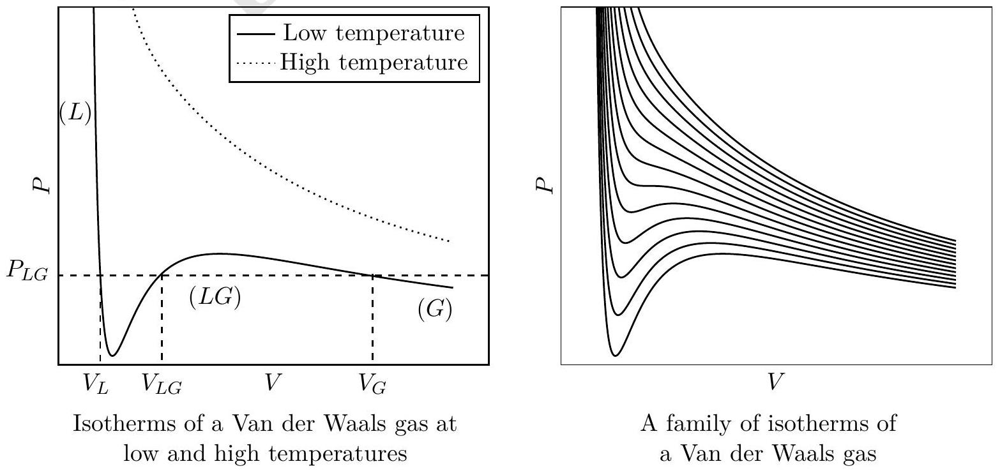

6. The Van der Waals Gas:
Consider $n$ mole of a non-ideal (realistic) gas. Its equation of state maybe described by the Van der Waals equation
$$
\left(P+\frac{a n^{2}}{V^{2}}\right)\left(\frac{V}{n}-b\right)=R T
$$
where $a$ and $b$ are positive constants. We take one mole of the gas $(n=1)$. You must bear in mind that one is often required to make judicious approximations to understand realistic systems.

(a) For this part only take $a=0$. Obtain expressions in terms of $V, T$ and constants for

i. the coefficient of volume expansion $(\beta)$; $\beta=$
ii. the isothermal compressibility $(\kappa)$. $\kappa=$
(b) Criticality:
The Van der Waals gas exhibits phase transition. A typical isotherm at low temperature is shown in the figure. Here $L(G)$ represents the liquid (gas) phase and at $P_{L G}$ there are three possible solutions for the volume $\left(V_{L}, V_{L G}, V_{G}\right)$. As the temperature is raised, at a certain temperature $T_{c}$, the three values of the volume merge to a single value, $V_{c}$ (corresponding pressure being $P_{c}$ ). This is called the point of criticality. As the temperature is raised further there exists only one real solution for the volume and the isotherm resembles that of an ideal gas.

i. Obtain the critical constants $P_{c}, V_{c}$ and $T_{c}$ in terms of $a, b$ and $R$.

ii. Obtain the values of $a$ and $b$ for $\mathrm{CO}_{2}$ given $T_{c}=3.04 \times 10^{2} \mathrm{~K}$ and $P_{c}=7.30 \times 10^{6} \mathrm{~N} \cdot \mathrm{~m}^{-2}$. [1]
$a=$ $b=$
iii. The constant $b$ represents the volume of the gas molecules of the system. Estimate the size $d$ of a $\mathrm{CO}_{2}$ molecule. $d=$

(c) The gas phase:
For the gaseous phase the volume $V_{G} \gg b$. Let the pressure $P_{L G}=P_{0}$, the saturated vapour pressure. $\left[\mathbf{1} \frac{\mathbf{1}}{\mathbf{2}}\right]$ $\left[\frac{1}{2}\right]$ $\left[\mathbf{1} \frac{\mathbf{1}}{\mathbf{2}}\right]$

i. Obtain the expression for $V_{G}$ in terms of $R, T, P_{0}$ and $a$.
$$
V_{G}=
$$
ii. State the corresponding expression for $V_{I}$ for an ideal gas.
$$
V_{I}=
$$
iii. Obtain $\left(V_{G}-V_{I}\right) / V_{I}$ for water given $T=1.00 \times 10^{2}{ }^{\circ} \mathrm{C}, P_{0}=1.00 \times 10^{5} \mathrm{~Pa}, b=3.10 \times$ $10^{-5} \mathrm{~m}^{3} \cdot \mathrm{~mol}^{-1}$ and $a=0.56 \mathrm{~m}^{6} \cdot \mathrm{~Pa} \cdot \mathrm{~mol}^{-2}$. Comment on your result.
$$
\frac{V_{G}-V_{I}}{V_{I}}=\quad \text { Comment: }
$$
(d) The liquid phase:
For the liquid phase $P \ll a / V_{L}^{2}$.
    i. Obtain the expression for $V_{L}$.
$$
V_{L}=
$$
    ii. Obtain the density of water $\left(\rho_{w}\right)$. You may take the molar mass to be $1.80 \times 10^{-2}$ $\mathrm{kg} \cdot \mathrm{mole}^{-1}$.
$$
\rho_{w}=
$$
iii. The heat of vaporization is the energy required to overcome the attractive intermolecular force as the system is taken from the liquid phase $\left(V_{L}\right)$ to the gaseous phase $\left(V_{G}\right)$. The term $a / V^{2}$ represents this. Obtain the expression for the specific heat of vaporization per unit mass $(L)$ and obtain its value for water.

| $L=$ | Value of $L=$ |
| :--- | :--- |

Detailed answers can be found on page numbers:
