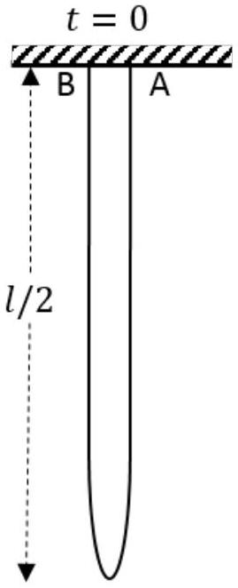
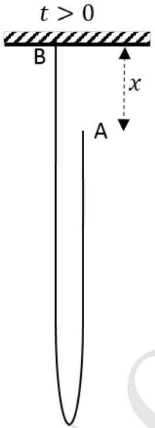
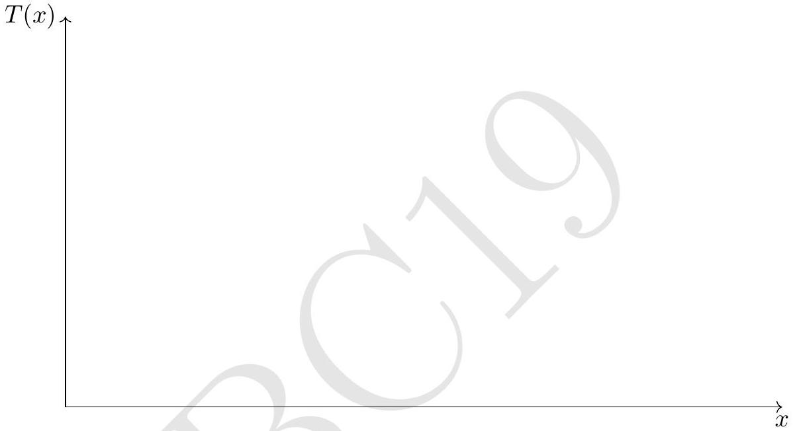

3. A chain of length $l$ and linear density $\lambda$ hangs from a horizontal support with both ends A and B fixed to a horizontal support as shown. The two fixed ends are close to each other. At time $t$ $=0$ the end A is released. All vertical distances $(x)$ are measured with respect to the horizontal support with the downward direction taken as positive (A and B are initially at $x=0$ ).

    (a) Obtain the momentum $P$ of the center of mass of the system when the end A has fallen by a distance $x$, in terms of $x$ and speed $\dot{x}$.
$$
P=
$$
    (b) Assume that the end A is falling freely under gravity, i.e., $\ddot{x}=g$. Obtain the tension $T$ at the fixed end B just before the chain completes the fall and becomes entirely vertical.
$$
T=
$$

Experimentally, the value of tension is found to be different from the above result. We adopt an alternative approach assuming conservation of mechanical energy.

(c) Obtain the potential energy $U(x)$ of the chain and plot it versus $x$. Take the potential energy of a point mass placed at the horizontal support to be zero.

(d) Obtain the speed $\dot{x}$ when the end A has fallen by a distance $x$. Assume that all sections of the falling (right side) part of the chain have the same speed.
$$
\dot{x}=
$$
(e) Hence obtain $T(x)$ at B as a function of $x$ and related quantities. You are advised to simplify your expression as far as possible.
$$
T(x)=
$$
(f) Qualitatively sketch $T(x)$ versus $x$.

Detailed answers can be found on page numbers:
