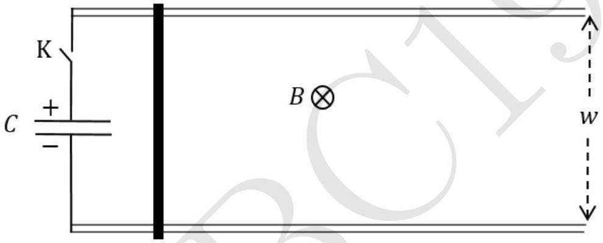

5. A pair of long parallel metallic rails of negligible resistance and separation $w$ are placed horizontally. A horizontal metal rod (dark thick line) of mass $M$ and resistance $R$ is placed perpendicularly onto the rails at one end (as shown). A uniform magnetic field $B$ exists perpendicular to the plane of the paper (pointing into the page). One end of the rail track is connected to a key $(\mathrm{K})$ and a capacitor of capacitance $C$ charged to voltage $V_{0}$. At $t=0$ the key is closed. Neglect friction and self inductance of the loop.

    (a) What is the final speed $\left(v_{\text {final }}\right)$ attained by the rod?
$$
v_{\text {final }}=
$$
    (b) Consider the ratio $r$ of the maximum kinetic energy attained by the rod to the energy initially stored in the capacitor. What is $r_{\text {max }}$, the maximum possible value of $r$, by appropriately choosing $B$ ?
$$
r_{\max }=
$$
    (c) Let $M=10.0 \mathrm{~kg}, w=0.10 \mathrm{~m}, V_{0}=1.00 \times 10^{4} \mathrm{~V}$ and a bank of capacitors ensures that $C$ $=1.00 \mathrm{~F}$. If $r=r_{\text {max }}$, calculate the value of $v_{\text {final }}$.
$$
v_{\text {final }}\left(r=r_{\max }\right)=
$$
Detailed answers can be found on page numbers:
