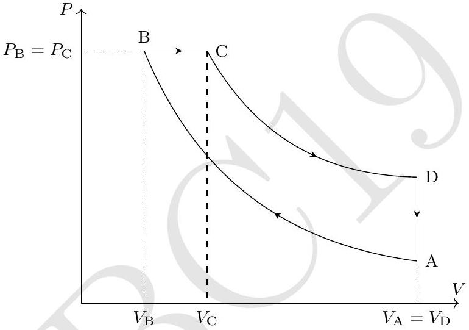
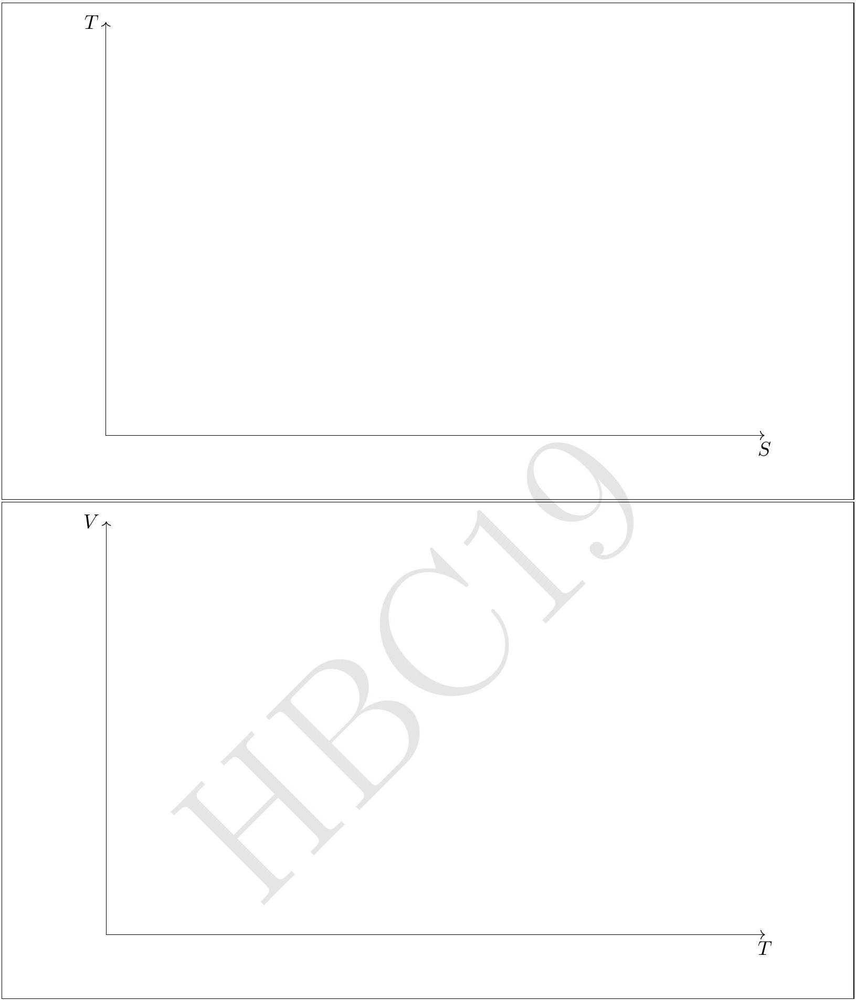

6. Consider $n$ moles of a monoatomic non-ideal (realistic) gas. Its equation of state may be described by the van der Waal's equation
$$
\left(P+\frac{a n^{2}}{V^{2}}\right)\left(\frac{V}{n}-b\right)=R T
$$
where $a$ and $b$ are positive constants and other symbols have their usual meanings. The internal energy change of a realistic gas can be given by
$$
d U=C_{V} d T+\left\{T\left(\frac{d P}{d T}\right)_{V}-P\right\} d V
$$
As indicated in the above expression, the derivative of pressure is taken at constant volume.
We take one mole of the gas $(n=1)$ through a Diesel cycle (ABCDA) as shown in the following $P-V$ diagram (diagram is not to scale). During the whole cycle assume that the molar heat capacity at constant volume ( $C_{V}$ ) remains constant at $3 R / 2$. Path AB and CD are reversible adiabats.

    (a) Obtain the temperature at $\mathrm{B}\left(T_{\mathrm{B}}\right)$ in terms of temperature at $\mathrm{A}\left(T_{\mathrm{A}}\right), V_{\mathrm{A}}, V_{\mathrm{B}}$ and constants only.
$$
T_{\mathrm{B}}=
$$
    (b) Let temperature at A to be $T_{\mathrm{A}}=100.00 \mathrm{~K}, V_{\mathrm{A}}=8.00 \mathrm{l}, V_{\mathrm{B}}=1.00 \mathrm{l}, V_{\mathrm{C}}=2.00 \mathrm{l}, a=1.355$ $\mathrm{l}^{2} \cdot \mathrm{~atm} / \mathrm{mol}^{2}$, and $b=0.0313 \mathrm{l} / \mathrm{mol}$. Calculate the highest temperature reached during the whole cycle.
Highest temperature =
    (c) Calculate the efficiency $\eta$ of the cycle.
$$
\text { Value of } \eta=
$$
    (d) Draw the corresponding $T-S$ (entropy) and $V-T$ diagram for the Diesel cycle. Wherever possible, mention the numerical values of $T, V$, and $S$ on the diagrams.

Detailed answers can be found on page numbers:
