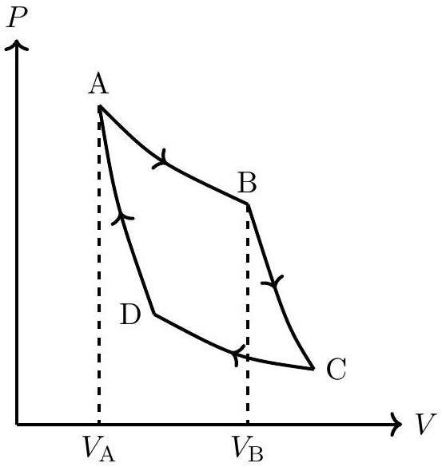

1. A certain gas obeys the equation of state $U(S, V, N)=a S^{7} / V^{4} N^{2}$, where $a$ is a dimensioned constant. Here $U$ represents the internal energy of the gas, $S$ the entropy, $V$ the volume and $N$ the fixed number of particles of the system.
    (a) Let such a gas be filled in a box of volume $V$ and the internal energy of the system be $U$. A partition is placed to divide the box into two equal parts, each having volume $V / 2$. For each part, the internal energy is now $\alpha U$ and the dimensioned constant be $\beta a$. Obtain $\alpha$ and $\beta$.
$$
\alpha=
$$
$$
\beta=
$$
    (b) The temperature $T$ can be expressed in terms of the derivative of internal energy as
$$
T=\left(\frac{d U}{d S}\right)_{V, N}
$$
where the subscripts indicate that the differentiation has been carried out keeping $V$ and $N$ constant. In a similar way, express pressure $P$ in terms of a derivative of the internal energy.
$$
P=
$$
    (c) Find the equation of state of the given system relating $P, T$, and $V$.
$$
P=
$$
    (d) One mole of this gas executes a Carnot cycle [7] ABCDA between reservoirs at temperatures $T_{1}$ and $T_{2}\left(T_{1}>T_{2}\right)$. Obtain the heat change in the process AB $\left(Q_{\mathrm{AB}}\right)$ and work done by the system in the processes AB and BC $\left(W_{\mathrm{AB}}, W_{\mathrm{BC}}\right)$ of the cycle. Express your answers only in terms of temperatures $T_{1}, T_{2}$, volumes $V_{A}, V_{B}$, and the other constants.

    $Q_{\mathrm{AB}}=$

$$
W_{\mathrm{AB}}=
$$

$$
W_{\mathrm{BC}}=
$$

Detailed answers can be found on page numbers:
