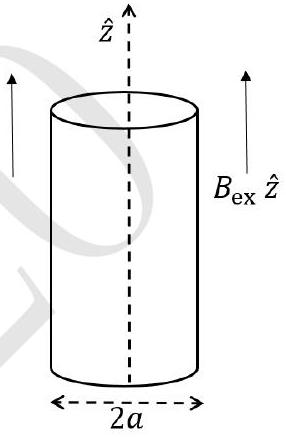

2. An insulating uniformly charged cylindrical shell of radius $a$ lies with its axis along the $z$ axis. The shell's moment of inertia per unit length about the $z$ axis and the surface charge density are $I$ and $\sigma$ respectively. The cylinder is placed in an external uniform magnetic field $B_{\mathrm{ex}} \hat{z}$, and is initially at rest. Starting at $t=0$ the external magnetic field is slowly reduced to zero. What is the final angular velocity $\omega$ of the cylinder?

$$
\omega=
$$
Detailed answers can be found on page numbers:
