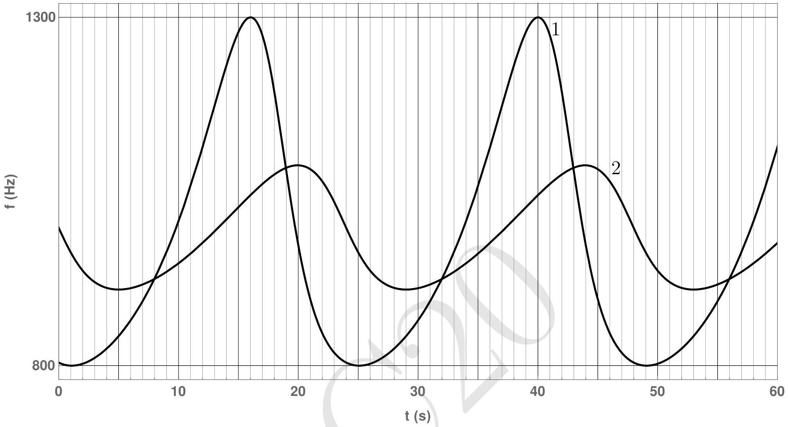
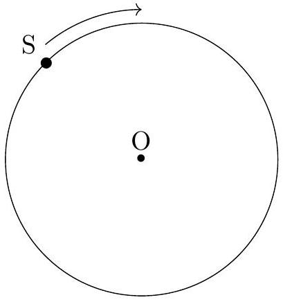

4. A sound source S is performing uniform circular motion with time period $T$. It is continuously emitting sound of a fixed frequency $f_{0}$. Two detectors 1 and 2 are placed somewhere in the same plane as the circular trajectory of the source. The frequency $f$, of the sound received by the two detectors is plotted as a function of time $t$ as shown below (the clocks of the two detectors are synchronized).

Take the speed of sound in the medium to be 330 m/s.

(a) Determine the time period $T$ of the source.
$$
T=
$$
(b) The figure below shows the circular trajectory of the source S. Qualitatively mark the positions of both the detectors by indicating 1 and 2. Here O denotes the centre of the trajectory. You must provide detailed justification of your answer in the detailed answer sheet.

(c) Obtain the frequency $f_{0}$ of the source. [3]
$$
f_{0}=
$$
(d) Calculate the distance $(D)$ between the detectors. [9]
$$
D=
$$
Detailed answers can be found on page numbers:
