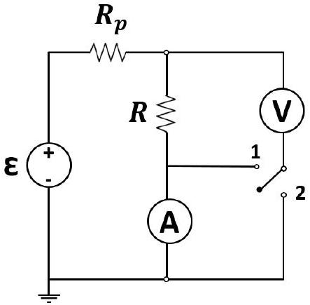

1. The ammeter-voltmeter method is widely used for measuring electrical resistances in the physics laboratory. In this method, the resistance $R$ is always derived from the readings $V$ and $I$ from a voltmeter and an ammeter respectively, using Ohm's law: $R=V / I$. While using this method, it is assumed that the ammeter and voltmeter used in the setup are ideal. In this problem, we will find the pitfalls of this assumption and devise a new setup with a better performance.
The standard ammeter-voltmeter setup consists of a DC voltage source $(\varepsilon)$ maintained at a constant voltage, a protection resistance $\left(\mathrm{R}_{\mathrm{p}}\right)$, an ammeter (A), and a voltmeter (V). The unknown internal resistances of the ammeter and the voltmeter are $R_{A}$ and $R_{V}$, respectively. Also, $R_{V} \gg R_{A}$. We aim to measure the true value $R$ of an unknown resistor.
We consider a two commonly used circuit configurations (1) and (2) indicated by the two possible positions of the switch in the circuit diagram shown below. Let the measured values of the resistance $R$ be $R_{\mathrm{m} 1}$ and $R_{\mathrm{m} 2}$ in the setups (1) and (2), respectively. The relative error, $\Delta$, is defined as the ratio of the absolute error of the measurement to the actual value: $\Delta=\left(R_{\mathrm{m}}-R\right) / R$.

    (a) [2 marks] Obtain the relative errors in the measurements $\left(\Delta_{1}\right.$ and $\left.\Delta_{2}\right)$ for each of the above configurations.
    (b) [4 marks] Using exactly the same circuit elements, can you suggest a step by step procedure, with the necessary circuit diagram(s), to measure the true value of the resistance R, regardless of the values of the internal resistances of the ammeter and the voltmeter? You may use the measurements made in part (a).
