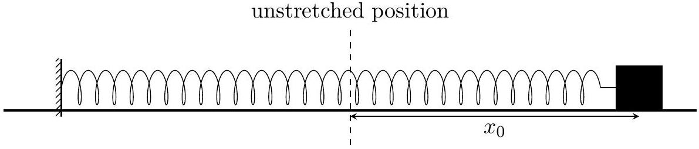

1. A block of mass $m=0.1 \mathrm{~kg}$ is attached to a spring (one end fixed to the wall) with spring constant $k=50 \mathrm{~N} \mathrm{~m}^{-1}$. The block slides on a rough horizontal table along the $x$-axis. Assume that both the coefficients of kinetic $\left(\mu_{k}\right)$ and static friction $\left(\mu_{s}\right)$ are same and constant $\left(\mu_{k}=\mu_{s}=\mu=0.25\right)$. The block is initially displaced to $x_{0}=0.1 \mathrm{~m}$ from the unstretched position (normal length of the spring, $x=0$ ) of the spring and released from rest as shown below. Neglect any air resistance. Take the acceleration $g$ due to gravity to be $10 \mathrm{~m} / \mathrm{s}^{2}$.

    (a) [3 marks] How many times $(n)$ will the block cross the unstretched position before coming to rest permanently?
    (b) [1 marks] Determine the total distance $D$ covered by the block before coming to rest.
    (c) [6 marks] Let us divide one complete oscillation of the block, starting from a fully stretched condition of the spring, into four distinct sections, requiring the following times in order:
        (i) $t_{1}$ : time taken for the block to move from fully stretched to the unstretched position,
        (ii) $t_{2}$ : time taken for the block to move from the unstretched position to fully compressed position,
        (iii) $t_{3}$ : time taken for the block to move from fully compressed to the unstretched position,
        (iv) $t_{4}$ : time taken for the block to move from the unstretched position to fully stretched position.

Let the distance covered during the above intervals be $d_{1}, d_{2}, d_{3}$, and $d_{4}$, respectively. Also, let $T_{1}$ and $T_{2}$ be the time taken to complete the first and the second oscillations, respectively, starting from the initial displacement, $x_{0}$.
Compare the above times and distances by inserting an appropriate sign (from among <, >, or = only) between the given quantities in each of the boxes below. Note that you will be penalised for 0.5 marks for giving each incorrect answer in this part. You need not to justify your answer.

| $t_{1}$ | $t_{2}$ | $t_{2}$ | $t_{3}$ | $t_{1}$ | $t_{3}$ |
| :--- | :--- | :--- | :--- | :--- | :--- |
| $d_{1}$ | $d_{2}$ | $d_{2}$ | $d_{4}$ | $T_{1}$ | $T_{2}$ |

(d) [2 marks] Qualitatively plot the displacement $x$ from the unstretched position vs the time $t$.
