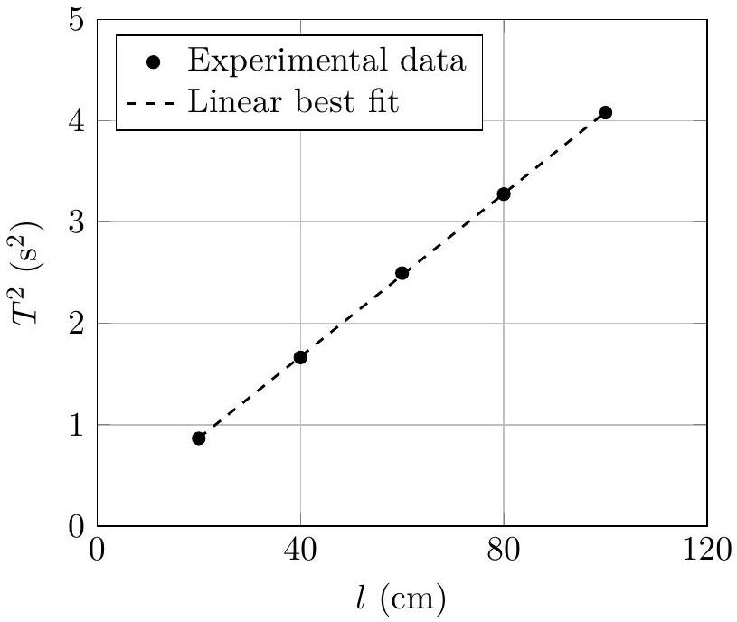

4. A student performed an experiment to determine the acceleration due to gravity $(g)$ using a simple pendulum which has a spherical bob of diameter $d$ hung with a long string. She varied the length
of the string $l$, and measured the period of oscillation $T$ every time. She calculated the value of $g$ from each measurement as shown in the table below.

She noticed that not only was the average value of $g$ smaller than the expected value, each one of the measurements had yielded a value smaller than the true value.
Next, she plotted a graph between $T^{2}$ and $l$ from the same data, and obtained the value of $g=981 \mathrm{~cm} / \mathrm{s}^{2}$ from the slope of the best fit line.

| $l$ (in cm) | $T$ (in s) | $g$ (in cm/s) |
| :--- | :--- | :--- |
| 20 | 0.93 | 912 |
| 40 | 1.29 | 948 |
| 60 | 1.58 | 948 |
| 80 | 1.81 | 963 |
| 100 | 2.02 | 967 |
| Average $g$ |  | 947 |

(a) [3 marks] What do you think might be the main cause for the consistently low values of $g$ that she obtained from each of her measurements?
(b) [4 marks] Explain in detail why she still obtained a correct value of $g$ from the slope of the graph plotted from the same data.

Assume that the instruments of measuring time and length were accurate enough, and all the measurements of the stated quantities were correct within the accuracy of the instruments. It is verified that the graph and the linear best fit were correctly plotted, and all numerical calculations in the above are correct. Note that you are not expected to plot any graph (no graph paper is provided to you).
