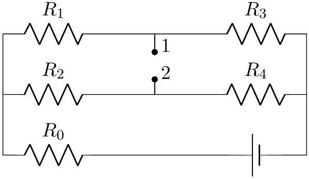

5. [12 marks] A circuit consists of an emf source and five resistors with unknown resistances. When an ideal ammeter is connected between points 1 and 2, its reading is $I_{A}$. If instead a resistor $R$ is connected to the same two points, the current through that resistor is $I_{R}$. If instead an ideal voltmeter is connected between points 1 and 2, its reading is $V$. Obtain $V$ in terms of $I_{A}, R$ and $I_{R}$ only.

