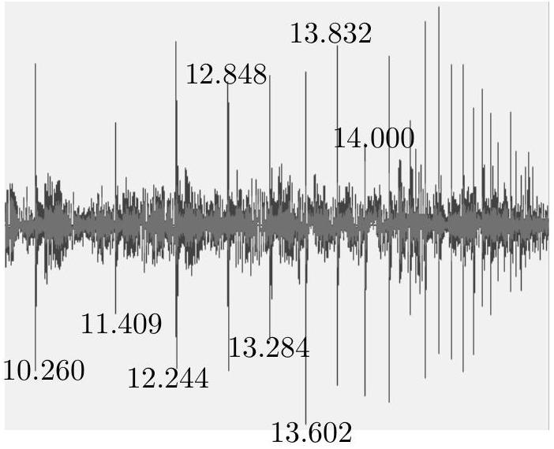

1. [6 marks] Dancing on the floor

There are various apps that record the intensity of an audio signal. An app (WaveEditor™ here) displays the audio signal as a wave, whose amplitude is proportional to the audio signal's loudness. A smartphone with this app recording the sound signal is kept on a uniformly built flat floor of a classroom.

A perfectly small spherical steel ball is thrown up such that it almost touches the ceiling and comes back without hitting. The ball hits the floor and thereafter it keeps bouncing. The app records the sound signal produced when the ball hits the floor on every bounce. A screenshot of the recording is shown. The timestamps (in seconds) of the first eight consecutive bounces are also shown next to the peak. For example, the app records a peak at 10.260s when the first time the ball hits the floor.

Make reasonable assumptions, when the ball hits the floor and calculate the height of the classroom from the given data. State your assumptions clearly.
