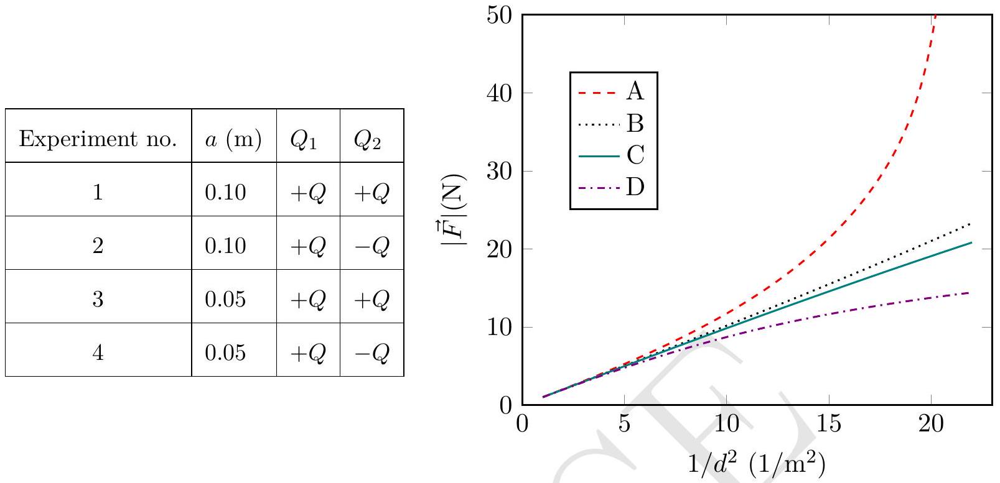

1. [8 marks] An electrifying experiment
Professor Coulomb was investigating how the magnitude of the force $(|\vec{F}|)$ between two charged spheres depends on the distance between their centres. He conducted four separate experiments by placing two identical conducting spheres 1 and 2, each of radius $a$, at different distances $d$ from each other. The experiments are outlined in the table below. Here $Q_{1}$ and $Q_{2}$ are the charges on the spheres 1 and 2, respectively. The measurement results are presented in the graph.

Figure out which measurement (A, B, C, D) belongs to which experiment (1, 2, 3, 4). Explain your answers in the detailed answersheet. You may draw diagrams, if necessary.
