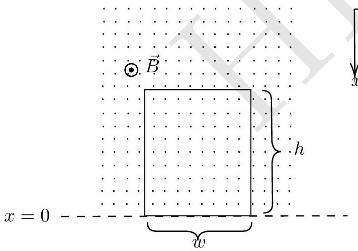
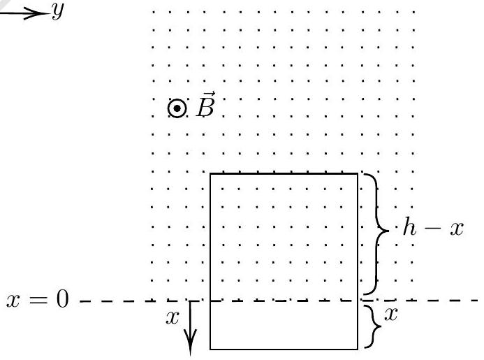

## 4. Mag-Grav Tussle

A rectangular conducting loop of mass $m$, width $w$, length $h$, and self inductance $L$ is held in the vertical $x-y$ plane with its bottom edge along the $y$-axis (see figure on the left below). In this problem take the resistance of the loop to be zero. A uniform magnetic field $\vec{B}$ is applied horizontally as shown in the figure such that

$$
\begin{aligned}
\vec{B} & =B \hat{k} \quad \text { for } x \leq 0 \\
& =0 \quad \text { for } x>0
\end{aligned}
$$

The loop is released from rest at time $t=0$ and descends under gravity (see the figure to the right below). The acceleration due to gravity $g$ is in $+x$ direction.

(a)

(b)

(a) [5 marks] Obtain $x(t)$, the position of the bottom edge of the loop at time $t$, in terms of relevant variables.
(b) [6 marks] Imagine different possible scenarios for the nature of motion of the loop and plot $x(t)$ for each.
