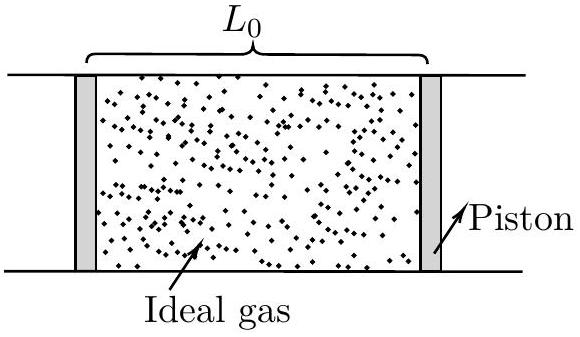

## 5. Thermal Tussle

Consider a horizontal insulated cylindrical tube of very large length. Two identical insulated pistons, each of mass $M=0.2 \mathrm{~kg}$ are fitted within the tube separated by a length $L_{0}=1 \mathrm{~m}$. The space between the two pistons is filled with one mole of (ideal) helium gas, initially at temperature $T_{0}=300 \mathrm{~K}$. The external pressure, everywhere outside the pistons and tube, is zero.

Initially, the pistons are held in place by an external mechanism. At time $t=0$, the mechanism is released and the pistons move without friction and the process is quasistatic initially. Assume that the gas behaves ideally throughout. Let $C_{p}$ and $C_{v}$ be the specific heats of the gas at constant pressure and volume respectively. Also, $\gamma=C_{p} / C_{v}=5 / 3$.

(a) [ $\mathbf{6}$ marks] Determine the velocity $\left(v_{p}\right)$ of each piston in terms of the gas temperature $T$ and other relevant variables. At what temperature $\left(T_{c}\right)$, is the process no longer quasistatic? Calculate $T_{c}$.
(b) [4 marks] From here, we restrict our analysis only to the quasistatic regime of the process. We define $u=T / T_{0}$. Obtain the relation between $u$ and $t$ in the following form
$$
t=f(u)
$$
You may leave the answer in terms of a suitable integral involving $L_{0}, M$ and other variables.
(c) [4 marks] Qualitatively plot the rate of change of temperature $(d T / d t)$ vs $T$. Mark any significant point(s) on the temperature axis in the plot.
(d) [4 marks] At what time $t$ does the temperature $T$ of the gas reach 20K? What is the piston velocity $\left(v_{\mathrm{p}}\right)$ at this point?
