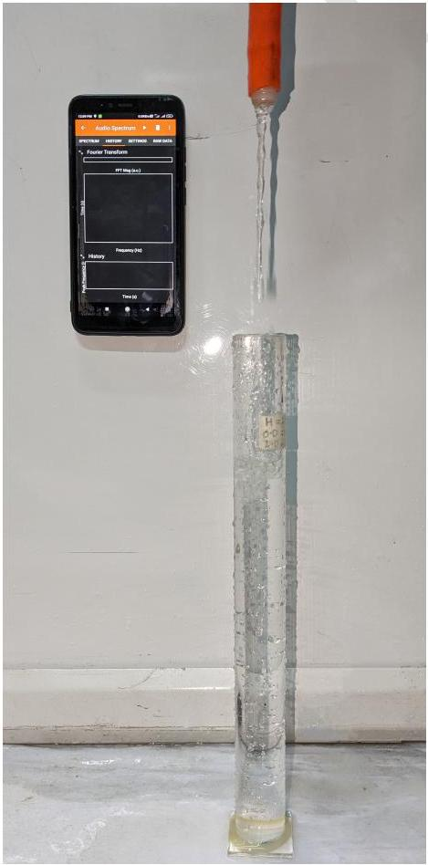

## 6. Sonic Sleuth

During her summer vacation, Dheera decides to carry out a smartphone based experiment. She utilizes a smartphone's frequency sensor that can measure the frequency of the audio signal it receives. She takes a long cylindrical tube closed at one end. This tube has a length of $L=30.0 \mathrm{~cm}$ and an inner diameter of $d=2.45 \mathrm{~cm}$. Dheera starts filling the tube with water, which is dripping from a tap at a constant rate $Q$ (measured in milliliters per second (mL/s)).
Dheera positions her smartphone near the open end of the tube to measure the frequency of the sound emitted as water fills the tube. An app on the phone captures a range of frequencies in the recorded audio at any given time. At randomly chosen values of time $t$, one of the frequencies at that time is shown in the following table.

| Time $t(\mathrm{~s})$ | Frequency $f(\mathrm{~Hz})$ | Time $t(\mathrm{~s})$ | Frequency $f(\mathrm{~Hz})$ |
| :--- | :--- | :--- | :--- |
| 5.0 | 915 | 36.0 | 434 |
| 7.6 | 320 | 39.6 | 481 |
| 16.2 | 345 | 41.9 | 500 |
| 16.7 | 1008 | 42.5 | 1454 |
| 20.9 | 360 | 51.1 | 1618 |
| 25.7 | 1148 | 51.6 | 574 |
| 28.9 | 1196 | 56.1 | 1782 |
| 31.5 | 410 | 60.2 | 680 |
| 33.3 | 1290 | 66.3 | 820 |

Help her to analyse the experiment.

(a) [3 marks] Derive the expression for the velocity of sound $c_{s}$ in terms of $f, t$, and constants.
(b) [8 marks] Choose a pair of suitable variables and plot a linear graph. Specify the axis labels. Obtain the speed of sound $c_{s}$ and the rate $Q$ from this plot.

**** END OF THE QUESTION PAPER ****

Space for rough work - will NOT be submitted for evaluation
