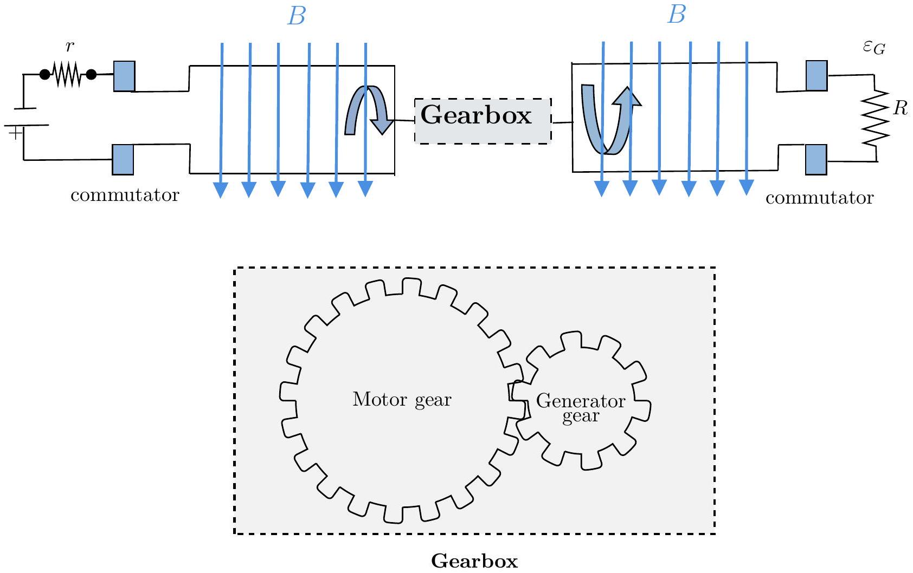

## 2. Gearminator: Rise of the Machines

We consider a "thought experiment" involving a DC motor and a DC generator coupled mechanically through a gearbox, operating under idealized conditions, to explore the power output and efficiency of the system (see schematic figure below). The schematic gearbox assembly is also shown in the figure.

Both the motor and the generator have $N$ loops of area $A$ and rotate in a uniform magnetic field of strength $B$. As usual, both the motor and the generator use commutators (indicated by the blue blocks) to reverse the direction of current in each arm every half cycle, to ensure unidirectional output. The generator is connected to an external resistance $R$, and the motor is driven by a constant voltage $V_{M}$ with an internal resistance $r$. The gearbox is idealized, with no energy loss due to friction or otherwise, and no slipping between the teeth of the gears. For a pair of meshing gears, as shown above, the angular speed ratio, also known as the gear ratio $X$, is defined as:

$$
X=\frac{\omega_{M}}{\omega_{G}},
$$

where $\omega_{M}$ and $\omega_{G}$ are the angular velocities of the motor and the generator, respectively. Let $\left\langle P_{G}\right\rangle$, and $\left\langle P_{M}\right\rangle$ be the time-averaged generator output power and the time-averaged motor input power, respectively, over one complete cycle.

(a) [ $\mathbf{6}$ marks] Derive the expression for $\omega_{G}$ in terms of $X, R, r$, and the given parameters. For fixed values of $r$ and $R$, determine the expression of $X$ for which $\omega_{G}$ is maximum.
(b) [3 marks] Derive the expression for the generator output power $\left\langle P_{G}\right\rangle$ in terms of $X, R, r$, and the given parameters. For fixed values of $r$ and $R$, determine the expression of $X$ for which $\left\langle P_{G}\right\rangle$ is maximum.
(c) [5 marks] For fixed values of $r$ and $R$, determine the condition on $X$ for which the efficiency $\eta$ is maximum, where
$$
\eta=\frac{\left\langle P_{G}\right\rangle}{\left\langle P_{M}\right\rangle} .
$$
Calculate this maximum value of $\eta$.
