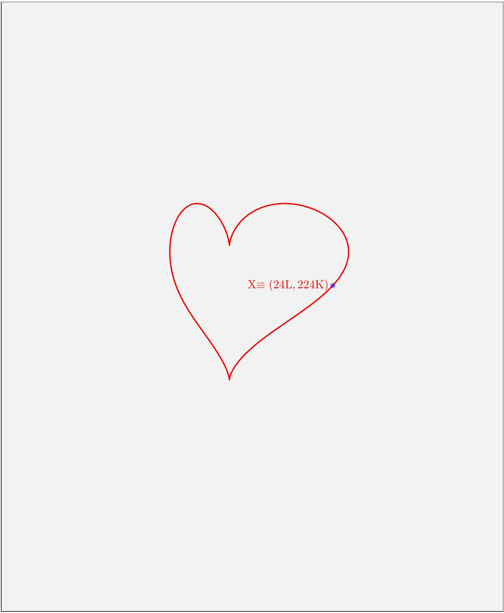

3. Love is in the air

A thermodynamic cycle is performed for one mole of an ideal monoatomic gas. The representation of this cycle is in the shape of a "heart" in the volume $(V)$ - temperature $(T)$ graph (shown as the shaded area below). However, neither of the axes are provided in the graph. The graph is drawn to scale with 1 cm along the $V$-axis representing 4 litre, and 1 cm along the $T$-axis representing 80 K.

It is given that the pressure at the point $X$ is minimum for the whole cycle, with the temperature and volume at this point being $T_{X}=224 \mathrm{~K}$ and $V_{X}=24$ litre.

(a) [13 marks] Draw both the $V$ and $T$ axes to scale in the same diagram given in the Summary Answersheet. Indicate the origin by "O". Justify your answer in the detailed answersheet. You are given one extra answer box in the answersheet, in case of any mistake in the first.
(b) [3 marks] For the axes and origin you have drawn, indicate the point(s) on the graph where the pressure is/are maximum in the cycle by ⊗ and label it as $P_{\text {max }}$ on the curve. Determine the value of the maximum pressure.
