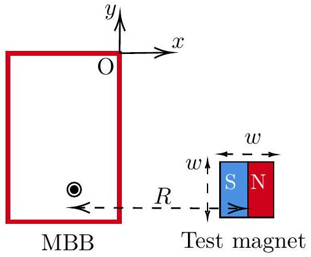
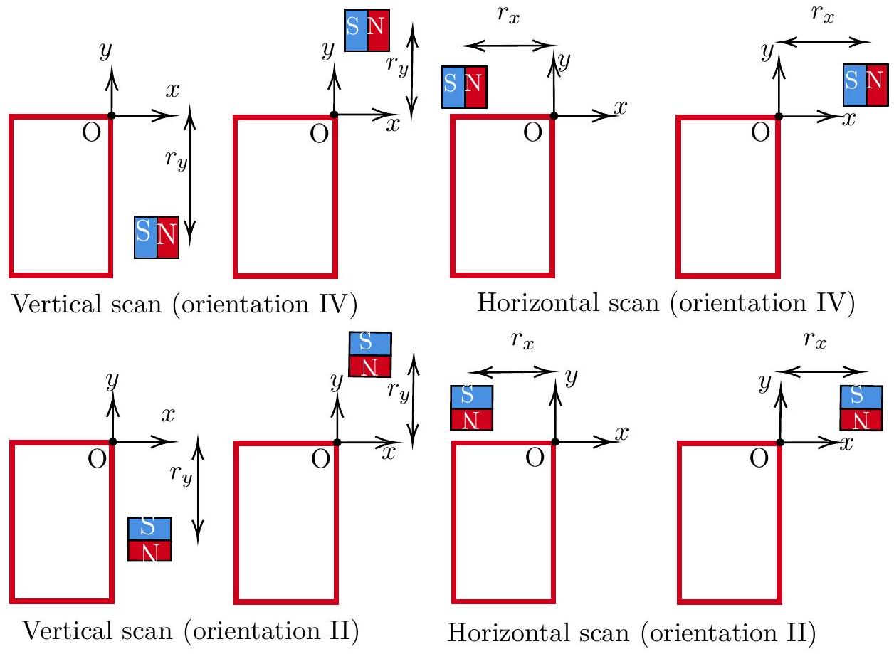
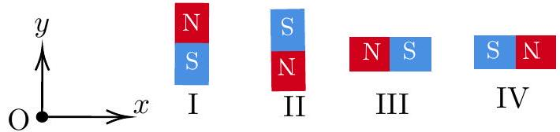
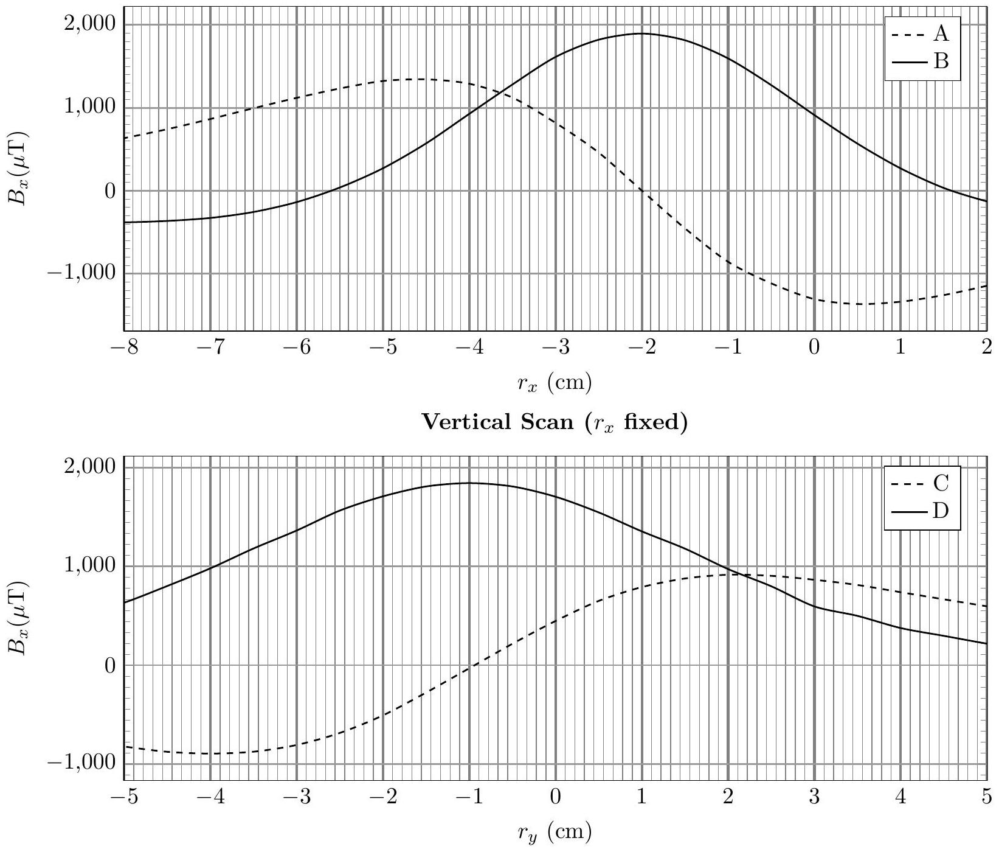
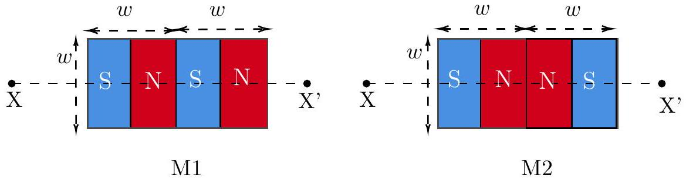
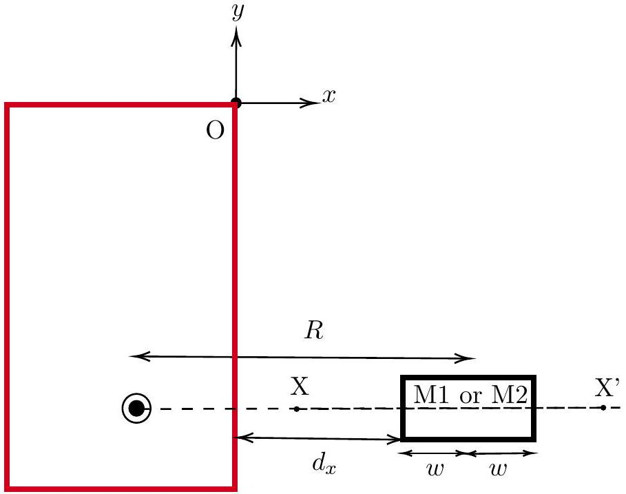

4. The Magnetic Black Box (MBB)

A magnetometer is a Hall-effect-based sensor that measures the magnetic field at its location. In the figure below, a magnetometer is located somewhere inside a closed "magnetic black box" (which we shall henceforth refer to as MBB) of negligible thickness. Fig. (1) gives a top view, where the red rectangle depicts the MBB. The plane of the rectangle is taken as the $x-y$ plane of coordinates, with the origin O taken at the top right corner. The unknown location of the magnetometer is denoted by the coordinates $\left(x_{0}, y_{0}\right)$. For example, it could be located at the
position marked by ● inside the MBB. Note that the actual location of the magnetometer inside the MBB may be different from that in the figure; this is true for all subsequent figures in this problem as well.

Figure 1: Schematic representation of the magnetic black box (MBB) and a test magnet.

The components $B_{x}, B_{y}$ and $B_{z}$ of the magnetic field measured by the magnetometer depend on the strength and the orientation of the magnetic dipole moment, of a magnet positioned nearby and the distance $R$ between the center of the magnet and the magnetometer. The effect of the Earth's magnetic field is neglected throughout this problem.

Vanya is performing an experiment using the MBB. She has to first locate the exact position of the magnetometer inside the MBB. She has a cubical test magnet of side length $w=10 \mathrm{~mm}$ (see Fig. (1)) and unknown dipole strength $\vec{P}$.
She places the MBB on a wooden table. Then she records the magnetic field values displayed by the magnetometer as the test magnet is moved either parallel to the $y$-axis while keeping $x$ fixed (vertical scan) or parallel to the $x$-axis while keeping $y$ fixed (horizontal scan) as shown in Fig. (2). The magnitudes of the distances, $r_{x}$ and $r_{y}$, measured from the center of the magnet, are also shown in the figure.

Figure 2: Some of the configurations of the vertical and horizontal scans as seen from the top. See Fig. (3) for the explanation of orientations.

For each scan, Vanya also tries different orientations of the magnet by aligning the dipole moment vector $\vec{P}$ either parallel or anti-parallel to the $y$-axis or $x$-axis. The different orientations (I to IV) are shown in Fig. (3). During the experiment, assume that the magnetometer location and the magnet's center are at the same height (i.e., their $z$-coordinates are always the same).

Figure 3: Different orientations of the test magnet

The graphs in Fig. (4) display the variation of the magnetic field $B_{x}$ for four of the vertical and horizontal scans (denoted by A, B, C, D) with certain combinations of the orientations.

Horizontal Scan ( $r_{y}$ fixed)

Figure 4

(a) [7 marks] Based on the above plots, identify which orientations (I-IV) these curves belong to. To indicate your answer, fill in the table in the answersheet. Determine the coordinates $\left(x_{0}, y_{0}\right)$ of the magnetometer's position. You must justify your answers.
(b) Vanya is given two cuboidal magnetic sets M1 and M2, each constructed using two identical cubic magnets (of side length $w=10 \mathrm{~mm}$ ). In set M1, two magnets, each of dipole moment $P^{\prime}$, are joined in an attractive configuration. In set M2, the magnets are joined in a repulsive configuration using a strong adhesive. Thus, each magnetic set has a length of $2 w$ (as shown in Fig. (5)).
Vanya aligns the central axis (XX' in Fig. (5)) of one magnetic set M1 or M2 such that the central axis passes through the magnetometer and is parallel to the $x$-axis. A representation of the setup is shown in Fig. 6. By keeping the $y$-coordinate fixed at $y_{0}$, Vanya moves the magnetic set parallel to the $x$-axis. The distance from the magnetometer to the midpoint of

Figure 5: Magnetic sets M1 and M2. Here $w=10 \mathrm{~mm}$.

Figure 6: Setup for measuring the dipole moment.

the magnetic set is $R$. For each position, she measures the distance $d_{x}$ (the distance from the face of the MBB to the nearest edge of the magnetic set) and the corresponding magnetic field component, $B_{x}$.

i. [5 marks] For the case of $R \gg w$, obtain expressions for the net magnetic field $B$ at the magnetometer due to M1 and M2 in terms of $R, w, P^{\prime}$, and other constants. You may assume that each individual magnet can be modelled as a pair of magnetic monopoles separated by a distance $w$.
ii.[10 marks] One set of Vanya's data is presented in the table below.

| $d_{x}(\mathrm{~cm})$ | $B_{x}(\mu \mathrm{~T})$ | $d_{x}(\mathrm{~cm})$ | $B_{x}(\mu \mathrm{~T})$ |
| :--- | :--- | :--- | :--- |
| 2.1 | -1359 | 3.1 | -646 |
| 2.3 | -1168 | 3.3 | -563 |
| 2.5 | -1001 | 3.5 | -493 |
| 2.7 | -855 | 3.7 | -447 |
| 2.9 | -743 | 3.9 | -398 |

Plot a suitable linear graph to analyze the data, and from the graph, identify whether the data belongs to M1 or M2. Justify your answer. From the same linear plot (or a different one), calculate $P^{\prime}$ of the individual magnets used in constructing the magnetic set.
