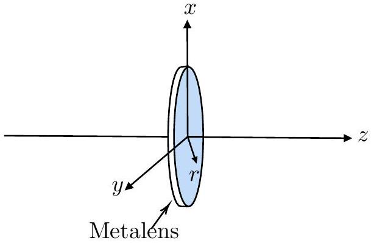
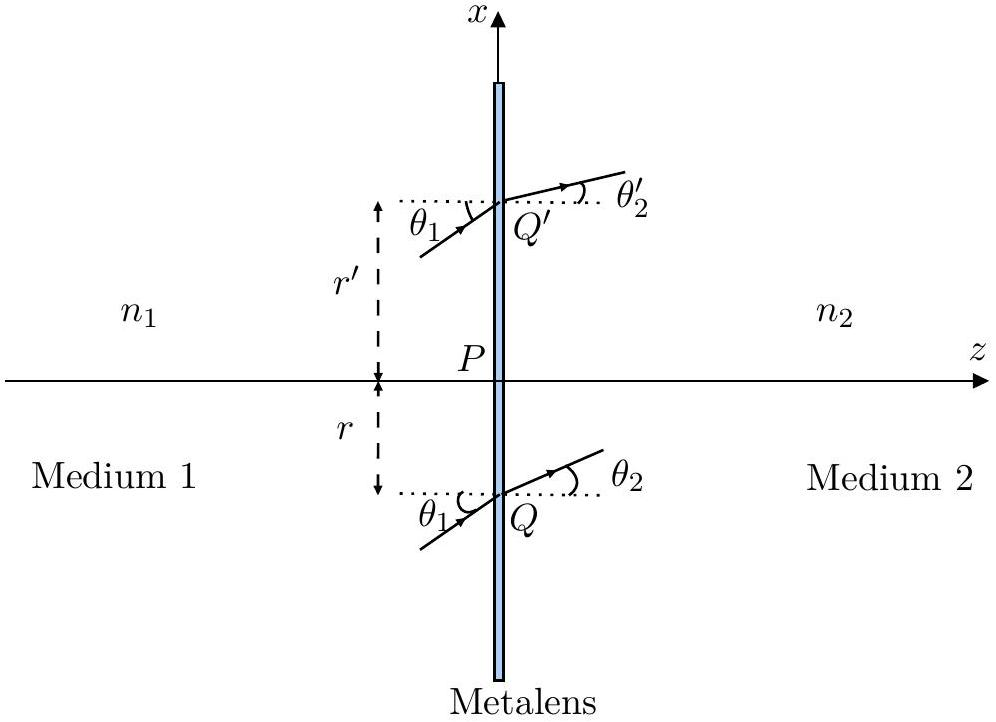
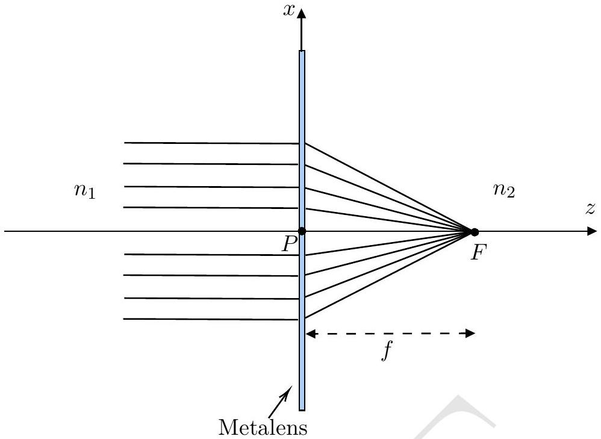
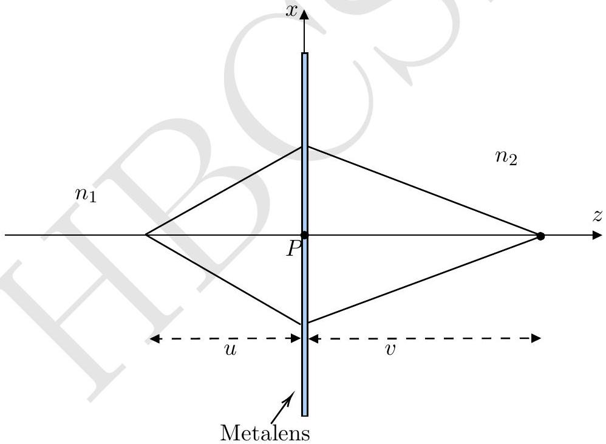

## 5. Metalens

A metasurface is a two-dimensional, ultra-thin optical structure consisting of an array of nanospaced optical nano-elements (also known as meta-atoms) on a flat surface (typically an ultra-thin glass plate). The primary function of the nano-elements is to locally introduce a phase shift $\phi(\overrightarrow{\mathbf{r}})$ to the wave, incident at position $\overrightarrow{\mathbf{r}}$. This function, $\phi(\overrightarrow{\mathbf{r}})$, is called the phase profile of the metasurface.

Metalens has a circular metasurface with a circularly symmetric phase profile function, $\phi(r)$, which depends on the distance $r$ of the point from the center of the metalens (see figure below). This type of metalens can be used for focusing incoming parallel rays to a point. Unlike normal lenses, the metalens will look just like an ultrathin circular disc.

Consider two homogeneous media of refractive indices $n_{1}$ and $n_{2}$ separated by a metalens as shown in the figure below. Suppose a beam of plane wave is incident at point $Q$ (at distance $r$ from the pole $P$ ) on the metasurface at an angle of $\theta_{1}$ from medium 1. Assume that the rays falling at $Q$ are in the plane containing $P Q$ and the axis of the lens ( $x-z$ plane). These rays will be refracted at an angle $\theta_{2}$ in the medium 2. The angle of refraction $\theta_{2}$ depends on $r$. Thus, the modified law of refraction for the metasurface can be written as

$$
n_{1} \sin \theta_{1}-n_{2} \sin \theta_{2}=f(r)
$$

Similarly, the rays falling at $Q^{\prime}$, at a distance $r^{\prime}$, will be refracted by an angle $\theta_{2}^{\prime}$.

(a) [8 marks] Find $f(r)$ in terms of $\phi(r)$ and $k_{o}$, the wave number of the incoming wave in a vacuum. To determine $f(r)$, assume two rays in $x-z$ plane incident at an angle $\theta_{1}$ at two infinitesimally close points, $r$ and $r+\Delta r$, are refracted by the same angle $\theta_{2}$. You don't need to derive the exact functional form of $\phi(r)$ for this part.

(b) [4 marks] Derive an expression for the phase profile $\phi(r)$, to convert a plane wavefront to spherical wavefront, with light being focused to a point $F$ on the axis (see figure below), which is at a distance $f$ from the pole P.

(c) [3 marks] Consider a metalens whose phase profile is obtained in part (b). For the paraxial approximation, derive an expression for the lens equation, having object distance $u$ and image distance being $v$, with focal length $f$ (see figure below).

