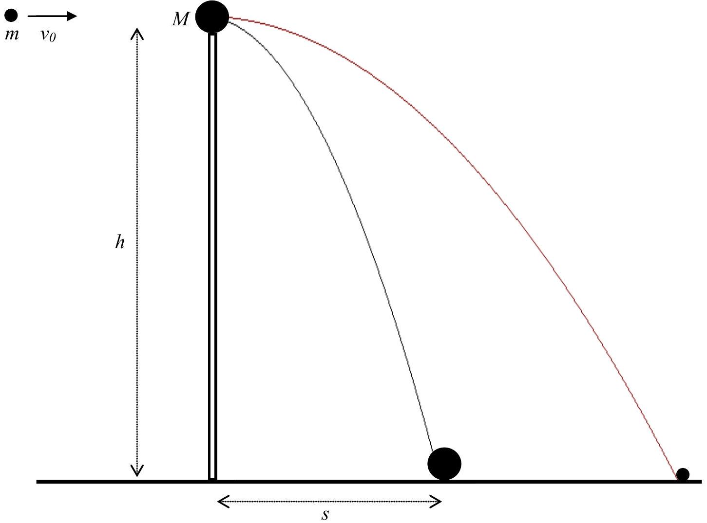
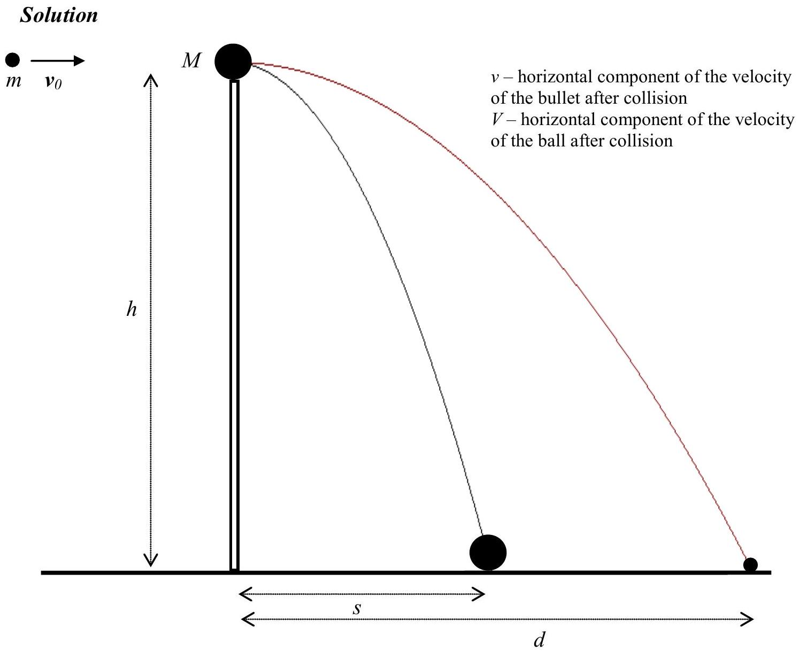

## Problem 1

A small ball with mass $M=0.2 \mathrm{~kg}$ rests on a vertical column with height $h=5 \mathrm{~m}$. A bullet with mass $m=0.01 \mathrm{~kg}$, moving with velocity $v_{0}=500 \mathrm{~m} / \mathrm{s}$, passes horizontally through the center of the ball (Fig. 1). The ball reaches the ground at a distance $s=20 \mathrm{~m}$. Where does the bullet reach the ground? What part of the kinetic energy of the bullet was converted into heat when the bullet passed trough the ball? Neglect resistance of the air. Assume that $g=10$ $\mathrm{m} / \mathrm{s}^{2}$.

Fig. 1

Fig. 2

We will use notation shown in Fig. 2.
As no horizontal force acts on the system ball + bullet, the horizontal component of momentum of this system before collision and after collision must be the same:

$$
m v_{0}=m v+M V .
$$

So,

$$
v=v_{0}-\frac{M}{m} V .
$$

From conditions described in the text of the problem it follows that

$$
v>V .
$$

After collision both the ball and the bullet continue a free motion in the gravitational field with initial horizontal velocities $v$ and $V$, respectively. Motion of the ball and motion of the bullet are continued for the same time:

$$
t=\sqrt{\frac{2 h}{g}} .
$$

It is time of free fall from height $h$.
The distances passed by the ball and bullet during time $t$ are:

$$
s=V t \quad \text { and } \quad d=v t,
$$

respectively. Thus

$$
V=s \sqrt{\frac{g}{2 h}} .
$$

Therefore

$$
v=v_{0}-\frac{M}{m} s \sqrt{\frac{g}{2 h}} .
$$

Finally:

$$
d=v_{0} \sqrt{\frac{2 h}{g}}-\frac{M}{m} s .
$$

Numerically:

$$
d=100 \mathrm{~m} .
$$

The total kinetic energy of the system was equal to the initial kinetic energy of the bullet:

$$
E_{0}=\frac{m v_{0}^{2}}{2} .
$$

Immediately after the collision the total kinetic energy of the system is equal to the sum of the kinetic energy of the bullet and the ball:

$$
E_{m}=\frac{m v^{2}}{2}, \quad E_{M}=\frac{M V^{2}}{2} .
$$

Their difference, converted into heat, was

$$
\Delta E=E_{0}-\left(E_{m}+E_{M}\right) .
$$

It is the following part of the initial kinetic energy of the bullet:

$$
p=\frac{\Delta E}{E_{0}}=1-\frac{E_{m}+E_{M}}{E_{0}} .
$$

By using expressions for energies and velocities (quoted earlier) we get

$$
p=\frac{M}{m} \frac{s^{2}}{v_{0}^{2}} \frac{g}{2 h}\left(2 \frac{v_{0}}{s} \sqrt{\frac{2 h}{g}}-\frac{M+m}{m}\right) .
$$

Numerically:

$$
p=92,8 \% .
$$
