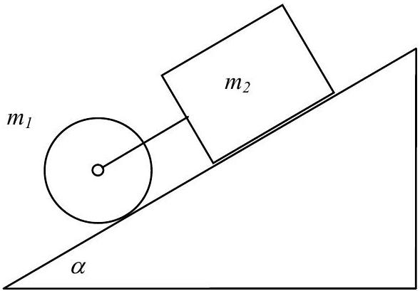
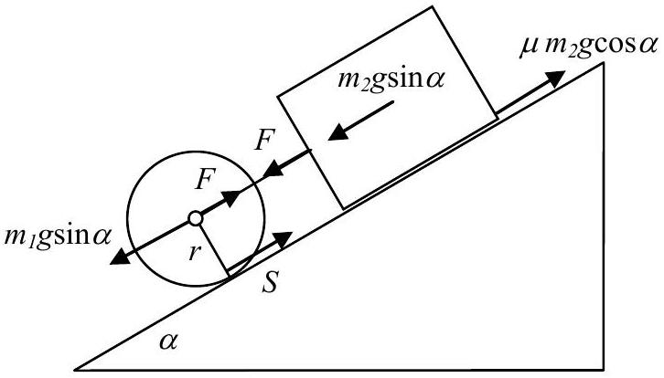

## Problem 1

On an inclined plane of $30^{\circ}$ a block, mass $m_{2}=4 \mathrm{~kg}$, is joined by a light cord to a solid cylinder, mass $m_{1}=8 \mathrm{~kg}$, radius $r=5 \mathrm{~cm}$ (Fig. 1). Find the acceleration if the bodies are released. The coefficient of friction between the block and the inclined plane $\mu=0.2$. Friction at the bearing and rolling friction are negligible.

Figure 1

Figure 2
