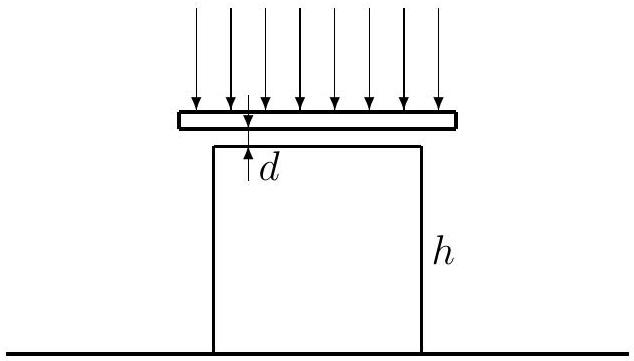

Problem 4. A glass plate is placed above a glass cube of 2 cm edges in such a way that there remains a thin air layer between them, see Figure 5.

Electromagnetic radiation of wavelength between 400 nm and 1150 nm (for which the plate is penetrable) incident perpendicular to the plate from above is reflected from both air surfaces and interferes. In this range only two wavelengths give maximum reinforcements, one of them is $\lambda=400 \mathrm{~nm}$. Find the second wavelength. Determine how it is necessary to warm up the cube so as it would touch the plate. The coefficient of linear thermal expansion is $\alpha=8.0 \cdot 10^{-6}{ }^{\circ} \mathrm{C}^{-1}$, the refractive index of the air $n=1$. The distance of the bottom of the cube from the plate does not change during warming up.

Figure 5:
