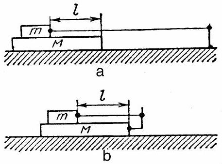
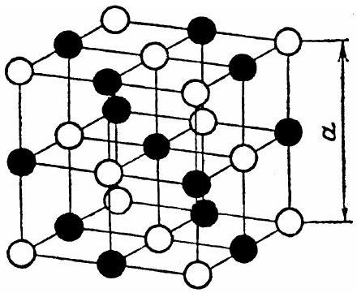

## Problem 1.

A long bar with the mass $M=1 \mathrm{~kg}$ is placed on a smooth horizontal surface of a table where it can move frictionless. A carriage equipped with a motor can slide along the upper horizontal panel of the bar, the mass of the carriage is $m=0.1 \mathrm{~kg}$. The friction coefficient of the carriage is $\mu=0.02$. The motor is winding a thread around a shaft at a constant speed $v_{0}=0.1 \mathrm{~m} / \mathrm{s}$. The other end of the thread is tied up to a rather distant stationary support in one case (Fig.1, a), whereas in the other case it is attached to a picket at the edge of the bar (Fig.1, b). While holding the bar fixed one allows the carriage to start moving at the velocity $V_{0}$ then the bar is let loose.

Fig. 1

Fig. 2

By the moment the bar is released the front edge of the carriage is at the distance $l=0.5 \mathrm{~m}$ from the front edge of the bar. For both cases find the laws of movement of both the bar and the carriage and the time during which the carriage will reach the front edge of the bar.
