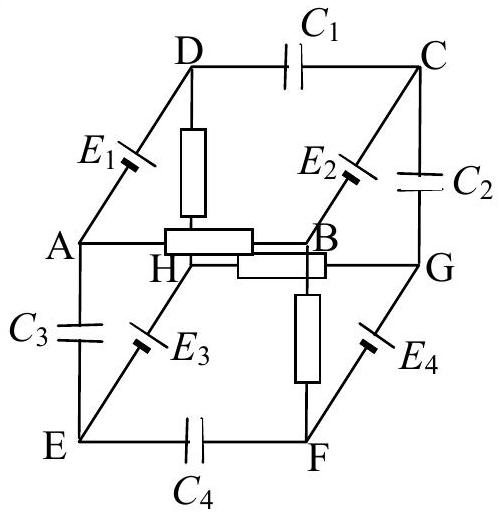

## Question 3.

Four batteries of EMF $E_{1}=4 \mathrm{~V}, E_{2}=8 \mathrm{~V}, E_{3}=12 \mathrm{~V}$, and $E_{4}=16 \mathrm{~V}$, four capacitors with the same capacitance $\mathrm{C}_{1}=C_{2}=C_{3}=C_{4}=1 \mu \mathrm{~F}$, and four equivalent resistors are connected in the circuit shown in Fig. 3. The internal resistance of the batteries is negligible.

- Calculate the total energy $W$ accumulated on the capacitors when a steady state of the system is established.
- The points H and B are short connected. Find the charge on the capacitor $C_{2}$ in the new steady state.

Fig. 3
