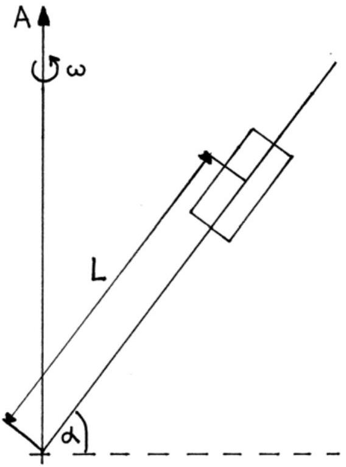

# Problems of the 8th International Physics Olympiad (Güstrow, 1975)

Gunnar Friege ${ }^{\mathbf{1}}$ \& Gunter Lind

## Introduction

The 8th International Physics Olympiad took place from the 7.7. to the 12.7. 1975 in Güstrow, in the German Democratic Republic (GDR). Altogether, 9 countries with 45 pupils participated. The teams came from Bulgaria, the German Democratic Republic, the Federal Republic of Germany (FRG), France, Poland, Rumania, Tchechoslowakia, Hungary and the USSR. The entire event took place in the pedagogic academy of Güstrow. Pupils and leaders were accommodated inside the university academy complex. On the schedule there was the competition and receptions as well as excursions to Schwerin, Rostock, and Berlin were offered. The delegation of the FRG reported of a very good organisation of the olympiad.

The problems and solutions of the 8th International Physics Olympiad were created by a commission of university physics professors and lecturers. The same commission set marking schemes and conducted the correction of the tests. The correction was carried out very quickly and was considered as righteous and, in cases of doubt, as very generous.

The main competition consisted of a 5 hour test in theory and a 4.5 hour experimental test. The time for the theoretical part was rather short and for the experimental part rather long. The problems originated from central areas of classical physics. The theoretical problems were relatively difficult, although solvable with good physics knowledge taught at school. The level of difficulty of the experimental problem was adequate. There were no additional devices necessary for the solution of the problems. Only basic formula knowledge was requested, and could be demanded from all pupils. Critics were only uttered concerning the second theoretical problem (thick lens). This problem requested relatively little physical understanding, but tested the mathematical skills and the routine in approaching problems (e.g. correct distinction of cases). However, it is also difficult to find substantial physics problems in the area of geometrical optics.

[^0]Altogether 50 points were the maximum to achieve; 30 in the theoretical test and 20 in the experimental test. The best contestant came from the USSR and had 43 points. The first prize (gold medal) was awarded with 39 points, the second prize (silver medal) with 34 points, the third prize (bronze medal) with 28 points and the fourth prize (honourable mention) with 22 points. Among the 45 contestants, 7 I. prizes, 9 II. prizes, 12 III. prizes and 8 IV. prizes were awarded, meaning that 80 \% of all contestants were awarded.

The following problem descriptions and solution are based mainly on a translation of the original German version from 1975. Because the original drafts are not well preserved, some new sketches were drawn. We also gave the problems headlines and the solutions are in more detail.

Theoretical problem 1: "Rotating rod"
A rod revolves with a constant angular velocity $\omega$ around a vertical axis A. The rod includes a fixed angle of $\pi / 2-\alpha$ with the axis. A body of mass $m$ can glide along the rod. The coefficient of friction is $\mu=\tan \beta$. The angle $\beta$ is called „friction angle“.

a) Determine the angles $\alpha$ under which the body remains at rest and under which the body is in motion if the rod is not rotating (i.e. $\omega=0$ ).
b) The rod rotates with constant angular velocity $\omega>0$. The angle $\alpha$ does not change during rotation. Find the condition for the body to remain at rest relative to the rod.

You can use the following relations:

$$
\begin{aligned}
& \sin (\alpha \pm \beta)=\sin \alpha \cdot \cos \beta \pm \cos \alpha \cdot \sin \beta \\
& \cos (\alpha \pm \beta)=\cos \alpha \cdot \cos \beta \mp \sin \alpha \cdot \sin \beta
\end{aligned}
$$
