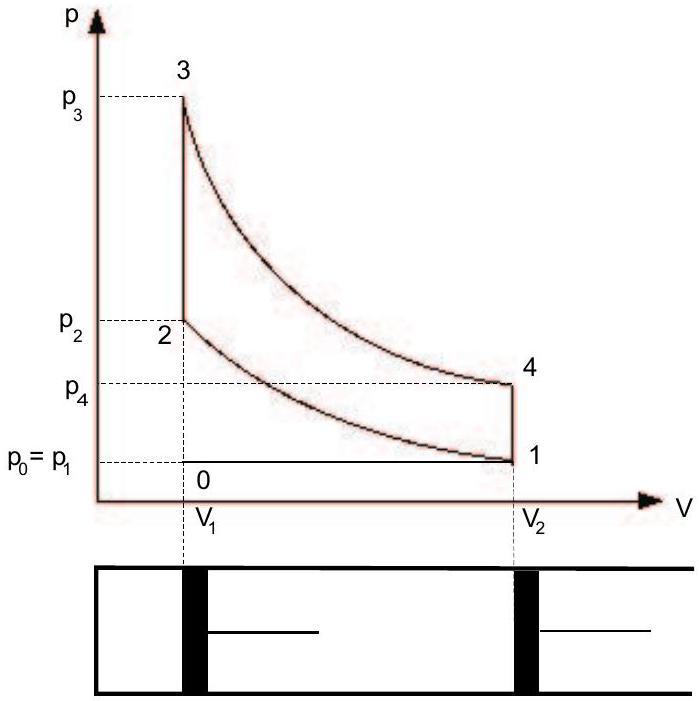

Problem 1. The compression ratio of a four-stroke internal combustion engine is $\varepsilon=9.5$. The engine draws in air and gaseous fuel at a temperature 27 °C at a pressure 1 atm = 100 kPa. Compression follows an adiabatic process from point 1 to point 2, see Fig. 1. The pressure in the cylinder is doubled during the mixture ignition (2-3). The hot exhaust gas expands adiabatically to the volume $V_{2}$ pushing the piston downwards (3-4). Then the exhaust valve opens and the pressure gets back to the initial value of 1 atm. All processes in the cylinder are supposed to be ideal. The Poisson constant (i.e. the ratio of specific heats $C_{p} / C_{V}$ ) for the mixture and exhaust gas is $\kappa=1.40$. (The compression ratio is the ratio of the volume of the cylinder when the piston is at the bottom to the volume when the piston is at the top.)

Figure 1:

a) Which processes run between the points 0-1, 2-3, 4-1, 1-0?
b) Determine the pressure and the temperature in the states 1, 2, 3 and 4.
c) Find the thermal efficiency of the cycle.
d) Discuss obtained results. Are they realistic?

Solution: a) The description of the processes between particular points is the following:

| 0-1 : | intake stroke | isobaric and isothermal process |
| :--- | :--- | :--- |
| 1-2 : | compression of the mixture | adiabatic process |
| 2-3 : | mixture ignition | isochoric process |
| 3-4 : | expansion of the exhaust gas | adiabatic process |
| 4-1 : | exhaust | isochoric process |
| 1-0 : | exhaust | isobaric process |

Let us denote the initial volume of the cylinder before induction at the point 0 by $V_{1}$, after induction at the point 1 by $V_{2}$ and the temperatures at the particular points by $T_{0}, T_{1}, T_{2}, T_{3}$ and $T_{4}$.

b) The equations for particular processes are as follows.

0-1 : The fuel-air mixture is drawn into the cylinder at the temperature of $T_{0}=T_{1}=300 \mathrm{~K}$ and a pressure of $p_{0}=p_{1}=0.10 \mathrm{MPa}$.

1-2 : Since the compression is very fast, one can suppose the process to be adiabatic. Hence:

$$
p_{1} V_{2}^{\kappa}=p_{2} V_{1}^{\kappa} \quad \text { and } \quad \frac{p_{1} V_{2}}{T_{1}}=\frac{p_{2} V_{1}}{T_{2}} .
$$

From the first equation one obtains

$$
p_{2}=p_{1}\left(\frac{V_{2}}{V_{1}}\right)^{\kappa}=p_{1} \varepsilon^{\kappa}
$$

and by the dividing of both equations we arrive after a straightforward calculation at

$$
T_{1} V_{2}^{\kappa-1}=T_{2} V_{1}^{\kappa-1}, \quad T_{2}=T_{1}\left(\frac{V_{2}}{V_{1}}\right)^{\kappa-1}=T_{1} \varepsilon^{\kappa-1} .
$$

For given values $\kappa=1.40, \varepsilon=9.5, p_{1}=0.10 \mathrm{MPa}, T_{1}=300 \mathrm{~K}$ we have $p_{2}=2.34 \mathrm{MPa}$ and $T_{2}=738 \mathrm{~K}\left(t_{2}=465^{\circ} \mathrm{C}\right)$.

2-3 : Because the process is isochoric and $p_{3}=2 p_{2}$ holds true, we can write
$$
\frac{p_{3}}{p_{2}}=\frac{T_{3}}{T_{2}}, \quad \text { which implies } \quad T_{3}=T_{2} \frac{p_{3}}{p_{2}}=2 T_{2} .
$$
Numerically, $p_{3}=4.68 \mathrm{MPa}, T_{3}=1476 \mathrm{~K}\left(t_{3}=1203^{\circ} \mathrm{C}\right)$.
3-4 : The expansion is adiabatic, therefore
$$
p_{3} V_{1}^{\kappa}=p_{4} V_{2}^{\kappa}, \quad \frac{p_{3} V_{1}}{T_{3}}=\frac{p_{4} V_{2}}{T_{4}} .
$$
The first equation gives
$$
p_{4}=p_{3}\left(\frac{V_{1}}{V_{2}}\right)^{\kappa}=2 p_{2} \varepsilon^{-\kappa}=2 p_{1}
$$
and by dividing we get
$$
T_{3} V_{1}^{\kappa-1}=T_{4} V_{2}^{\kappa-1}
$$
Consequently,
$$
T_{4}=T_{3} \varepsilon^{1-\kappa}=2 T_{2} \varepsilon^{1-\kappa}=2 T_{1} .
$$
Numerical results: $p_{4}=0.20 \mathrm{MPa}, T_{3}=600 \mathrm{~K}\left(t_{3}=327^{\circ} \mathrm{C}\right)$.
4-1 : The process is isochoric. Denoting the temperature by $T_{1}^{\prime}$ we can write
$$
\frac{p_{4}}{p_{1}}=\frac{T_{4}}{T_{1}^{\prime}},
$$
which yields
$$
T_{1}^{\prime}=T_{4} \frac{p_{1}}{p_{4}}=\frac{T_{4}}{2}=T_{1} .
$$
We have thus obtained the correct result $T_{1}^{\prime}=T_{1}$. Numerically, $p_{1}=$ 0.10 MPa, $T_{1}^{\prime}=300 \mathrm{~K}$.
c) Thermal efficiency of the engine is defined as the proportion of the heat supplied that is converted to net work. The exhaust gas does work on the piston during the expansion 3-4, on the other hand, the work is done on the mixture during the compression 1-2. No work is done by/on the gas during the processes 2-3 and 4-1. The heat is supplied to the gas during the process 2-3.

The net work done by 1 mol of the gas is

$$
W=\frac{R}{\kappa-1}\left(T_{1}-T_{2}\right)+\frac{R}{\kappa-1}\left(T_{3}-T_{4}\right)=\frac{R}{\kappa-1}\left(T_{1}-T_{2}+T_{3}-T_{4}\right)
$$

and the heat supplied to the gas is

$$
Q_{23}=C_{V}\left(T_{3}-T_{2}\right) .
$$

Hence, we have for thermal efficiency

$$
\eta=\frac{W}{Q_{23}}=\frac{R}{(\kappa-1) C_{V}} \frac{T_{1}-T_{2}+T_{3}-T_{4}}{T_{3}-T_{2}} .
$$

Since

$$
\frac{R}{(\kappa-1) C_{V}}=\frac{C_{p}-C_{V}}{(\kappa-1) C_{V}}=\frac{\kappa-1}{\kappa-1}=1,
$$

we obtain

$$
\eta=1-\frac{T_{4}-T_{1}}{T_{3}-T_{2}}=1-\frac{T_{1}}{T_{2}}=1-\varepsilon^{1-\kappa} .
$$

Numerically, $\eta=1-300 / 738=1-0.407, \eta=59,3 \%$.
d) Actually, the real $p V$-diagram of the cycle is smooth, without the sharp angles. Since the gas is not ideal, the real efficiency would be lower than the calculated one.
