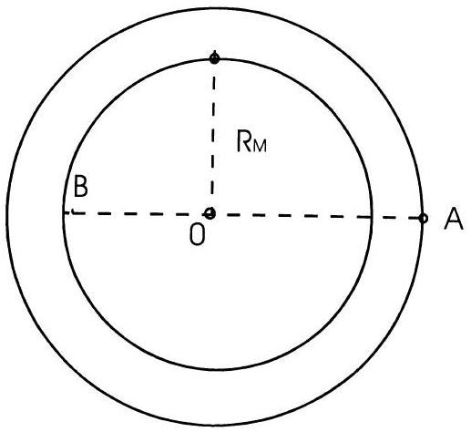
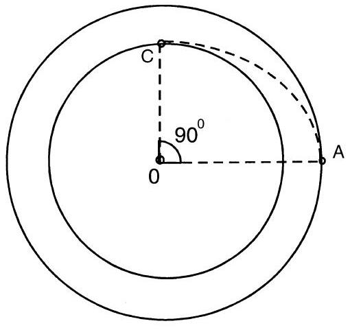

## Problem 1.

A space rocket with mass $M=12 \mathrm{t}$ is moving around the Moon along the circular orbit at the height of $h=100 \mathrm{~km}$. The engine is activated for a short time to pass at the lunar landing orbit. The velocity of the ejected gases $\mathrm{u}=10^{4} \mathrm{~m} / \mathrm{s}$. The Moon radius $R_{M}=1,7 \cdot 10^{3} \mathrm{~km}$, the acceleration of gravity near the Moon surface $g_{M}=1.7 \mathrm{~m} / \mathrm{s}^{2}$

Fig. 1

Fig. 2

1). What amount of fuel should be spent so that when activating the braking engine at point A of the trajectory, the rocket would land on the Moon at point B (Fig.1)?
2 ). In the second scenario of landing, at point A the rocket is given an impulse directed towards the center of the Moon, to put the rocket to the orbit meeting the Moon surface at point C (Fig.2). What amount of fuel is needed in this case?
