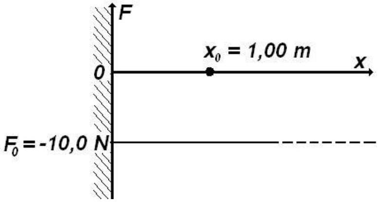
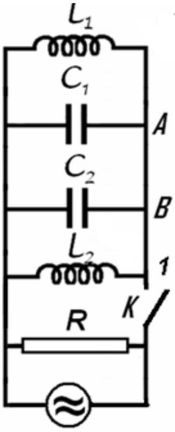
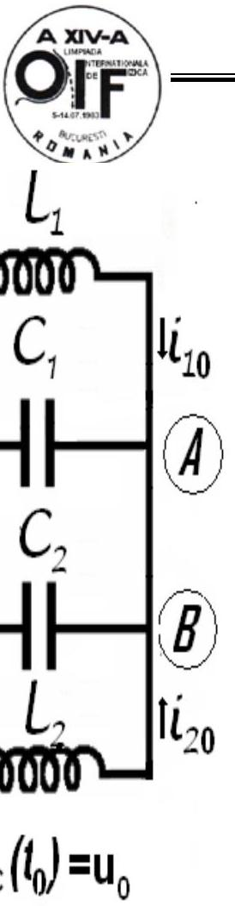
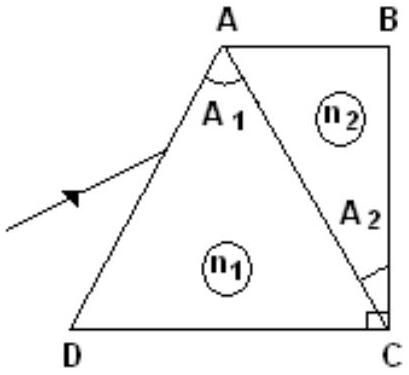

## Mechanics - Problem I (8 points)   Jumping particle

A particle moves along the positive axis $O x$ (one-dimensional situation) under a force that's projection on $O x$ is $F_{x}=F_{0}$ as represented in the figure below (as function of $x$ ). At the origin of $O x$ axis is placed a perfectly reflecting wall.
A friction force of constant modulus $F_{f}=1,00 \mathrm{~N}$ acts anywhere the particle is situated.
The particle starts from the point $x=x_{0}=1,00 \mathrm{~m}$ having the kinetic energy $E_{c}=10,0 \mathrm{~J}$.

a. Find the length of the path of the particle before it comes to a final stop
b. Sketch the potential energy $U(x)$ of the particle in the force field $F_{x}$.
c. Draw qualitatively the dependence of the particle speed as function of his coordinate $x$.

## Electricity - Problem II (8 points)

## Different kind of oscillation

Let's consider the electric circuit in the figure, for which $L_{1}=10 m H$, $L_{2}=20 m H, C_{1}=10 n F, C_{2}=5 n F$ and $R=100 k \Omega$. The switch $K$ being closed the circuit is coupled with a source of alternating current. The current furnished by the source has constant intensity while the frequency of the current may be varied.

a. Find the ratio of frequency $f_{m}$ for which the active power in circuit has the maximum value $P_{m}$ and the frequency difference $\Delta f=f_{+}-f_{-}$of the frequencies $f_{+}$and $f_{-}$for which the active power in the circuit is half of the maximum power $P_{m}$.

The switch $K$ is now open. In the moment $t_{0}$ immediately after the switch

is open the intensities of the currents in the coils $L_{1}$ and $i_{01}=0,1 \mathrm{~A}$ and
$i_{02}=0,2 A L_{1}$ (the currents flow as in the figure); at the same moment, the potential difference on the capacitor with capacity $C_{1}$ is $u_{0}=40 \mathrm{~V}$ :

b. Calculate the frequency of electromagnetic oscillation in $L_{1} C_{1} C_{2} L_{2}$ circuit;
c. Determine the intensity of the electric current in the $A B$ conductor;
d. Calculate the amplitude of the oscillation of the intensity of electric current in the coil $L_{1}$.

Neglect the mutual induction of the coils, and the electric resistance of the conductors. Neglect the fast transition phenomena occurring when the switch is closed or opened.

## Optics - Problem III (7points)

## Prisms

Two dispersive prisms having apex angles $\hat{A}_{1}=60^{\circ}$ and $\hat{A}_{2}=30^{\circ}$ are glued as in the figure below ( $\hat{C}=90^{\circ}$ ). The dependences of refraction indexes of the prisms on the wavelength are given by the relations

$$
\begin{aligned}
& n_{1}(\lambda)=a_{1}+\frac{b_{1}}{\lambda^{2}} ; \\
& n_{2}(\lambda)=a_{2}+\frac{b_{2}}{\lambda^{2}}
\end{aligned}
$$

were

$$
a_{1}=1,1, \quad b_{1}=1 \cdot 10^{5} n m^{2}, \quad a_{2}=1,3, \quad b_{2}=5 \cdot 10^{4} n m^{2} .
$$

a. Determine the wavelength $\lambda_{0}$ of the incident radiation that pass through the prisms without refraction on $A C$ face at any incident angle; determine the corresponding refraction indexes of the prisms.
b. Draw the ray path in the system of prisms for three different radiations $\lambda_{\text {red }}, \lambda_{0}, \lambda_{\text {violet }}$ incident on the system at the same angle.
c. Determine the minimum deviation angle in the system for a ray having the wavelength $\lambda_{0}$.
d. Calculate the wavelength of the ray that penetrates and exits the system along directions parallel to DC.

## Compton scattering

A photon of wavelength $\lambda_{i}$ is scattered by a moving, free electron. As a result the electron stops and the resulting photon of wavelength $\lambda_{0}$ scattered at an angle $\theta=60^{\circ}$ with respect to the direction of the incident photon, is again scattered by a second free electron at rest. In this second scattering process a photon with wavelength of $\lambda_{f}=1,25 \times 10^{-10} \mathrm{~m}$ emerges at an angle $\theta=60^{\circ}$ with respect to the direction of the photon of wavelength $\lambda_{0}$. Find the de Broglie wavelength for the first electron before the interaction. The following constants are known:
$h=6,6 \times 10^{-34} J \cdot s$ - Planck's constant
$m=9,1 \times 10^{-31} k g$ - mass oh the electron
$c=3,0 \times 10^{8} m / s$ - speed of light in vacuum

The purpose of the problem is to calculate the values of the speed, momentum and wavelength of the first electron.

To characterize the photons the following notation are used:

Table 4.1
|  | initial photon | photon after the first scattering | final photon |
| :--- | :--- | :--- | :--- |
| momentum | $\vec{p}_{i}$ | $\vec{p}_{0}$ | $\vec{p}_{f}$ |
| energy | $E_{i}$ | $E_{0}$ | $E_{f}$ |
| wavelength | $\lambda_{i}$ | $\lambda_{i}$ | $\lambda_{f}$ |

To characterize the electrons one uses

Table 4.2
|  | first electron before collision | first electron after collision | second electron before collision | Second electron after collision |
| :--- | :--- | :--- | :--- | :--- |
| momentum | $\vec{p}_{1 e}$ | 0 | 0 | $\vec{p}_{2 e}$ |
| energy | $E_{1 e}$ | $E_{0 e}$ | $E_{0 e}$ | $E_{2 e}$ |
| speed | $\vec{V}_{1 e}$ | 0 | 0 | $\vec{V}_{2 e}$ |

## IPhO's LOGO - Problem V

The Logo of the International Physics Olympiad is represented in the figure below.
The figure presents the phenomenon of the curving of the trajectory of a jet of fluid around the shape of a cylindrical surface. The trajectory of fluid is not like the expected dashed line but as the circular solid line.
Qualitatively explain this phenomenon (first observed by Romanian engineer Henry Coanda in 1936).
This problem will be not considered in the general score of the Olympiad. The best solution will be awarded a special prize.

