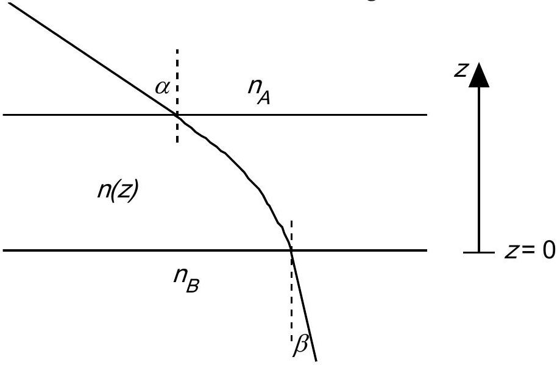

Problem 1

a) Consider a plane-parallel transparent plate, where the refractive index, $n$, varies with distance, $z$, from the lower surface (see figure). Show that $n_{A} \sin \alpha=n_{B} \sin \beta$. The notation is that of the figure.

b) Assume that you are standing in a large flat desert. At some distance you see what appears to be a water surface. When you approach the "water" is seems to move away such that the distance to the "water" is always constant. Explain the phenomenon.
c) Compute the temperature of the air close to the ground in b) assuming that your eyes are located 1.60 m above the ground and that the distance to the "water" is 250 m. The refractive index of the air at 15 °C and at normal air pressure (101.3 kPa) is 1.000276. The temperature of the air more than 1 m above the ground is assumed to be constant and equal to 30 °C. The atmospheric pressure is assumed to be normal. The refractive index, $n$, is such that $n-1$ is proportional to the density of the air. Discuss the accuracy of your result.
