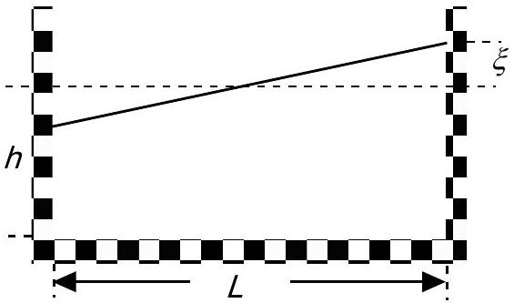
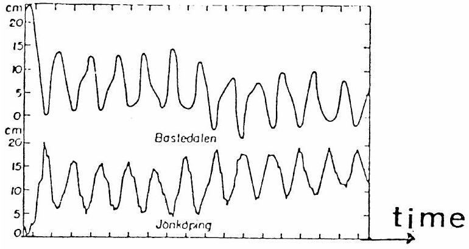

## Problem 2

In certain lakes there is a strange phenomenon called "seiching" which is an oscillation of the water. Lakes in which you can see this phenomenon are normally long compared with the depth and also narrow. It is natural to see waves in a lake but not

something like the seiching, where the entire water volume oscillates, like the coffee in a cup that you carry to a waiting guest.

In order to create a model of the seiching we look at water in a rectangular container. The length of the container is $L$ and the depth of the water is $h$. Assume that the surface of the water to begin with makes a small angle with the horizontal. The seiching will then start, and we assume that the water surface continues to be plane but oscillates around an axis in the horizontal plane and located in the middle of the container.

Create a model of the movement of the water and derive a formula for the oscillation period $T$. The starting conditions are given in figure above. Assume that $\xi \ll h$. The table below shows experimental oscillation periods for different water depths in two containers of different lengths. Check in some reasonable way how well the formula that you have derived agrees with the experimental data. Give your opinion on the quality of your model.

Table 1. $L=479 \mathrm{~mm}$
| $h m m$ | 30 | 50 | 69 | 88 | 107 | 124 | 142 |
| :--- | :--- | :--- | :--- | :--- | :--- | :--- | :--- |
| $T / s$ | 1.78 | 1.40 | 1.18 | 1.08 | 1.00 | 0.91 | 0.82 |

Table 2. $L=143 \mathrm{~mm}$
| $h m m$ | 31 | 38 | 58 | 67 | 124 |
| :--- | :--- | :--- | :--- | :--- | :--- |
| $T / s$ | 0.52 | 0.52 | 0.43 | 0.35 | 0.28 |

The graph below shows results from measurements in lake Vättern in Sweden. This lake has a length of 123 km and a mean depth of 50 m . What is the time scale in the graph?

The water surface level in Bastudalen (northern end of lake Vättern) and Jönköping (southern end).
