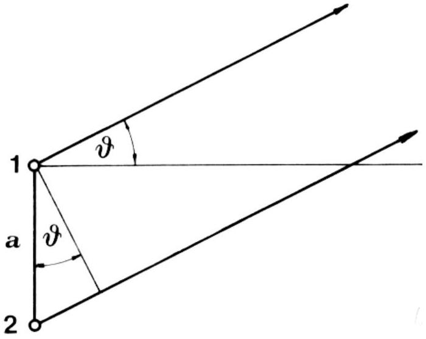

## Problem 1

a) Let the electrical signals supplied to rods 1 and 2 be $E_{1}=E_{0} \cos \omega t$ and $E_{2}=E_{0} \cos (\omega t+\delta)$, respectively. The condition for a maximum signal in direction $\vartheta_{A}$ (Fig. 4) is:

$$
\frac{2 \pi a}{\lambda} \sin \vartheta_{A}-\delta=2 \pi N
$$

and the condition for a minimum signal in direction $\vartheta_{B}$ :

$$
\frac{2 \pi a}{\lambda} \sin \vartheta_{B}-\delta=2 \pi N^{\prime}+\pi
$$

where $N$ and $N^{\prime}$ are arbitrary integers. In addition, $\mathcal{9}_{A}-\mathcal{9}_{B}=\varphi$, where

Fig. 4

$\varphi$ is given. The problem can now be formulated as follows: Find the parameters $a, \mathcal{9}_{A}, \mathcal{9}_{B}, \delta, N$, and $N^{\prime}$ satisfying the above equations such, that $a$ is minimum.
We first eliminate $\delta$ by subtracting the second equation from the first one:

$$
a \sin \vartheta_{A}-a \sin \vartheta_{B}=\lambda\left(N-N^{\prime}-\frac{1}{2}\right) .
$$

Using the sine addition theorem and the relation $\vartheta_{B}=\vartheta_{A}-\varphi$ :

$$
2 a \cos \left(\mathcal{Y}_{A}-\frac{1}{2} \varphi\right) \sin \frac{1}{2} \varphi=\lambda\left(N-N^{\prime}-\frac{1}{2}\right)
$$

or

$$
a=\frac{\lambda\left(N-N^{\prime}-\frac{1}{2}\right)}{2 \cos \left(\vartheta_{A}-\frac{1}{2} \varphi\right) \sin \frac{1}{2} \varphi} .
$$

The minimum of $a$ is obtained for the greatest possible value of the denominator, i. e.:

$$
\cos \left(\vartheta_{A}-\frac{1}{2} \varphi\right)=1, \quad \vartheta_{A}=\frac{1}{2} \varphi,
$$

and the minimum value of the numerator, i. e.:

$$
N-N^{\prime}=1 .
$$

The solution is therefore:

$$
a=\frac{\lambda}{4 \sin \frac{1}{2} \varphi}, \quad \mathcal{g}_{A}=\frac{1}{2} \varphi, \quad \mathcal{g}_{B}=-\frac{1}{2} \varphi \quad \text { and } \quad \delta=\frac{1}{2} \pi-2 \pi N .
$$

( $\mathrm{N}=0$ can be assumed throughout without loosing any physically relevant solution.)
b) The wavelength $\lambda=c / v=11.1 \mathrm{~m}$, and the angle between directions A and $\mathrm{B}, \varphi=157^{\circ}-72^{\circ}=85^{\circ}$. The minimum distance between the rods is $a=4.1 \mathrm{~m}$, while the direction of the symmetry line of the rods is 72° + 42.5° = 114.5° measured from the north.
