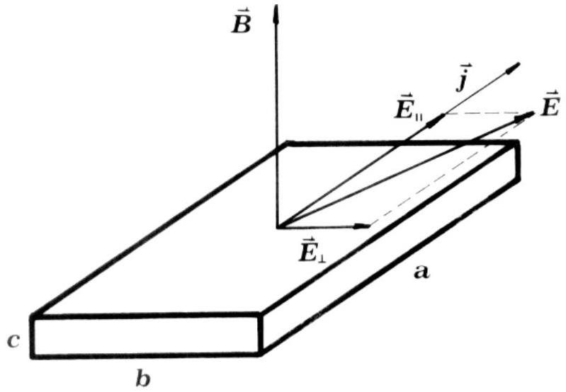
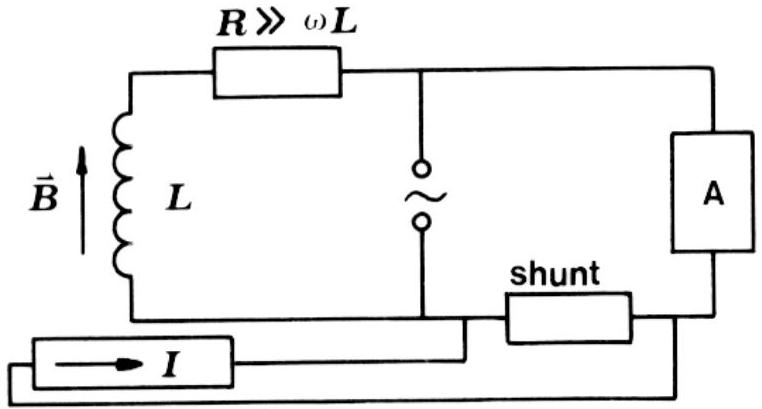

## Problem 2

a) First the electron velocity is calculated from the current I:

$$
I=j S=n e_{0} v b c, \quad v=\frac{I}{n e_{0} b c}=25 \mathrm{~m} / \mathrm{s} .
$$

The components of the electric field are obtained from the electron velocity. The component in the direction of the current is

$$
E_{\|}=\frac{v}{\mu}=3.2 \mathrm{~V} / \mathrm{m} .
$$

The component of the electric field in the direction $b$ is equal to the Lorentz force on the electron divided by its charge:

$$
E_{\perp}=v B=2.5 \mathrm{~V} / \mathrm{m} .
$$

The magnitude of the electric field is

$$
E=\sqrt{E_{\|}^{2}+E_{\perp}^{2}}=4.06 \mathrm{~V} / \mathrm{m} .
$$

while its direction is shown in Fig. 5 (Note that the electron velocity is in the opposite direction with respect to the current.)

Fig. 5

b) The potential difference is

$$
U_{H}=E_{\perp} b=25 \mathrm{mV}
$$

c) The potential difference $U_{H}$ is now time dependent:
$$
U_{H}=\frac{I B b}{n e_{0} b c}=\frac{I_{0} B_{0}}{n e_{0} c} \sin \omega t \sin (\omega t+\delta) .
$$

The DC component of $U_{H}$ is

$$
\bar{U}_{H}=\frac{I_{0} B_{0}}{2 n e_{0} c} \cos \delta .
$$

d)A possible experimental setup is-shown in Fig. 6

Fig. 6
