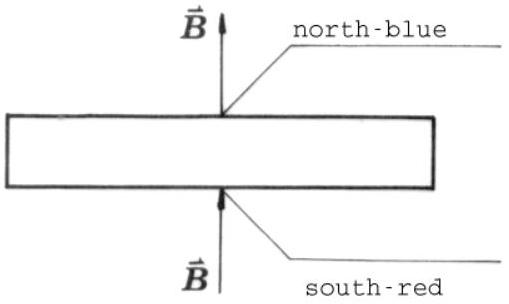
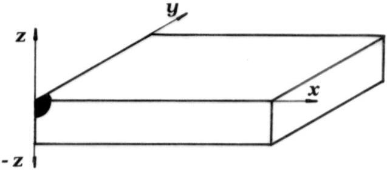
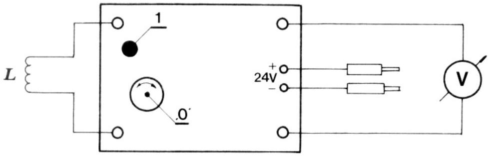

## Problem 3

In a space research project two schemes of launching a space probe out of the Solar system are discussed. The first scheme (i) is to launch the probe with a velocity large enough to escape from the Solar system directly. According to the second one (ii), the probe is to approach one of the outer planets, and with its help change its direction of motion and reach the velocity necessary to escape from the Solar system. Assume that the probe moves under the gravitational field of only the Sun or the planet, depending on whichever field is stronger at that point.

a) Determine the minimum velocity and its direction relative to the Earth's motion that should be given to the probe on launching according to scheme (i).
b) Suppose that the probe has been launched in the direction determined in a) but with another velocity. Determine the velocity of the probe when it crosses the orbit of Mars, i. e., its parallel and perpendicular components with respect to this orbit. Mars is not near the point of crossing, when crossing occurs.
c) Let the probe enter the gravitational field of Mars. Find the minimum launching velocity from the Earth necessary for the probe to escape from the Solar system.
Hint: From the result a) you know the optimal magnitude and the direction of the velocity of the probe that is necessary to escape from the Solar system after leaving the gravitational field of Mars. (You do not have to worry about the precise position of Mars during the encounter.) Find the relation between this velocity and the velocity components before the probe enters the gravitational field of Mars; i. e., the components you determined in b). What about the conservation of energy of the probe?
d) Estimate the maximum possible fractional saving of energy in scheme (ii) with respect to scheme (i). Notes: Assume that all the planets revolve round the Sun in circles, in the same direction and in the same plane. Neglect the air resistance, the rotation of the Earth around its axis as well as the energy used in escaping from the Earth's gravitational field.

Data: Velocity of the Earth round the Sun is 30 km/s, and the ratio of the distances of the Earth and Mars from the Sun is 2/3.

### 1.2 Experimental competition

## Exercise A

Follow the acceleration and the deceleration of a brass disk, driven by an AC electric motor. From the measured times of half turns, plot the angle, angular velocity and angular acceleration of the disk as functions of time. Determine the torque and power of the motor as functions of angular velocity.

## Instrumentation

1. AC motor with switch and brass disk
2. Induction sensor
3. Multichannel stop-watch (computer)

## Instruction

The induction sensor senses the iron pegs, mounted on the disk, when they are closer than 0.5 mm and sends a signal to the stop-watch. The stop-watch is programmed on a computer so that it registers the time at which the sensor senses the approaching peg and stores it in memory. You run the stop-watch by giving it simple numerical commands, i. e. pressing one of the following numbers:

5 - MEASURE.
The measurement does not start immediately. The stop-watch waits until you specify the number of measurements, that is, the number of successive detections of the pegs:
3-30 measurements
6-60 measurements
Either of these commands starts the measurement. When a measurement is completed, the computer displays the results in graphic form. The vertical axis represents the length of the interval between detection of the pegs and the horizontal axis is the number of the interval.

7 - display results in numeric form.
The first column is the number of times a peg has passed the detector, the second is the time elapsed from the beginning of the measurement and the third column is the length of the time interval between the detection of the two pegs.
In the case of 60 measurements:
8 - displays the first page of the table
2 - displays the second page of the table
4 - displays the results graphically.

A measurement can be interrupted before the prescribed number of measurements by pressing any key and giving the disk another half turn.
The motor runs on 25 V AC. You start it with a switch on the mounting base. It may sometimes be necessary to give the disk a light push or to tap the base plate to start the disk.
The total moment of inertia of all the rotating parts is: $(14.0 \pm 0.5) \cdot$ $10^{-6} \mathrm{kgm}^{2}$.

## Exercise B

Locate the position of the centers and determine the orientations of a number of identical permanent magnets hidden in the black painted block. A diagram of one such magnet is given in Figure 1. The coordinates $x, y$ and $z$ should be measured from the red corner point, as indicated in Figure 2.
Determine the $z$ component of the magnetic induction vector $\vec{B}$ in the $(x, y)$ plane at $z=0$ by calibrating the measuring system beforehand.
Find the greatest magnetic induction $B$ obtainable from the magnet supplied.

## Instrumentation

1. Permanent magnet given is identical to the hidden magnets in the block.
2. Induction coil; 1400 turns, $R=230 \Omega$

Fig. 1

Fig. 2

3. Field generating coils, 8800 turns, $R=990 \Omega$, 2 pieces
4. Black painted block with hidden magnets
5. Voltmeter (ranges 1 V, 3 V and 10 V recommended)
6. Electronic circuit (recommended supply voltage 24 V)
7. Ammeter
8. Variable resistor $3.3 \mathrm{k} \Omega$
9. Variable stabilized power supply 0-25 V, with current limiter
10. Four connecting wires
11. Supporting plate with fixing holes
12. Rubber bands, multipurpose (e. g. for coil fixing)
13. Tooth picks
14. Ruler
15. Thread

## Instructions

For the magnet-search only nondestructive methods are acceptable. The final report should include results, formulae, graphs and diagrams. The diagrams should be used instead of comments on the methods used wherever possible.
The proper use of the induced voltage measuring system is shown in Figure 3.

This device is capable of responding to the magnetic field. The peak voltage is proportional to the change of the magnetic flux through the coil.
The variable stabilized power supply is switched ON (1) or OFF (0) by the lower left pushbutton. By the (U) knob the output voltage is increased through the clockwise rotation. The recommended voltage is 24 V. Therefore switch the corresponding toggle switch to the 12 V - 25 V position. With this instrument either the output voltage $U$ or the output current $I$ is measured, with respect to the position of the corresponding toggle switch (V,A). However, to get the output voltage the upper right switch should be in the 'Vklop' position. By the knob (I) the output current is limited bellow the preset value. When rotated clockwise the power supply can provide 1.5 A at most.

Fig. 3 '0' zero adjust dial, '1' push reset button

Note: permeability of empty space $\mu_{0}=1.2 \cdot 10^{-6} \mathrm{Vs} / \mathrm{Am}$.

## 2 Solutions

### 2.1 Theoretical competition
