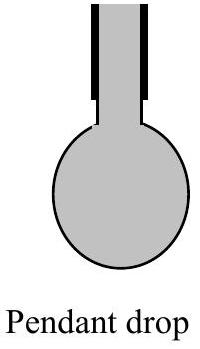
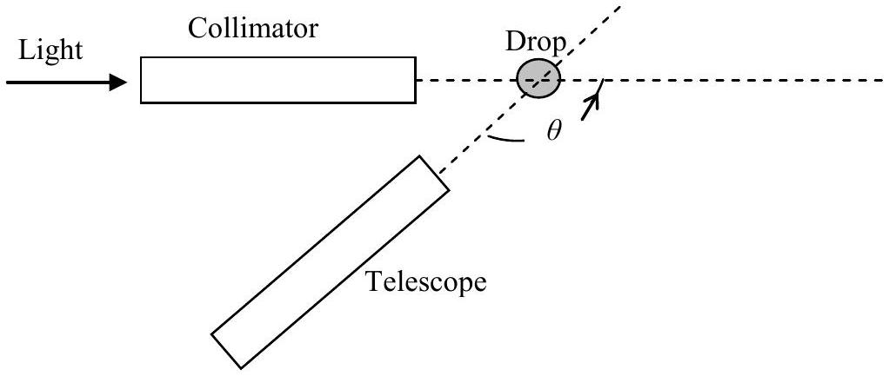

## 1986 INTERNATIONAL PHYSICS   OLYMPIAD

## EXPERIMENT 1.

$2 \frac{1}{2} \mathrm{hrs}$

## APPARATUS

1. Spectrometer with collimator and telescope.
2. 3 syringes; one for water, one for liquid A and one for liquid $B$.
3. A beaker of water plus two sample tubes containing liquids A and $B$.
43 retort stands with clamps.
5. 12V shielded source of white light.
6. Black card, plasticine, and black tape.
7. 2 plastic squares with holes to act as stops to be placed over the ends of the telescope, with the use of 2 elastic bands.
8. Sheets of graph paper.
9. Three dishes to collect water plus liquids A and B lost from syringes.

Please complete synopsis sheet in addition to answering this experimental problem.

Plan of Apparatus

## INSTRUCTIONS AND INFORMATION

1. Adjust collimator to produce parallel light. This may be performed by the following sequence of operations:
(a) Focus the telescope on a distant object, using adjusting knob on telescope, so that the cross hairs and object are both in focus.
(b) Position the telescope so that it is opposite the collimator with slit illuminated so that the slit can be viewed through the telescope.
(c) Adjust the position of the collimator lens, using the adjusting knob on the collimator, so that the image of the slit is in focus on the cross hairs of the telescope's eyepiece.
(d) Lock the spectrometer table, choosing an appropriate 'zero' on the vernier scale, so that subsequent angular measurements of the telescope's position can conveniently be made.
2. Remove the eyepiece from telescope and place black plastic stops symmetrically over both ends of the telescope, using the elastic bands, so that the angle of view is reduced.
3. Open up collimator slit.
4. Use the syringes to suspend, vertically, a pendant drop symmetrically above the centre of the spectrometer table so that it is fully illuminated by the light from the collimator and can be viewed by telescope.
5. The central horizontal region of the suspended drop will produce rainbows as a result of two reflections and $\mathrm{k}(\mathrm{k}=1,2, \ldots)$ internal reflections of the light. The first order rainbow corresponds to one internal reflection. The second order rainbow corresponds to two
Internal reflections. The k'th order rainbow corresponds to k internal reflections. Each rainbow contains all the colours of the spectrum. These can be observed directly by eye and their angular positions can bed accurately measured using the telescope. Each rainbow is due to white light rays incident on the drop at a well determined angle of incidence, that is different for each rainbow.
6. The first order rainbow can be recognized as it has the greatest intensity and appears on the right hand* side of the drop. The second order rainbow appears with the greatest intensity on the left hand* side of the drop. These two rainbows are within an angular separation of 20° of each other for water droplets. The weak intensity fifth order rainbow can be observed on the right hand side of the drop located somewhere between the other two, 'blue', extreme ends of the first and second order rainbows.
7. Light reflected directly from the external surface of the drop and that refracted twice but not internally reflected, will produce bright white glare spots that will hinder observations.
8. The refractive indices, $n$, of the liquids are:

$$
\begin{array}{ll}
\text { Water } & n_{\mathrm{w}}=1.333 \\
\text { Liquid A } & n_{\mathrm{A}}=1.467 \\
\text { Liquid B } & n_{\mathrm{B}}=1.534
\end{array}
$$

In addition to the experimental report please complete the summary sheet.

Footnote:-This statement is correct if the collimator is to the left of the telescope, as indicated in the diagram. If the collimator is on the righthand side of the telescope the first order rainbow will appear on the lefthand side of the drop and the second order rainbow on the righthand side of the drop.

## Measurements

1) Observe, by eye, the first and second order water rainbows. Measure the angle $\theta$ through which the telescope has to be rotated, from the initial direction for observing the parallel light from the collimator, to observe, using a pendant water droplet, the red light at the extreme end of the visible spectrum from:
(a) the first order rainbow on the right of the drop $(k=1)$;
(b) the second order rainbow on the left of the drop $(k=2)$;
(c) the weak fifth order rainbow $(k=5)$, between the first and second order rainbows.

One of these angles may not be capable of measurement by the rotation of the telescope due to the mechanical constraints limiting the range of $\theta$. If this is found to be the case, use a straight edge in place of the telescope to measure $\theta$.
(Place the appropriate dish on the spectrometer table to catch any falling droplets.)
Deduce the angle of deviation, $\phi$, that is the angle the incident light is rotated by the two reflections and $k$ reflections at the drop's internal surface, for (a), (b) and (c). Plot a graph of $\phi$ against $k$.
2.Determine $\phi$ for the second order rainbows produced by liquids A and B using the red visible light at the extreme end of the visible spectrum. (Place respective dishes on table below to catch any falling liquid as the quantities of liquid are limited).
Using graph paper plot $\cos \frac{\phi}{6}$ against $\frac{1}{n}, n$ being the refractive index, for all three liquids and insert the additional point for $n=1$. Obtain the best straight line through these points; measure its gradient and the value of $\phi$ for which $n=2$.

## EXPERIMENT 2

Apparatus
RML Nimbus computer
Ten sheets of graph paper.
Please complete synopsis sheet in addition to answering this experimental problem.

## THIS IS A TWO AND A HALF HOUR EXAMINATION

## INFORMATION

The microcomputer has been programmed to solve the Newtonian equations of motion for a twodimensional system of 25 interacting particles, in the $x y$ plane. It is able to generate the positions and velocities of all particles at discrete, equally spaced time intervals. By depressing appropriate keys (which will be described), access to dynamic information about the system can be obtained. The system of particles is confined to a box which is initially (at time $t=0$ ) arranged in a twodimensional square lattice. A picture of the system is displayed on the screen together with the numerical data requested. All particles are identical; the colours are to enable the particles to be distinguished. As the system evolves in time the positions and velocities of the particles will change. If a particle is seen to leave the box the program automatically generates a new particle that enters the box at the opposite face with the same velocity, thus conserving the number of particles in the box.
Any two particles i and j , separated by a distance $r_{i j}$ interact with a well-defined potential $U_{i j}$,
It is convenient to use dimensionless quantities throughout the computation. The quantities given below are used throughout the calculations.

| Variable | Symbol |
| :--- | :--- |
| Distance | $r^{*}$ |
| Velocity | $v^{*}$ |
| Time | $t^{*}$ |
| Energy | $E^{*}$ |
| Mass of particle | $M^{*}=48$ |
| Potential | $U_{\mathrm{ij}}{ }^{*}$ |
| Temperature | $T^{*}$ |
| Kinetic Energy | $E_{k}{ }^{*}=\frac{1}{2} m * v^{* 2}$ |

## INSTRUCTIONS

The computer program allows you to access three distinct sets of numerical information and display them on the screen. Access is controlled by the grey function keys on the left-hand side of the keyboard, labelled F1, F2, F3, F4, and F10. These keys should be pressed and released - do not hold down a key, nor press it repeatedly. The program may take up to 1 second to respond.

FIRST INFORMATION SET. PROBLEMS 1-5

$$
\begin{aligned}
& \left\langle v_{x}, n\right\rangle=\frac{1}{25} \sum_{i=1}^{25}\left(v_{i x}^{*}\right)^{n} \\
& \left\langle v_{y}, n\right\rangle=\frac{1}{25} \sum_{i=1}^{25}\left(v_{i y}^{*}\right)^{n}
\end{aligned}
$$

and

$$
<U>=\frac{1}{25} \sum_{j=1}^{25} \sum_{i=1}^{25} U_{i j}^{*} \quad(i \neq j)
$$

where
$v_{i x}^{*}$ is the dimensionless $x$ - component of the velocity for the $i$ 'th particle,
$v_{i y}^{*}$ is the dimensionless $y$ - component of the velocity for the $i$ 'th particle, and $n$ is and integer with $n \geq 1$.
[Note: the summation over $U_{i y}^{*}$ excludes the cases in which $i=j$ ]
After depressing F1 it is necessary to input the integer $n(n \geq 1)$ by depressing one of the white keys in the top row of the keyboard, before the information appears on the screen.

The information is displayed in dimensionless time intervals $\Delta t$ at dimensionless times

$$
\mathrm{S} \Delta t^{* *} \quad(\mathrm{~S}=0,1,2, \ldots . .)
$$

$\Delta t^{* *}$ is set by the computer program to the value $\Delta t^{* *}=0 \bullet 100000$.
The value of S is displayed at the bottom right hand of the screen. Initially it has the value $\mathrm{S}=0$. The word "waiting" on the screen indicates that the calculation has halted and information concerning the value of S is displayed.

Depressing the long bar (the "space" bar) at the bottom of the keyboard will allow the calculation of the evolution of the system to proceed in time steps $\Delta^{* *} t$. The current value of S is always displayed on the screen. Whilst the calculation is proceeding the word "running" is displayed on the screen.

Depressing F1 again will stop the calculation at the time integer indicated by S on the screen, and display the current values of

$$
<v_{x}, n>,<v_{y}, n>\text { and }<U>
$$

after depressing the integer $n$. The evolution of the system continues on pressing the long bar. The system can, if required, be reset to its original state at $\mathrm{S}=0$ by pressing F10 TWICE.

## SECOND INFORMATION SET: PROBLEM 6

Depressing F2 initiates the computer program for the compilation of the histogram in problem 6. This program generates a histogram table of the accumulated number $\Delta N$, of particle velocity components as a function of dimensionless velocity. The dimensionless velocity components, $v_{x}$ and $v_{y}$ are referred to collectively by $v_{c}$. The dimensionless velocity range is divided into equal intervals $\Delta v_{c}=0.05$. The centres of the dimensionless velocity "bins" have magnitudes

$$
v_{c}^{*}=\mathrm{B} \Delta v_{c}^{*} \quad(\mathrm{~B}=0, \pm 1 \pm 2, \ldots \ldots \ldots)
$$

When the long bar on the keyboard is pressed the 2 x 25 dimensionless velocity components are calculated at the current time step, and the program adds one, for each velocity component, into the appropriate velocity 'bin'. This process is continued, for each time step, until F3 is depressed. Once F3 is depressed the (accumulated) histogram is displayed. The accumulation of counts can then be continued by pressing the long bar. (Alternatively if you wish to return to the initial situation, with zero in all bins, press F2).
The accumulation of histogram data should continue for about 200 time steps after initiation.
In the thermodynamic equilibrium the histogram can be approximated by the relation

$$
\Delta N=A e^{\left[\frac{-24\left(v_{c}^{*}\right)^{2}}{\alpha}\right]}
$$

where $\alpha$ is a constant associated with the temperature of the system, and $A$ depends on the total number of accumulated velocity components.

## THIRD INFORMATION SET: PROBLEM 7

Depressing F4 followed by the long bar at any time during the evolution of the system will initiate the program for Problem 7. The program will take some 30 seconds, in real time, before displaying a table containing the two
Quantities

$$
<R X, 2>=\frac{1}{25} \sum_{i=1}^{25}\left[x_{i}^{*}(S)-x_{i}^{*}(S R)\right]^{2}
$$

and

$$
<R Y, 2>=\frac{1}{25} \sum_{i=1}^{25}\left[y_{i}^{*}(S)-y_{i}^{*}(S R)\right]^{2}
$$

where $x_{\mathrm{i}}{ }^{*}$ and $y_{\mathrm{i}}{ }^{*}$ are the dimensionless position components for the $i$ 'th particle. $S$ is the integer time unit and $S R$ is the fixed initial integer time at which the programme is initiated by depressing F4. It is convenient to introduce integer

$$
S Z=S-S R \ldots
$$

The programme displays a table of $<R X, 2>$ and $<R Y, 2>$ for

$$
S Z=0,2,4 \ldots \ldots \ldots 24 .
$$

Prior to the display appearing on the screen a notice 'Running' will appear on the screen indicating that a computation is proceeding. Depressing F4, followed by the long bar, again will initiate a new table with $S R$ advanced to the point at which F4 was depressed.

## COMPUTATIONAL PROBLEMS

1 Verify that the dimensionless total linear momentum of the system is conserved for the times given by

$$
S=0,40,80,120,160 .
$$

State the accuracy of the computer calculation.
2. Plot the variation in dimensionless kinetic energy of the system with time using the time sequence

$$
S=0,2,4,6,12,18,24,30,50,70,90,130,180 .
$$

3. Plot the variation in dimensionless potential energy of the system with time using the time sequence in 2 .
4. Obtain the dimensionless total energy of the system at times indicated in 2. Does the system conserve energy? State the accuracy of the total energy calculation.
5. The system is initially (at $S=0$ ) NOT in thermodynamic equilibrium. After a period of time the system reaches thermodynamic equilibrium in which the total dimensionless kinetic energy fluctuates about a mean value of $E_{k}^{*}$. Determine this value of $E_{k}^{*}$ and indicate the time, $S D$, after which the system is in thermodynamic equilibrium.
6. Using the dimensionless accumulated velocity data, during thermodynamic equilibrium, draw up a histogram giving the number $\Delta N$ of velocity components against dimensionless velocity component, using the constant velocity component interval $\Delta V_{c}{ }^{*}=0.05$, specified in the table available from the SECOND INFORMATION SET. Data accumulated from approximately 200 time steps should be used and the starting time integer $S$ should be recorded.

Verify that $\Delta N$ satisfies the relation

$$
\Delta N=A e^{-\left[\frac{24\left(v_{c}^{*}\right)^{2}}{\alpha}\right]}
$$

where $C$ and $A$ are constants. Determine the value of $\alpha$.
7. For the system of particles in thermodynamic equilibrium evaluate the average value of $R^{2},<R^{2}>$, where $R$ is the straight line distance between the position of a particle at a fixed initial time number $S R$ and time number $S$. The time number difference $S Z=(S-S R)$ takes the values

$$
S Z=\mathrm{O}, 2,4, \ldots . .24 .
$$

Plot $<R^{2}>$ against $S Z$ for any appropriate value of $S R$. Calculate the gradient of the function in the linear region and specify the time number range for which this gradient is valid.
In order to improve the accuracy of the plot repeat the previous calculations for three (additional) different values of SR and determine the AVERAGE $<R^{2}>$ for the four sets of results together with the 'linear' gradient and time number range.
Deduce, with appropriate reasoning, the thermodynamic equilibrium state of the system, either solid or liquid.
