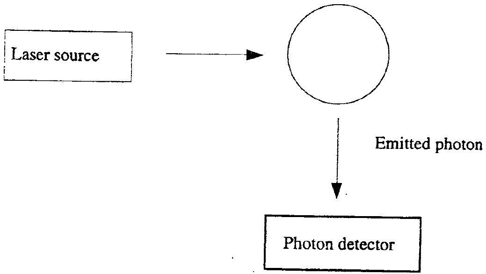
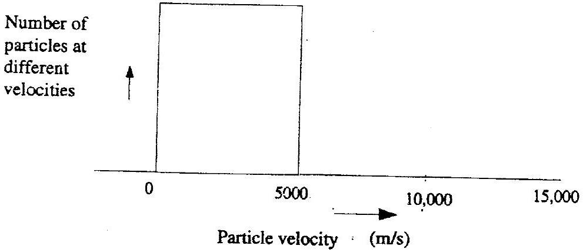

## $\mathbf{1 9}^{\text {th }}$ International Physics Olympiad - 1988 Bad Ischl / Austria

## Theory 1 Spectroscopy of Particle Velocities

## Basic Data

The absorption and emission of a photon is a reversible process. A good example is to be found in the excitation of an atom from the ground state to a higher energy state and the atoms' subsequent return to the ground state. In such a case we may detect the absorption of a photon from the phenomenon of spontaneous emission or fluorescence. Some of the more modern instrumentation make use of this principle to identify atoms, and also to measure or calculate the value of the velocity in the velocity spectrum of the electron beam.

In an idealised experiment (see fig. 19.1) a single-charged ion travels in the opposite direction to light from a laser source with velocity v. The wavelength of light from the laser source is adjustable. An ion with velocity Zero can be excited to a higher energy state by the application of laser light having a wavelength of $\lambda=600 \mathrm{~nm}$. If we excite a moving ion, our knowledge on Dopplers effect tells us that we need to apply laser light of a wavelength other than the value given above.
There is given a velocity spectrum embracing velocity magnitude from $\mathrm{v}_{1}=0 \frac{\mathrm{~m}}{\mathrm{~s}}$ to $\mathrm{v}_{2}=6,000 \frac{\mathrm{~m}}{\mathrm{~s}}$. (see fig. 19.1)

Fig. 19.1

## Questions

1.1
1.1.1

What range of wavelength of the laser beam must be used to excite ions of all velocities in the velocity spectrum given above ?
1.1.2

A rigorous analysis of the problem calls for application of the principle from the theory of special relativity

$$
v^{\prime}=v \cdot \sqrt{\frac{1+\frac{v}{c}}{1-\frac{v}{c}}}
$$

Determine the error when the classical formula for Dopplers ${ }^{\prime}$ effect is used to solve the problem.
1.2

Assuming the ions are accelerated by a potential U before excited by the laser beam, determine the relationship between the width of the velocity spectrum of the ion beam and the accelerating potential. Does the accelerating voltage increase or decrease the velocity spectrum width ?
1.3

Each ion has the value $\frac{\mathrm{e}}{\mathrm{m}}=4 \cdot 10^{6} \frac{\mathrm{~A} \cdot \mathrm{~s}}{\mathrm{~kg}}$, two energy levels corresponding to wavelength $\lambda^{(1)}=600 \mathrm{~nm}$ and wavelength $\lambda^{(2)}=\lambda^{(1)}+10^{-3} \mathrm{~nm}$. Show that lights of the two wavelengths used to excite ions overlap when no accelerating potential is applied. Can accelerating voltage be used to separate the two spectra of laser light used to excite ions so that they no longer overlap? If the answer is positive, calculate the minimum value of the voltage required.

Fig. 19.2
