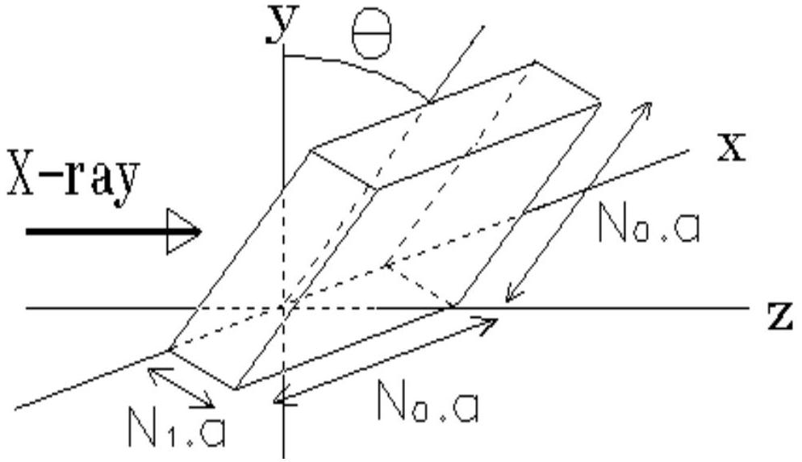
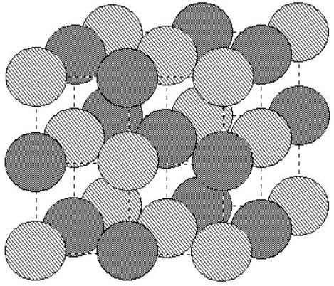
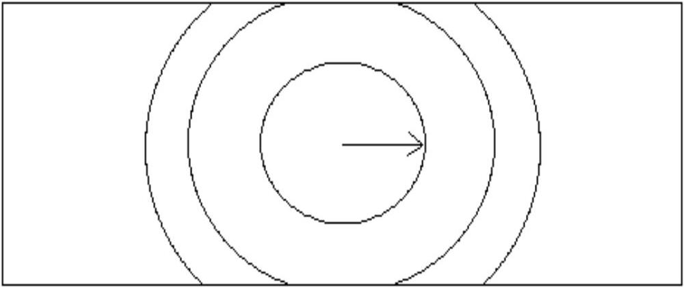

Question 1. X-ray Diffraction from a crystal.
We wish to study X-ray diffraction by a cubic crystal lattice. To do this we start with the diffraction of a plane, monochromatic wave that falls perpendicularly on a 2-dimensional grid that consists of $\mathrm{N}_{1} \times \mathrm{N}_{2}$ slits with separations $\mathrm{d}_{1}$ and $\mathrm{d}_{2}$. The diffraction pattern is observed on a screen at a distance L from the grid. The screen is parallel to the grid and L is much larger than $\mathrm{d}_{1}$ and $\mathrm{d}_{2}$.

a - Determine the positions and widths of the principal maximum on the screen. The width is defined as the distance between the minima on either side of the maxima.

We consider now a cubic crystal, with lattice spacing a and size $\mathrm{N}_{0}$.a $\times \mathrm{N}_{0}$.a $\times \mathrm{N}_{1}$.a. $\mathrm{N}_{1}$ is much smaller than $\mathrm{N}_{0}$. The crystal is placed in a parallel X-ray beam along the z-axis at an angle $\Theta$ (see Fig. 1). The diffraction pattern is again observed on a screen at a great distance from the crystal.

Figure 1 Diffraction of a parallel X-ray beam along the z-axis. The angle between the crystal and the y-axis is $\Theta$.

b - Calculate the position and width of the maxima as a function of the angle $\Theta$ (for small $\Theta$ ).
- What in particular are the consequences of the fact that $\mathrm{N}_{1} \ll \mathrm{~N}_{0}$.

The diffraction pattern can also be derived by means of Bragg's theory, in which it is assumed that the X-rays are reflected from atomic planes in the lattice. The diffraction pattern then arises from interference of these reflected rays with each other.

c - Show that this so-called Bragg reflection yields the same conditions for the maxima as those that you found in b.

In some measurements the so-called powder method is employed. A beam of X-rays is scattered by a powder of very many, small crystals. (Of course the sizes of the crystals are much larger than the lattice spacing, a).
Scattering of X-rays of wavelength 0.15 nm by Potassium Chloride [KCl] (which has a cubic lattice, see Fig.2) results in the production of concentric dark circles on a photographic plate. The distance between the crystals and the plate is 0.10 m, and the radius of the smallest circle is 0.053 m (see Fig. 3). $\mathrm{K}^{+}$and $\mathrm{Cl}^{-}$ions have almost the same size, and they may be treated as identical scattering centres.

Figure 2. The cubic latice of Potassium Chloride in which the $\mathrm{K}^{+}$and $\mathrm{Cl}^{-}$wons have almost the same size.

Figure 3. Scattering of X-rays by a powder of KCl crystals results in the production of concentric dark circles on a photographic plate.

d - Calculate the distance between two neighbouring K ions in the crystal.
