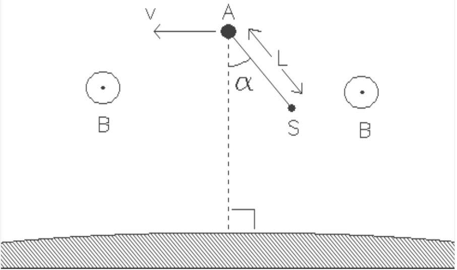

Question 2. Electric experiments in the magnetosphere of the earth.
In May 1991 the spaceship Atlantis will be placed in orbit around the earth. We shall assume that this orbit will be circular and that it lies in the earth's equatorial plane. At some predetermined moment the spaceship will release a satellite S, which is attached to a conducting rod of length L . We suppose that the rod is rigid, has negligible mass, and is covered by an electrical insulator. We also neglect all friction. Let $\alpha$ be the angle that the rod makes to the line between the Atlantis and the centre of the earth. (see Fig. 1).
S also lies in the equatorial plane. Assume that the mass of the satellite is much smaller than that of the Atlantis, and that L is much smaller than the radius of the orbit.

$\mathrm{a}_{1}$ - Deduce for which value(s) of $\alpha$ the configuration of the spaceship and satellite remain unchanged (with respect to the earth)? In other words, for which value(s) of $\alpha$ is $\alpha$ constant?

Figure 1 The spaceship Atlantis (A) with a satellite (S) in an orbit around the earth. The orbit lies in the earth's equatorial plane.
The magnetic field (B) is perpendicular to the diagram and is directed towards the reader.

$\mathrm{a}_{2}$ - Discuss the stability of the equilibrium for each case.
Suppose that, at a given moment, the rod deviates from the stable configuration by a small angle. The system will begin to swing like a pendulum.

b - Express the period of the swinging in terms of the period of revolution of the system around the earth.

In Fig. 1 the magnetic field of the earth is perpendicular to the diagram and is directed towards the reader. Due to the orbital velocity of the rod, a potential difference arises between its ends. The environment (the magnetosphere) is a rarefied, ionised gas with a very good electrical conductivity. Contact with the ionised gas is made by means of electrodes in A (the Atlantis) and S (the satellite). As a consequence of the motion, a current, I, flows through the rod.
$\mathrm{c}_{1}$ - In which direction does the current flow through the rod? (Take $\alpha=0$ )

Data:

- the period of the orbit
- length of the rod
- magnetic field strength of the eart at the height of the satellite
- the mass of the shuttle Atlantis

$$
\begin{aligned}
& \mathrm{T}=5,4 \cdot 10^{3} \mathrm{~s} \\
& \mathrm{~L}=2,0 \cdot 10^{4} \mathrm{~m} \\
& \mathrm{~B}=5,0 \cdot 10^{-5} \mathrm{~Wb} \cdot \mathrm{~m}^{-2} \\
& \mathrm{~m}=1,0 \cdot 10^{5} \mathrm{~kg}
\end{aligned}
$$

Next, a current source inside the shuttle is included in the circuit, which maintaines a net direct current of 0.1 A in the opposite direction.

$\mathrm{c}_{2}$ - How long must this current be maintained to change the altitude of the orbit by 10 m.
Assume that $\alpha$ remains zero. Ignore all contributions from currents in the magnetosphere.
- Does the altitude decrease or increase?
