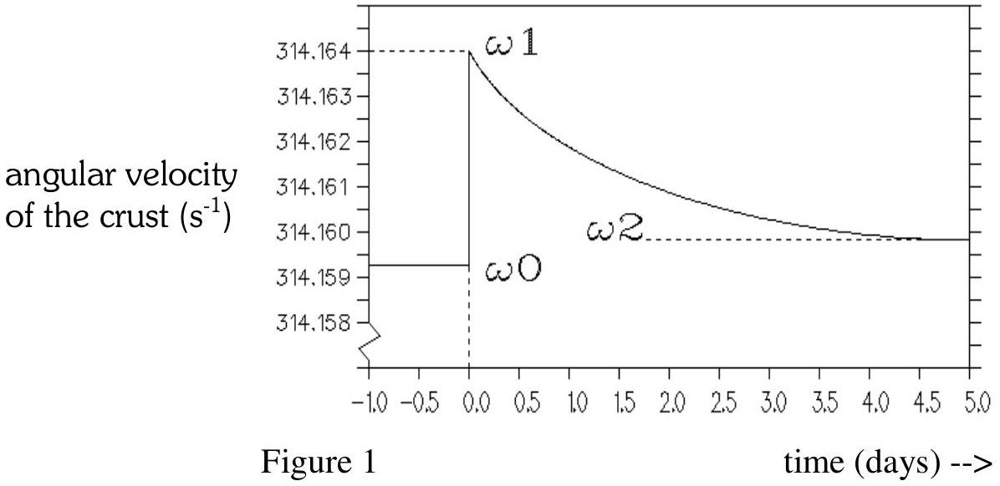

Question 3. The rotating neutron star.
A 'millisecond pulsar' is a source of radiation in the universe that emits very short pulses with a period of one to several milliseconds. This radiation is in the radio range of wavelengths; and a suitable radio receiver can be used to detect the separate pulses and thereby to measure the period with great accuracy.

These radio pulses originate from the surface of a particular sort of star, the so-called neutron star. These stars are very compact: they have a mass of the same order of magnitude as that of the sun, but their radius is only a few tens of kilometers. They spin very quickly. Because of the fast rotation, a neutron star is slightly flattened (oblate). Assume the axial cross-section of the surface to be an ellipse with almost equal axes. Let $\mathrm{r}_{\mathrm{p}}$ be the polar and $\mathrm{r}_{\mathrm{e}}$ the equatorial radii; and let us define the flattening factor by:

$$
\epsilon=\frac{\left(r_{e}-r_{p}\right)}{r_{p}}
$$

Consider a neutron star with a mass of $2.0 .10^{30} \mathrm{~kg}$, an average radius of $\quad 1.0 .10^{4} \mathrm{~m}$, and a rotation period of $2.0 .10^{-2} \mathrm{~s}$.

a - Calculate the flattening factor, given that the gravitational constant is $6.67 .10^{-11}$ N. $\mathrm{m}^{2} . \mathrm{kg}^{-2}$.

In the long run (over many years) the rotation of the star slows down, due to energy loss, and this leads to a decrease in the flattening. The star has however a solid crust that floats on a liquid interior. The solid crust resists a continuous adjustment to equilibrium shape. Instead, starquakes occur with sudden changes in the shape of the crust towards equilibrium. During and after such a star-quake the angular velocity is observed to change according to figure 1.

A sudden change in the shape of the crust of a neutron star results in a sudden change of the angular velocity.

b - Calculate the average radius of the liquid interior, using the data of Fig. 1. Make the approximation that the densities of the crust and the interior are the same. (Ignore the change in shape of the interior).
