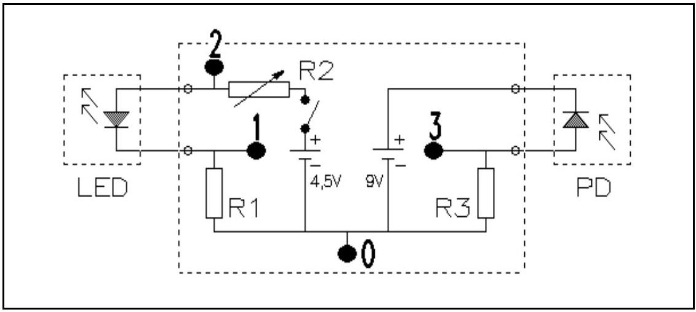
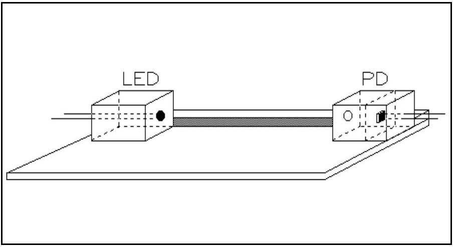

## Question 4. Determination of the efficiency of a LED.

Introduction
In this experiment we shall use two modern semiconductors: the light-emitting diode (LED) and the photo-diode (PD). In a LED, part of the electrical energy is used to excite electrons to higher energy levels. When such an excited electron falls back to a lower energy level, a photon with energy $\mathrm{E}_{\text {photon }}$ is emitted, where

$$
E_{\text {photon }}=\frac{h . c}{\lambda}
$$

Here h is Planck's constant, c is the speed of light, and $\lambda$ is the wavelength of the emitted light. The efficiency of the LED is defined to be the ratio between the radiated power, $\phi$ , and the electrical power used, $\mathrm{P}_{\mathrm{LED}}$ :

$$
\eta=\frac{\phi}{P_{L E D}}
$$

In a photo-diode, radiant energy is transformed into electrical energy. When light falls on the sensitive surface of a photo-diode, some (but not all) of the photons free some (but not all) of the electrons from the crystal structure. The ratio between the number of incoming photons per second, $\mathrm{N}_{\mathrm{p}}$, and the number of freed electrons per second, $\mathrm{N}_{e}$, is called the quantum efficiency, $\mathrm{q}_{\mathrm{p}}$

$$
q_{p}=\frac{N_{e}}{N_{p}}
$$

The experiment
The purpose of this experiment is to determine the efficiency of a LED as a function of the current that flows through the LED. To do this, we will measure the intensity of the emitted light with a photo-diode. The LED and the PD have been mounted in two boxes, and they are connected to a circuit panel (Fig. 1). By measuring the potential difference across the LED, and across the resistors $\mathrm{R}_{1}$ and $\mathrm{R}_{3}$, one can determine both the potential differences across, and the currents flowing through the LED and the PD.

We use the multimeter to measure VOLTAGES only!! This is done by turning the knob to position ' V '. The meter selects the appropriate sensitivity range automatically. If the display is not on "AUTO" switch "off" and push on "V" again. Connection: "COM" and " $\mathrm{V}-\Omega$ ".

The box containing the photo-diode and the box containing the LED can be moved freely over the board. If both boxes are positioned opposite to each other, then the LED, the PD and the hole in the box containing the PD remain in a straight line.

Data:- The quantum efficiency of the photo-diode

- The detection surface of the PD is
- The wave-length of the light emitted from the LED is
- The internal resistance of the voltmeter is:

$$
\begin{aligned}
& \mathrm{q}_{\mathrm{p}}=0.88 \\
& 2.75 \times 2.75 \mathrm{~mm}^{2} \\
& 635 \mathrm{~nm} . \\
& 100 \mathrm{M} \Omega \text { in the range up to } \\
& 200 \mathrm{mV} \\
& 10 \mathrm{M} \Omega \text { in the other ranges. }
\end{aligned}
$$

The range is indicated by small numbers on the display.

- Planck's constant
- The elementary quantum of charge
- The speed of light in vacuo

$$
\begin{aligned}
& \mathrm{h}=6.63 \cdot 10^{-34} \mathrm{~J} \cdot \mathrm{~s} \\
& \mathrm{e}=1.6 \cdot 10^{-19} \mathrm{C} \\
& \mathrm{c}=3.00 \cdot 10^{8} \mathrm{~m} \cdot \mathrm{~s}^{-1}
\end{aligned}
$$

Figure 1.
$$
\begin{aligned}
& \mathrm{R}_{1}=100 \Omega \\
& \mathrm{R}_{2}=\text { variable resistor } \\
& \mathrm{R}_{3}=1 \mathrm{M} \Omega
\end{aligned}
$$

The points labelled 0, 1, 2 and 3 are measuring points.

Figure 2 The experimental setup: a board and the two boxes containing the LED and the photo-diode.

Instructions

1. Before we can determine the efficiency of the LED, we must first calibrate the photo-diode. The problem is that we know nothing about the LED.
Show experimentally that the relation between the current flowing through the photo-diode and the intensity of light falling on it, I [J.s ${ }^{-1} . \mathrm{m}^{-2}$ ], is linear.
2. Determine the current for which the LED has maximal efficiency.
3. Carry out an experiment to measure the maximal (absolute) efficiency of the LED.

No marks (points) will be allocated for an error analysis (in THIS experiment only). Please summarize data in tables and graphs with clear indications of quantities (and units).
