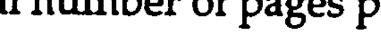
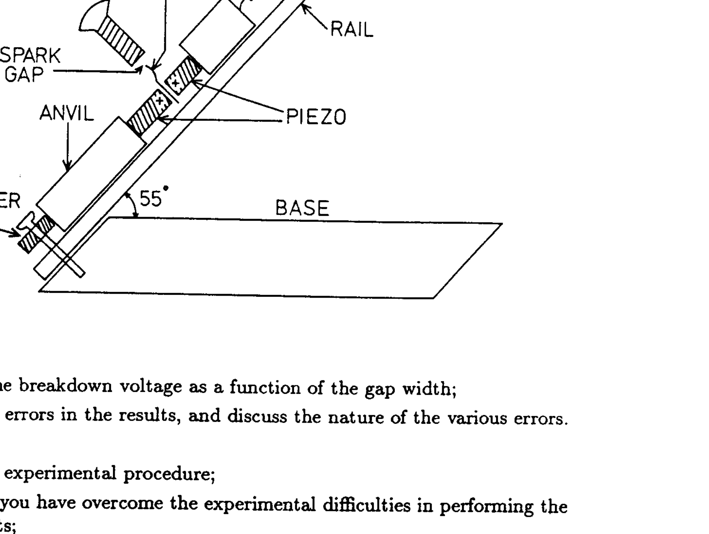

# XXIII INTERNATIONAL PHYSICS OLYMPIAD HELSINKI, ESPOO

## EXPERIMENTAL COMPETITION

July 9 th 1992
available time: $2 \times 2 \frac{1}{2}$ hours

## READ THIS FIRST

After two and half hours you must stop carrying out your first experiment and go to another room for the second experiment.

## Instructions:

1. Use no other pen than the one allotted by the organizers
2. Do not use the same paper for different problems.
3. Use only the marked side of the paper
4. Write at the top of each and every page:

- the number of the problem
- the number of the page per problem, starting by number 1
- the total number of pages per problem

Example: $11 / 4$; $12 / 4$; $13 / 4$; $14 / 4$
5. Mark the graph papers with your identification.

# EXPERIMENTAL PROBLEM 1   Investigation of the Electric Breakdown of Air

In this experimental problem the electric breakdown of air is to be studied by means of high voltages generated by piezoelectric material.
The experimental apparatus consists of an inclined slide (see figure) on which a hammer of mass $m$ can slide down a guide rail. The sliding hammer then hits an assembly of two cylinders of piezoelectric material and compresses them. Compression of the piezoelectric material causes electric charging of the ends of the cylinders. The generated voltage is conducted to an adjustable spark gap. If the gap is small enough there will be a spark across the gap which can be seen by the naked eye. However, if the voltage is too small, there will be no spark. The smallest voltage that produces a spark over a given gap is called the breakdown voltage of the gap.

## Instructions

- determine the breakdown voltage as a function of the gap width;
o estimate the errors in the results, and discuss the nature of the various errors.
In your report,
- explain your experimental procedure;
- explain how you have overcome the experimental difficulties in performing the measurements;
o discuss the general validity of this result in other situations in which electrical breakdown of air occurs;
- write down the serial number on your piezoelectric assembly so that your results can be checked.

## Discussion of the theory for a piezoelectric cylinder

The full theory of a piezoelectric is not required in this experiment. The following approximate analysis is sufficient.
The piezoelectric cylinder can be modelled as a combination of a mechanical spring and an electric capacitor. The two ends of the cylinder act as the plates of the capacitor. When the spring is compressed, the compressing movement causes electric charge to move from one plate of the capacitor to the other plate, causing a voltage to appear across the capacitor. The quantity of charge moved is proportional to the amount of compression. The process is reversible: when the compressing force is released and the material resumes its original shape, an opposite movement of charge takes place. Consider the following sequence of events with a piezoelectric cylinder of capacitance $C: 1$ ) a force is applied on the cylinder; 2) the two ends of the cylinder are momentarily short circuited; and 3) the force is removed. In (1), a charge $Q$ is transferred and the voltage $U=Q / C$ appears across the cylinder. In (2), the voltage drops to zero, $U=0$. In (3), a smaller voltage is generated of opposite sign to the original voltage.
The capacitance of the piezoelectric cylinder is denoted by $C_{p}$. When an initially uncharged and unstressed piezoelectric cylinder is compressed so that mechanical work $E$ is done by the compressing force, then energy $K \times E$ is transformed into electrical energy and stored in the capacitor (capacitance $C_{p}$ ). The value of the constant $K$ depends on the piezoelectric material. The manufacturer of the piezoelectric cylinders used in this experiment reports that

$$
K=0.5 .
$$

## Performing the experiment

The piezoelectric assembly supplied has been made so that compression causes a positive charge to appear in the ends of the piezoelectric cylinders which are marked + in the figure. The + ends are connected to each other and to an electrode in the centre of the assembly which acts as one terminal of the spark gap.
The apparatus is arranged so that the hammer makes electrical contact. with the upper end of the top piezoelectric cylinder, thus connecting the piezoelectric material with the metal rail.
There is a larger mass which acts as an anvil below the piezoelectric assembly. The compressing force is generated by the combined action of the hammer and the anvil. The anvil is supported on a cushion of foam rubber so that no sudden impact force is transmitted from the anvil to the base of the equipment. The anvil provides an electrical connection between the lower end of the bottom piezoelectric cylinder and the rail. There is a copper wire connected from the rail to an adjusting screw which serves as the other terminal of the spark gap.
There is a limiter on the rail which prevents the hammer from exceeding a height of approximately 10 cm . Do not attempt to bypass this limiter. Contact the invigilator if you are unable to observe any sparks at all.

There are two methods for observing the sparks:

1. Visual observation of the spark. If this method is used, then it is necessary to make the electrical connection between the adjusting screw and the sliding rail.
2. Feeling the spark with your finger. If this method is used, disconnect the grounding wire and instead, touch one finger to the screw and another finger to the metal rail. The spark current will go through your hand and you will be able to feel whether there is a spark or not.
You can use whichever method you prefer, or both methods if you wish.
In addition to the apparatus discussed above, a triangular ruler/protractor, a small screw driver, and some sheets of graph paper are provided.

## Data for the experimental apparatus

Acceleration due to gravity
Capacitance of one piezoelectric cylinder
Mass of the hammer
Combined mass of the piezoelectric assembly and anvil
Angle of the slide rail with respect to the horizontal direction
Pitch of the thread on the screw used for adjusting the spark gap

$$
\begin{aligned}
g & =9.82 \mathrm{~m} / \mathrm{s}^{2} \\
C_{p} & =20 \mathrm{pF} \pm 2 \mathrm{pF} \\
m & =34.6 \mathrm{~g} \\
M & =87.5 \mathrm{~g} \pm 0.5 \mathrm{~g} \\
& =55^{\circ} \pm 1^{\circ} \\
& =0.80 \mathrm{~mm} / \text { turn }
\end{aligned}
$$

## Notes

1. The capacitor equivalent of the piezoelectric cylinder, $C_{p}$, has a very low leakage current, thus it can keep a charge for a long time. Bear this fact in mind when planning your experimental procedures.
2. The electrical charge generated by the piezoelectric material is so small that it is not dangerous. The spark does not hurt but you can feel it!
3. There is a small risk that the piezoelectric cylinders could shatter into pieces because of the repeated impacts. If this should happen, contact the organizers: there are spare cylinders available. In order to avoid breakages, make sure that the piezoelectric assembly rests properly on the rail and is pressed securely against the anvil before each impact. Suspend the hammer by the thread supplied before letting it slide, so that it will slide smoothly without jumping.
4. The capacitance of the spark gap is so small that it need not be taken into account.
5. The hammer and anvil are considered to be absolutely rigid bodies, so they are not compressed by the impact.
