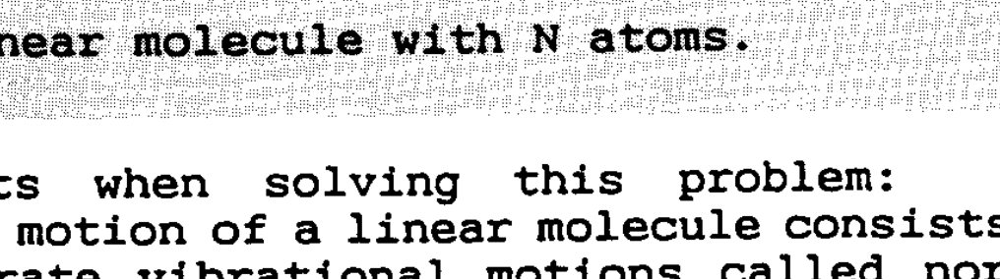
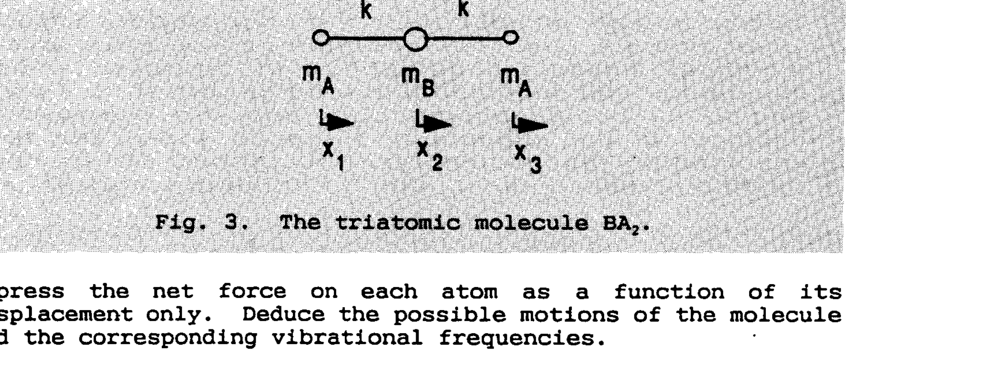

## PROBLEM 2 : THE LONGITUDINAL MOTION OF A LINEAR MOLECULE

In this problem you will analyze the longitudinal motion of a linear molecule, i.e., the motion along the molecular axis. The rotational motion and the bending of the molecule are not considered. The molecule is assumed to consist of $N$ atoms of mass $m_{1}, m_{2}$, ... $m_{N}$, respectively. Each atom is assumed to be connected to its neighbors by a chemical bond. Each bond is approximated by a massless spring which obeys Hooke's law with spring constants $k_{1}, k_{2}, \ldots k_{N-1}$. The molecule is shown in Fig. 1.

Fig.1. A linear molecule with N atoms.

Use the following facts when solving this problem: The longitudinal vibrational motion of a linear molecule consists of a superposition of separate vibrational motions called normal vibrations, or normal modes. In a normal mode all atoms vibrate in simple harmonic motion with the same frequency and pass through their equilibrium positions simultaneously.

## Questions

1) Let $x_{i}$ be the displacement of atom $i$ from its equilibrium position. Express the force $F_{i}$ acting on each atom $i$ as a function of the displacements $x_{1}, x_{2}, \ldots, x_{N}$ and the spring constants $k_{1}, k_{2}, \ldots, k_{N-1}$. What relationship is there among the forces $F_{1}, F_{2}, \ldots, F_{N}$ ? Using this relationship, derive a relationship between the displacements $x_{1}, x_{2}, \ldots, x_{N}$ and give a physical interpretation of this relationship.
2) Analyze the motion of a diatomic molecule AB (Fig. 2). The value of the spring constant is $k$. Derive an expression for the forces acting on atoms $A$ and $B$. Determine the possible types of motion of the molecule. Determine the corresponding vibrational frequencies and interpret the result. In particular, how is it possible for the atoms to vibrate with the same frequency even though their masses are not the same?

Fig. 2. The diatomic molecule AB

3) Analyze the motion of the triatomic molecule $\mathrm{BA}_{2}$ (Fig. 3)

Express the net force on each atom as a function of its displacement only. Deduce the possible motions of the molecule and the corresponding vibrational frequencies.
4) The frequencies of the two longitudinal modes of vibration of the $\mathrm{CO}_{2}$ molecule are $3.998 \times 10^{13} \mathrm{~Hz}$ and $7.042 \times 10^{13} \mathrm{~Hz}$, respectively. Determine a numerical value for the spring constant of the CO bond.

How well do you think this approximation for the bond structure of the molecule describes the vibrational motion of the real molecule?

The atomic mass of the carbon atom $=12$ amu and that of the oxygen atom $=16$ amu. The atomic mass unit $=1.660 \times 10^{-27} \mathrm{~kg}$.
