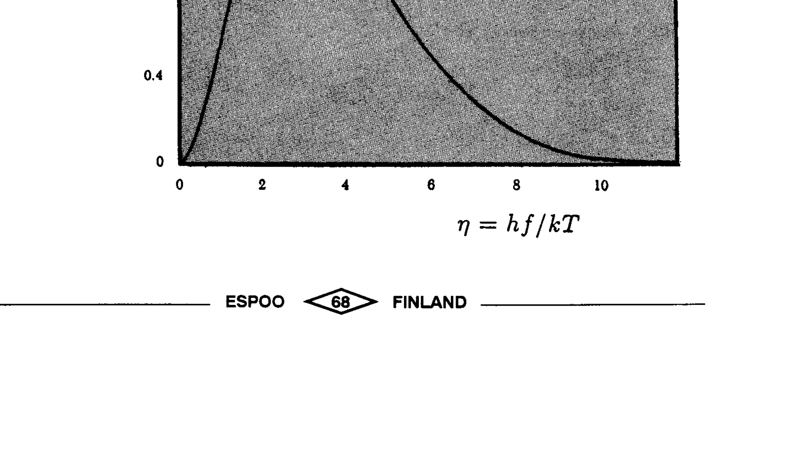

## PROBLEM 3 : A SATELLITE IN SUNSHINE

In this problem you will calculate the temperature of a space satellite. The satellite is assumed to be a sphere with a diameter of 1 m . All of the satellite remains at a uniform temperature. All of the spherical surface of the satellite is coated with the same kind of coating. The satellite is located near the earth but is not in the earth's shadow.

The surface temperature of the sun (its blackbody temperature) $T_{\text {sun }}=6000 \mathrm{~K}$ and its radius is $6.96 \times 10^{8} \mathrm{~m}$. The distance between the sun and the earth is $1.5 \times 10^{11} \mathrm{~m}$. The sunlight heats the satellite to a temperature at which the blackbody emission from the satellite equals the power absorbed from the sunlight. The power per unit area emitted by a black body is given by Stefan-Boltzmann's law $\mathrm{P}=\sigma \mathrm{T}^{4}$ where $\sigma$ is the universal constant $5.67 \times 10^{-8} \mathrm{~W} \cdot \mathrm{~m}^{-2} \mathrm{~K}^{-4}$. In the first approximation, you can assume that both the sun and the satellite absorb all electromagnetic radiation incident upon them.

1) Find an expression for the temperature $T$ of the satellite. What is the numerical value of this temperature?
2) The blackbody radiation spectrum $u(T, f)$ of a body at temperature T obeys Planck's radiation law

$$
u(T, f) d f=\frac{8 \pi k^{4} T^{4}}{c^{3} h^{3}} \frac{\eta^{3} d \eta}{e^{\eta}-1}
$$

where $\eta=h f / k T$ and $u(T, f) d f$ is the energy density of the electromagnetic radiation in a frequency interval [ $f, f+d f$ ]. In the equation $h=6.6 \times 10^{-34} \mathrm{~J} \cdot \mathrm{~s}$ is Planck's constant, $k=1.4 \times 10^{-23} \mathrm{~J} \cdot \mathrm{~K}^{-1}$ is Boltzmann's constant, and $\mathrm{c}=3.0 \times 10^{8} \mathrm{~m} \cdot \mathrm{~s}^{-1}$ is the speed of light.

The blackbody spectrum, integrated over all frequencies $f$ and directions of emission, gives the total radiated power per unit area $P=\sigma T^{4}$ as expressed in the Stefan-Boltzmann law given above.

$$
\sigma=\frac{2 \pi^{5} k^{4}}{15 c^{2} h^{3}}
$$

The figure shows the normalized spectrum

$$
\frac{C^{3} h^{3}}{8 \pi k^{4}} \frac{u(T, f)}{T^{4}}
$$

as a function of $\eta$.
In many applications it is necessary to keep the satellite as cool as possible. To cool the satellite, engineers use a reflective coating that reflects light above a cut-off frequency but does not prevent heat radiation at lower frequency from escaping. Assume that this (sharp) cut-off frequency corresponds to $h f / k=1200 \mathrm{~K}$.

What is the new equilibrium temperature of the satellite? The exact answer is not needed. Therefore, do not perform any tedious integrations; make approximations where necessary. The integral over the entire range is

$$
\int_{0}^{\infty} \frac{\eta^{3} d \eta}{e^{\eta}-1}=\frac{\pi^{4}}{15}
$$

and the maximum of $\eta^{3} /\left(e^{\eta}-1\right)$ occurs at $\eta \approx 2.82$. For small $\eta$ you can expand the exponential function as $e^{\eta} \approx 1+\eta$.
3) If we now have a real satellite, with extending solar panels that generate electricity, the dissipated heat in the electronics inside the satellite acts as an extra source of heat. Assuming that the power of the internal heat source is 1 kW , what is the equilibrium temperature of the satellite in case 2 above?
4) A manufacturer advertises a special paint in the following way:
"This paint will reflect more than $90 \%$ of all incoming radiation (both visible light and infrared) but it will radiate at all frequencies (visible light and infrared) as a black body, thus removing lots of heat from the satellite. Thus the paint will help keep the satellite as cool as possible."

Can such paint exist? Why or why not?
5) What properties should a coating have in order to raise the temperature of a spherical body similar to that of the satellite considered here above the temperature calculated in 1 ?

