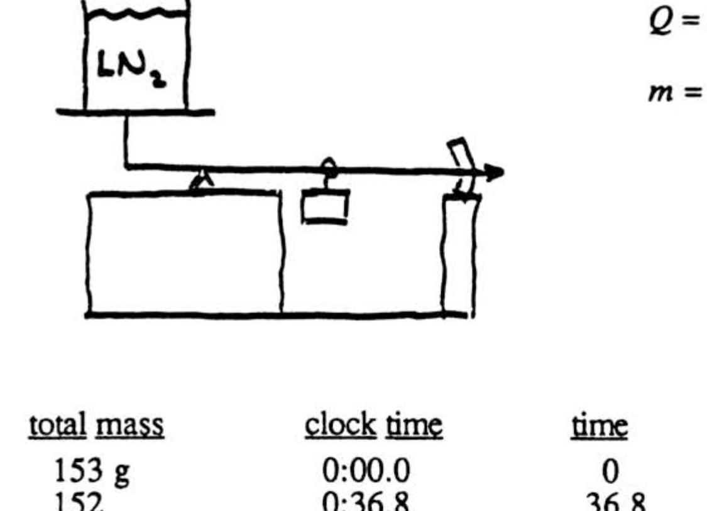
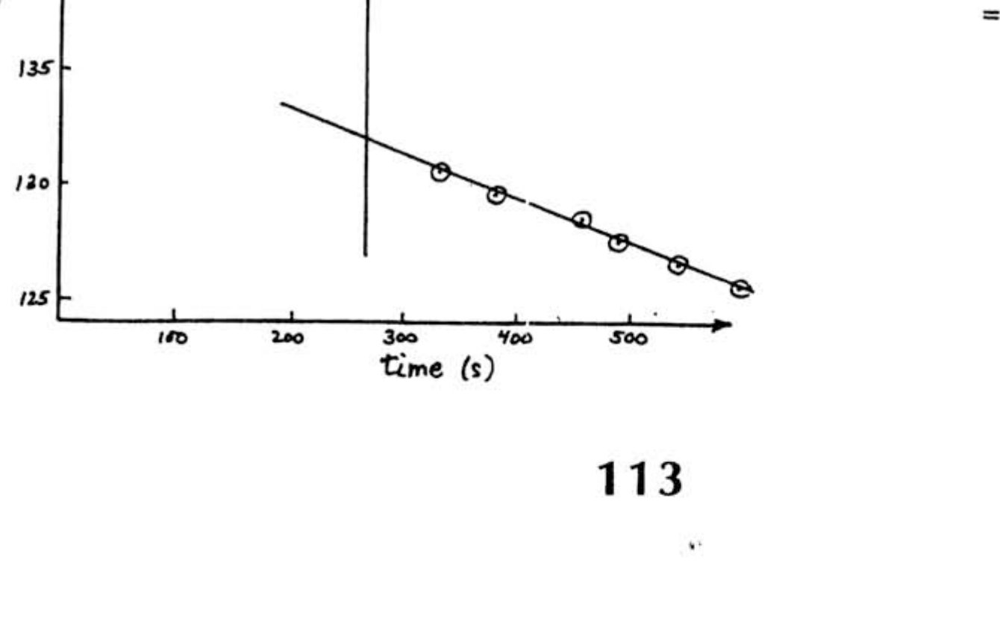
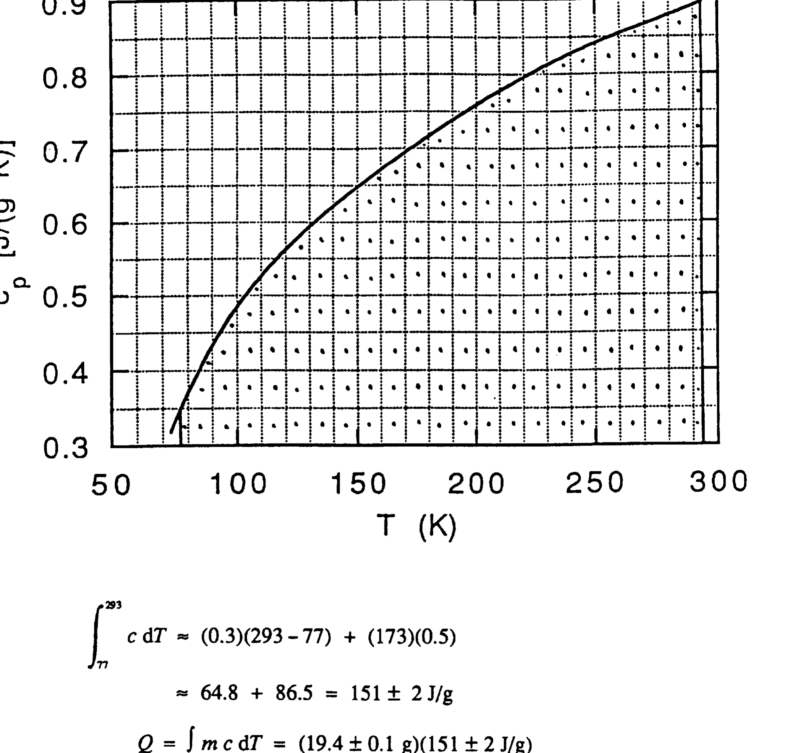
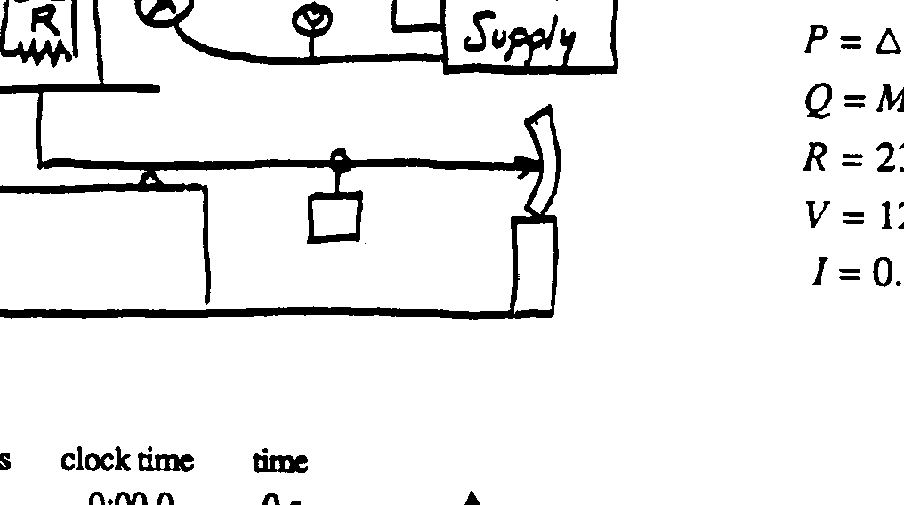
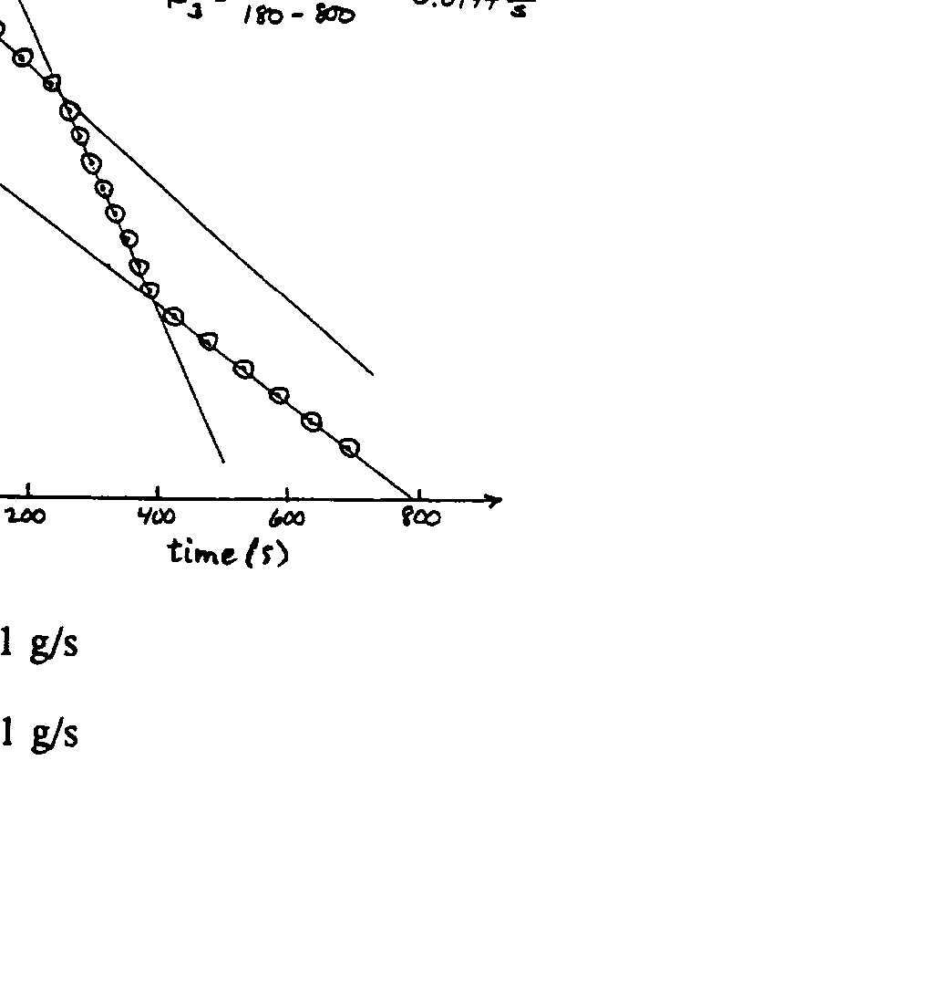

## Experimental Problem 1 .. Solutions

## Method \#1

$$
\begin{aligned}
& Q=m c \Delta T=m \int c \mathrm{~d} T \\
& Q=L \Delta M_{\mathrm{LN}_{2}} \\
& m=19.4 \pm 0.1 \mathrm{~g}
\end{aligned}
$$

|  | total mass | clock time | time |
| :--- | :--- | :--- | :--- |
|  | 153 g | 0:00.0 | 0 |
|  | 152 | 0:36.8 | 36.8 |
|  | 151 | 1:19.1 | 79.1 |
|  | 150 | 2:00.7 | 120.7 |
|  | 149 | 2:40.5 | 160.5 |
|  | 148 | 3.23.1 | 203.1 |
| Add Al mass | 150 (130.6) | 5:31.8 | 331.8 |
|  | 149 (129.6) | 6:21.6 | 381.6 |
|  | 148 (128.6) | 7:17.3 | 457.3 |
|  | 147 (127.6) | 8:08.6 | 488.6 |
|  | 146 (126.6) | 9:00.9 | 540.9 |
|  | 145 (125.6) | 9:54.6 | 594.6 |

$$
\begin{aligned}
\Delta M_{\mathrm{LN} 2} & =146.5-132.0 \\
& =14.5 \pm 0.3 \mathrm{~g}
\end{aligned}
$$

$$
\begin{aligned}
\int_{n}^{293} c \mathrm{~d} T & \approx(0.3)(293-77)+(173)(0.5) \\
& \approx 64.8+86.5=151 \pm 2 \mathrm{~J} / \mathrm{g} \\
Q & =\int m c \mathrm{~d} T=(19.4 \pm 0.1 \mathrm{~g})(151 \pm 2 \mathrm{~J} / \mathrm{g}) \\
& =2930 \pm 42 \mathrm{~J} \\
L=\frac{Q}{\Delta M_{\mathrm{LN} 2}} & =\frac{2930 \pm 42 \mathrm{~J}}{14.5 \pm 0.3 \mathrm{~g}}=202 \pm 5 \mathrm{~J} / \mathrm{g}
\end{aligned}
$$

## Method \#2

$$
\begin{aligned}
& P=I V=V^{2} / R=R^{2} R \\
& P=\Delta Q / \Delta t \\
& Q=M_{\mathrm{LN} 2} L \\
& R=23.0 \Omega\left(\text { in }_{\mathrm{LN}}\right) \\
& V=12.7 \mathrm{~V} \\
& I=0.56 \mathrm{~A}
\end{aligned}
$$

|  | total mass | clock time | time |
| :--- | :--- | :--- | :--- |
| $P=0$ | 156 g | 0:00.0 | 0 s |
|  | 155 | 0:45.2 | 45.2 |
|  | 154 | 1:31.4 | 91.4 |
|  | 153 | 2:16.2 | 136.2 |
|  | 152 | 2:60.0 | 180.0 |
|  | 151 | 3:47.2 | 227.2 |
| $P \neq 0$ | 150 | 4:13.6 | 253.6 |
|  | 149 | 4:32.1 | 272.1 |
|  | 148 | 4:50.1 | 290.1 |
|  | 147 | 5:08.9 | 308.9 |
|  | 146 | 5:27.2 | 327.2 |
|  | 145 | 5:45.7 | 345.7 |
|  | 144 | 6:04.1 | 364.1 |
|  | 143 | 6:21.9 | 381.9 |
| $P=0$ | 142 | 7:02.3 | 422.3 |
|  | 141 | 7:58.4 | 478.4 |
|  | 140 | 8:51.2 | 531.2 |
|  | 139 | 9:43.7 | 583.7 |
|  | 138 | 10:34.6 | 634.6 |
|  | 137 | 11:30.7 | 690.7 |

$$
\left.\begin{array}{c}
S_{P \neq 0}=-0.054 \pm 0.001 \mathrm{~g} / \mathrm{s} \\
\left\langle S_{P=0}\right\rangle=-0.020 \pm 0.001 \mathrm{~g} / \mathrm{s} \\
\text { Power }=P=\left|\frac{Q}{\Delta t}\right|=L\left|\frac{\Delta M_{\mathrm{LN} 2}}{\Delta t}\right| \\
P=I V=7.11 \mathrm{~W} \\
P=I^{2} R=7.21 \mathrm{~W} \\
P=V^{2} / R=7.01 \mathrm{~W}
\end{array}\right\} P=7.1 \pm 0.1 \mathrm{~W}
$$
