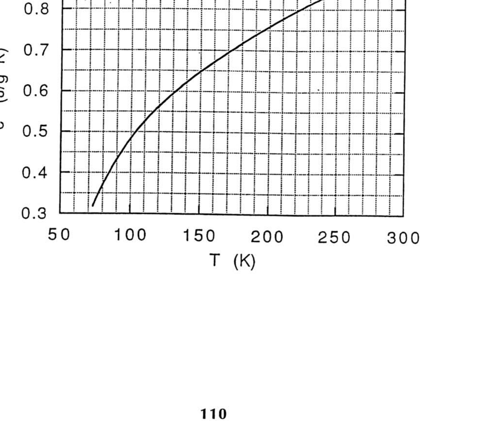
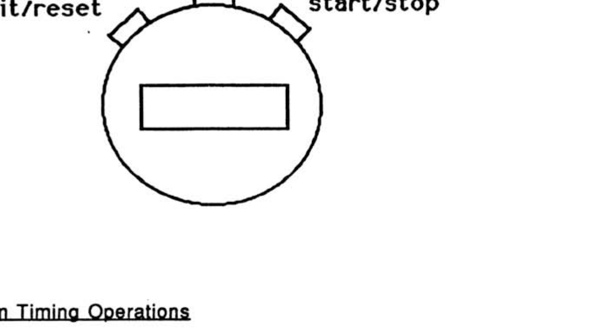
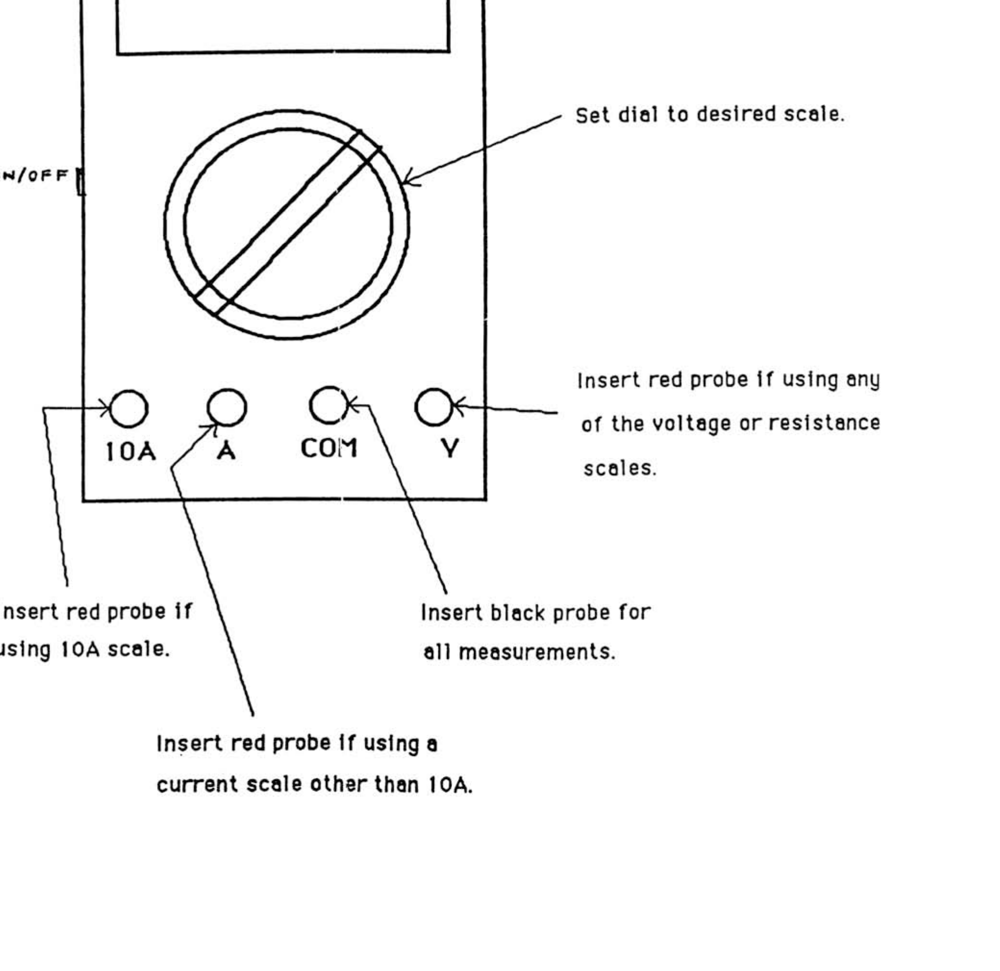

## Experimental Problem 1

## THE HEAT OF VAPORIZATION OF NITROGEN

The object of this experiment is to measure the heat of vaporization per unit mass $(L)$ of nitrogen using two different methods. In Method \#1, you will add a piece of aluminum to the sample of liquid nitrogen and measure how much liquid nitrogen evaporates as the aluminum cools. In Method \#2, you will add energy in the form of heat at a known rate to the sample of liquid nitrogen and measure the rate at which the liquid nitrogen vaporizes.

The liquid nitrogen is supplied to you in the "reservoir" container. Some of it can be poured into the "sample" container, which can be placed on the mass balance. The reading of the mass balance will decrease as liquid nitrogen vaporizes. This occurs (1) because the container is not a perfect insulator, (2) because energy is being added to the liquid nitrogen in the form of heat when the aluminum cools (in Method \#1), and (3) because energy is being added to the liquid nitrogen in the form of heat when current passes through a resistor placed in the liquid nitrogen (in Method \#2). A multimeter, which can be used to measure voltage $(V)$, current $(I)$, and resistance $(R)$, as well as a stopwatch are supplied. Instructions for using the multimeter and stopwatch are attached.

## Warnings

(1) Liquid nitrogen is very cold, so do not let it, or any object which has been cooled by it, touch you or your clothing in any way.
(2) Do not drop anything in the liquid nitrogen, and wear safety goggles at all times.
(3) Place the piece of aluminum in the liquid nitrogen slowly, as it will cause the liquid nitrogen to boil rapidly until equilibrium is reached. A piece of string is supplied for this purpose.
(4) The resistor can get very hot if it is not immersed in the liquid nitrogen. Pass current through the resistor only when it is in the container and completely immersed in liquid nitrogen.

## Method \#1

The specific heat of aluminum (c) varies significantly between room temperature and the temperature at which liquid nitrogen vaporizes under atmospheric pressure ( 77 K ). A graph showing the variation of $c$ with temperature ( $T$ ) is attached. Conduct an experiment to measure how much liquid nitrogen vaporizes when the aluminum block is cooled. Use this determination and the specific heat graph to determine the heat of vaporization per unit mass of nitrogen. You may assume that room temperature is $21 \pm 2^{\circ} \mathrm{C}$. Be sure to provide a quantitative estimate of the accuracy of your heat of vaporization value.

## Method \#2

Conduct an experiment to measure the rate at which liquid nitrogen vaporizes when current is passed through the resistor placed in the liquid nitrogen. A direct current power supply is provided; use it only with the dial in the " 8 " position and do not disconnect the
capacitor installed across its terminals. Use this result to determine the heat of vaporization per unit mass of nitrogen. Be sure to provide a quantitative estimate of the accuracy of your result.

Notes:
(1) Please include sketches, schematic diagrams, properly labelled tables, numbers with the proper units, etc. so the graders can determine exactly what you did.
(2) Ask for assistance if any piece of equipment is not working properly.

## Digital Stopwatch

## To Perform Timing Operations

1. Press "Mode" until 00000 appears
(You may have to press "Mode" several times to get the 00000 to appear)

## To Time a Single Interval

1. Press "Start/Stop" to start stopwatch.
2. Press "Start/Stop" to stop stopwatch.
3. Press "Split/Reset" to reset stopwatch to zero.

## Io Time Multiple Events Without Stopping the Stopwatch

1. Press "Start/Stop" to start stopwatch.
2. Press "Split/Reset" to stop the display while stopwatch keeps running.
3. Press "Split/Reset" to reset display to actual time.
4. Press "Start/Stop" to stop stopwatch after last event.
5. Press "Split/Reset" to reset stopwatch to zero.

## Multimeter

Insert red probe if using a current scale other than 10A.
