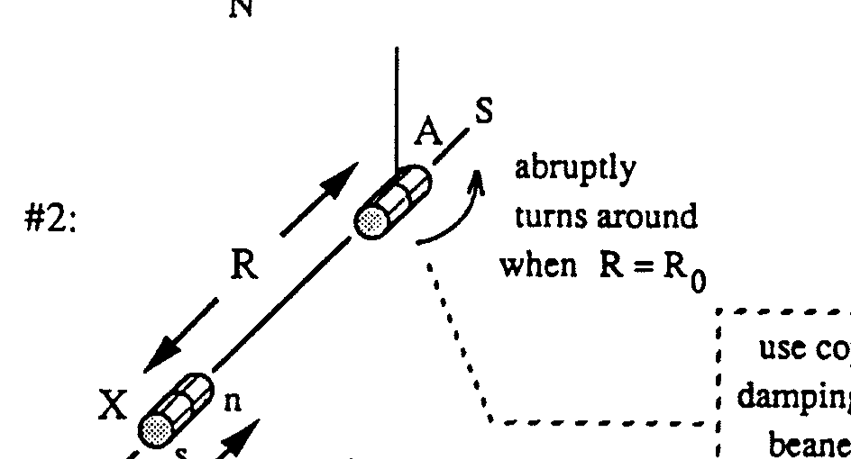
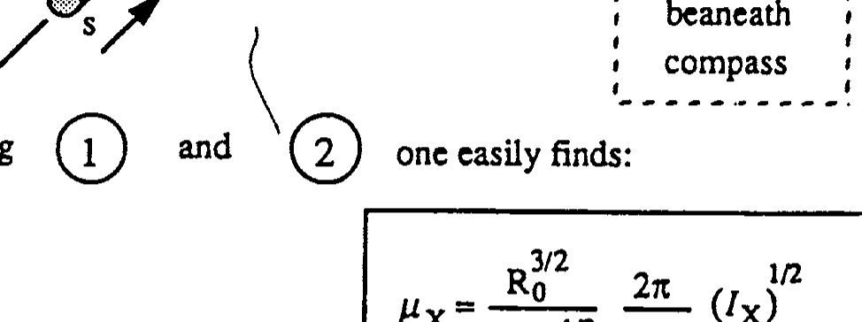
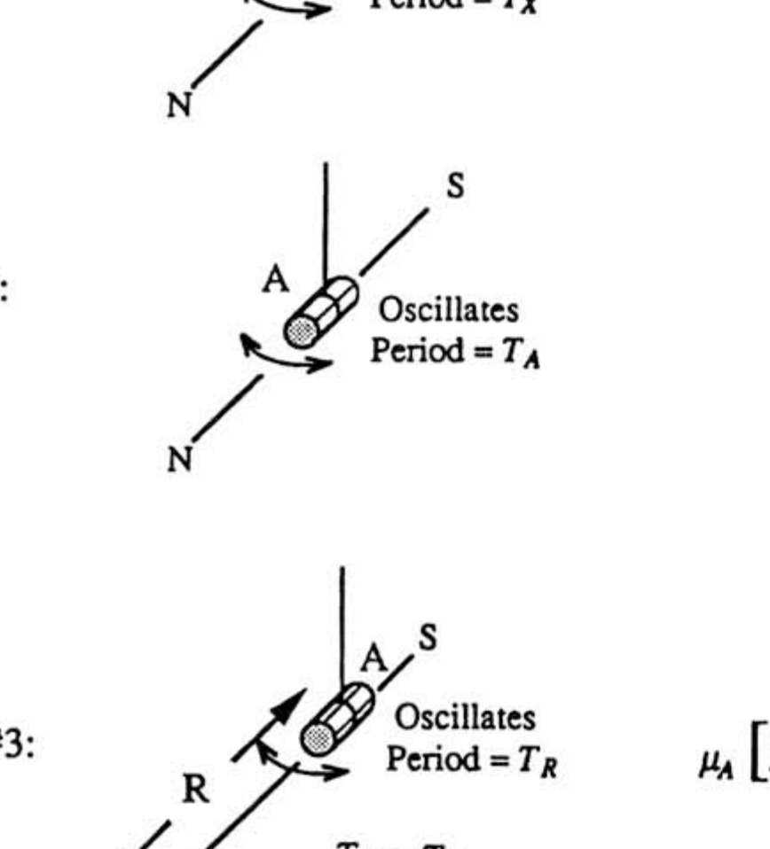
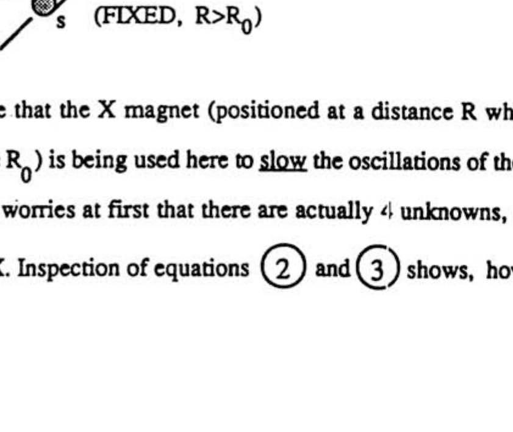
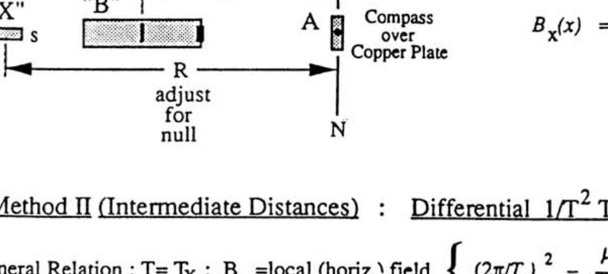
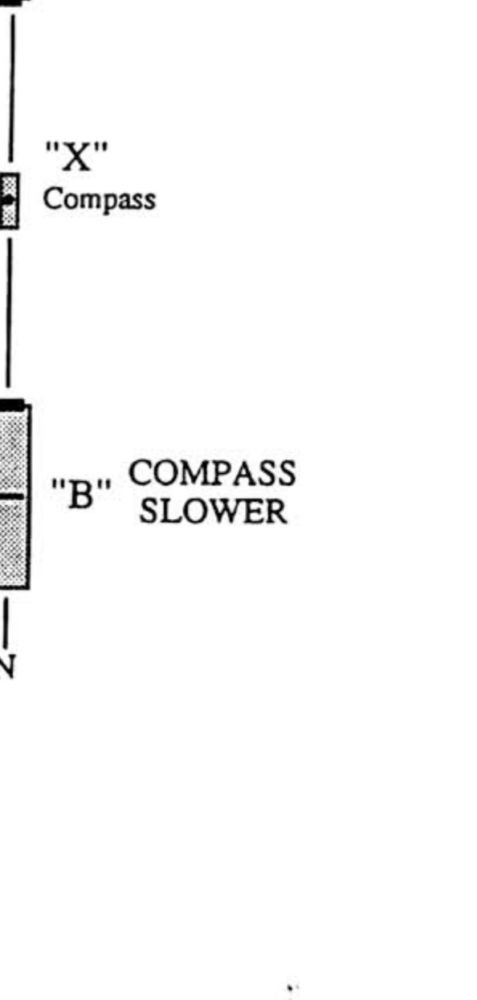
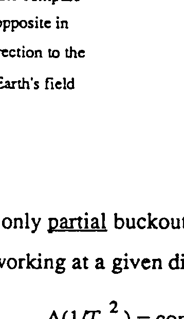
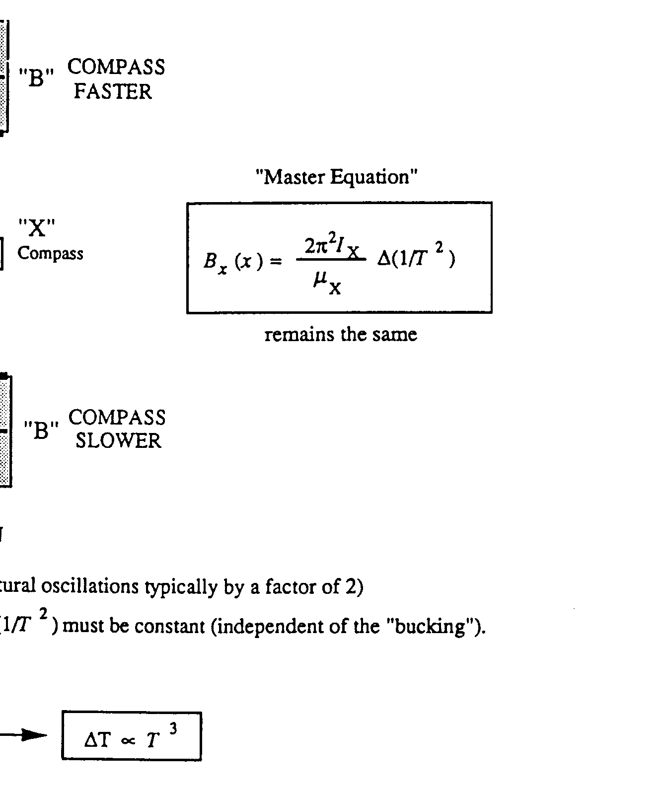
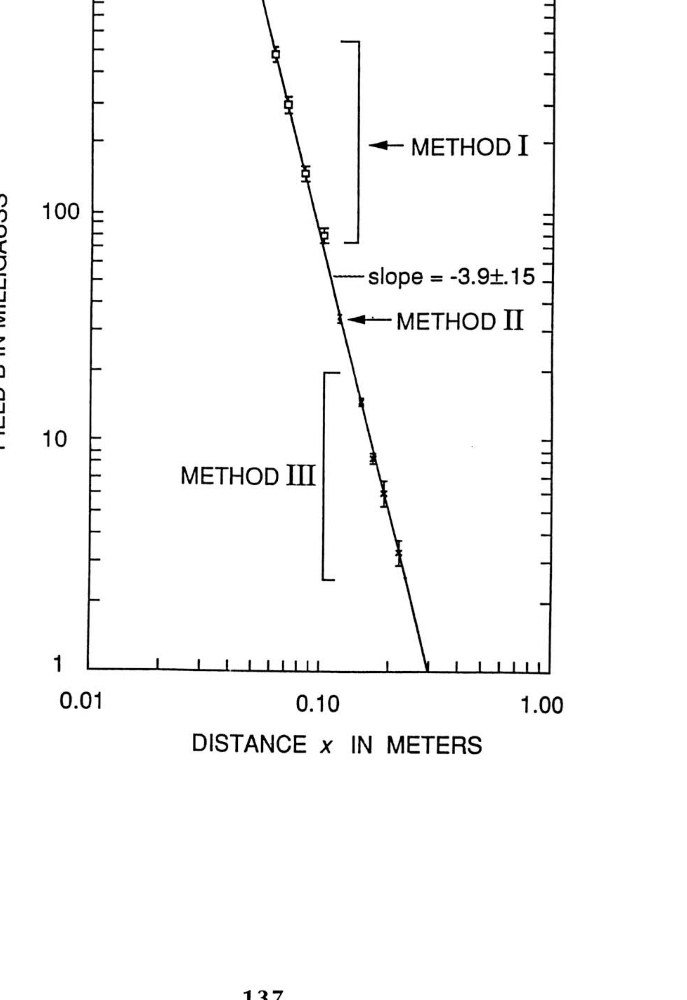
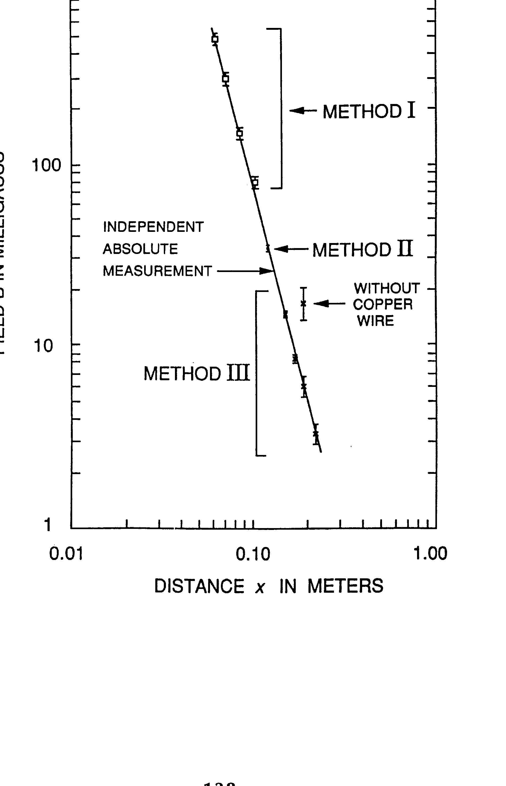

## Experimental Problem 2 ... Solutions

## PART 1: DETERMINATION OF $\mu_{\mathrm{X}}$

## Basic Insight :

The idea which enables one to "see into" the problem is contained in the following remark: The oscillation period of a given suspended magnet depends on the product of its moment and the (horizontal component of) the Earth's field, while the extent to which that magnet can influence the direction of another magnet used as a compass depends on the ratio of those two quantities.

It follows that by making measurements of both types, both the unknown moment and the horizontal component of the Earth's field can be determined. We suspect that this idea goes historically back to Gauss.

## First Solution : The "Turn-Around Method"

Experimental Arrangement

Combining

(1) and

one easily finds:

Equation

$$
\mu_{\mathrm{X}} B_{h}=I_{\mathrm{X}}\left(2 \pi / T_{\mathrm{X}}\right)^{2}
$$

$$
\mu_{\mathrm{x}} \frac{2 K}{\mathrm{R}_{0}^{3}}=B_{h}
$$

$$
\mu_{\mathrm{X}}=\frac{\mathrm{R}_{0}^{3 / 2}}{(2 K)^{1 / 2}} \frac{2 \pi}{T_{\mathrm{X}}}\left(I_{\mathrm{X}}\right)^{1 / 2}
$$

Second Solution : Dynamic Method with 3 Unknowns
The experience from our tests was that the "Turn-Around" method did not occur naturally to most students. They were much more comfortable with the idea of using one magnet to influence the period of another. Since the magnetic moments are not necessarily equal, it is clear that two measurements will no longer suffice. Our guess is that the following 3 -measurement scheme will be the most common student choice.

Experimental Arrangement

Equation

$$
\mu_{\mathrm{X}} B_{h}=I_{\mathrm{X}}\left(2 \pi / T_{\mathrm{X}}\right)^{2}
$$

$$
\mu_{\mathrm{A}} B_{h}=I_{\mathrm{A}}\left(2 \pi / T_{\mathrm{A}}\right)^{2}
$$

$$
\mu_{A}\left[B_{h}-\mu_{\mathrm{X}} \frac{2 K}{\mathrm{R}^{3}}\right]=I_{\mathrm{A}}\left(2 \pi / T_{\mathrm{R}}\right)^{2}
$$

Note that the X magnet (positioned at a distance R which is somewhat larger than the turn-around distance $R_{0}$ ) is being used here to slow the oscillations of the $A$ magnet on the compass.

One worries at first that there are actually 4 unknowns, since the inertial moment of A need not equal that of $X$. Inspection of equations (2) and (3) shows, however, that the ratio $\mu_{X} / B_{h}$ can be expresed
in terms of experimentally known quantities. Since (1) gives the product $\mu_{X} B_{h}$, the calculational strategy is clear. One easily finds:

$$
\mu_{\mathrm{X}}=\frac{\mathrm{R}^{3 / 2}}{(2 K)^{1 / 2}} \frac{2 \pi}{T_{\mathrm{X}}}\left(I_{\mathrm{X}}\right)^{1 / 2}\left[1-\left(T_{\mathrm{A}} / T_{\mathrm{R}}\right)^{2}\right]^{1 / 2}
$$

Alternatively, by reversing its poles, one can use the $X$ magnet to speed-up the oscillations of the $A$ magnet. Then, of course we have $T_{\mathrm{R}}<T_{\mathrm{A}}$. In this case (which is formally equivalent to the first case, with a reversal of the sign of $K$ ), one finds:

$$
\mu_{\mathrm{X}}=\frac{\mathrm{R}^{3 / 2}}{(2 K)^{1 / 2}} \frac{2 \pi}{T_{\mathrm{X}}}\left(I_{\mathrm{X}}\right)^{1 / 2}\left[\left(T_{\mathrm{A}} \pi_{\mathrm{R}}\right)^{2}-1\right]^{1 / 2}
$$

## SAMPLE EXPERIMENT

The Dynamic Method just outlined was used (in the case where the X magnet was used to slow down the oscillations of the A magnet in Arrangement \#3). In all cases 20 oscillations were timed. The distance R was $(17.0 \pm 0.1) \mathrm{cm}$. The X moment of inertia was $I_{\mathrm{X}}=(4.95 \pm 0.1) \times 10^{-8} \mathrm{~kg} \mathrm{~m}^{2}$. Using the notation given previously, the data were as follows:

$$
\begin{array}{ll}
\text { Measurements (in seconds) of } 20 T_{\mathrm{X}}: 10.83,10.99,10.91,10.94 . & \text { [Arrangement \#1] } \\
\text { Measurements (in seconds) of } 20 T_{\mathrm{A}}: 10.95,11.10,11.01,10.92 . & \text { [Arrangement \#2] } \\
\text { Measurements (in seconds) of } 20 T_{\mathrm{R}}: 21.70,21.65,21.78,21.59 . & \text { [Arrangement \#3] }
\end{array}
$$

Using a pocket calculator (HP32S) to obtain the averages and statistical errors gives:

$$
\begin{aligned}
& T_{\mathrm{X}}=(0.546 \pm .003) \mathrm{sec} \\
& T_{\mathrm{A}}=(0.550 \pm .004) \mathrm{sec} \\
& T_{\mathrm{R}}=(1.084 \pm .004) \mathrm{sec}
\end{aligned}
$$

The "statistical errors"" here are naively based on what the calculator gave for the estimated standard deviation around the sample mean. More carefully, one should divide this by the square root of the number of observations to give the estimated standard error of the sample mean. [Still more carefully, for such a small sample, one should apply th.e appropriate statistical correction factor]. For simplicity
we will use the naively calculated results. This will suffice for our purposes.
Write (4) as $\mu_{X}=G F$, where

$$
G=\frac{\mathrm{R}^{3 / 2}}{(2 K)^{1 / 2}} \frac{2 \pi}{T_{\mathrm{X}}}\left(I_{\mathrm{X}}\right)^{1 / 2} \quad \text { and } \quad F=\left[1-\left(T_{\mathrm{A}} / T_{\mathrm{R}}\right)^{2}\right]^{1 / 2}
$$

The expression for G is identical for that for $\mu_{\mathrm{X}}$ in the "turnaround method" when $\mathrm{R}=\mathrm{R}_{0}$. This must be true, since in that case $T_{R}$ goes to infinity.

Numerically

$$
G=\frac{[(0.170 \pm 0.001) \mathrm{m}]^{3 / 2}}{\left[2 \times 10^{-7} \mathrm{~N} / \mathrm{A}^{2}\right]^{1 / 2}} \frac{2 \pi}{(0.546 \pm .003) \mathrm{sec}}\left[(4.95 \pm 0.1) \times 10^{-8} \mathrm{~kg} \mathrm{~m}^{2}\right]^{1 / 2}
$$

then standard error propagation and reduction of the units give

$$
G=(0.401 \pm 0.006) \mathrm{Am}^{2}
$$

which is a $1.5 \%$ uncertainty. For $F$ we find numerically:

$$
F=\left\{1.000-\left[\frac{(0.550 \pm .004) \mathrm{sec}}{(1.084 \pm .004) \mathrm{sec}}\right]^{2}\right\}^{1 / 2}
$$

The central value here is 0.862 . One can easily use a pocket calculator to see the effects of the permitted statistical variations in each of the two places above. This shows that the effect of the numerator uncertainty is essentially $\pm 0.0022$, while that of the denominator is $\pm 0.0013$. Combining these statistically gives an net uncertainty in F of 0.0026 , so that the fractional uncertainty in F is 0.0033 . [ An analysis of this by calculus is straightforward, but cumbersome.] Then the fractional uncertainty in $\mu_{\mathrm{X}}$ is practically that in $G$. We find:

$$
\mu_{X}=(0.862 \pm 0.0026)(0.401 \pm 0.006) A m=(0.346 \pm .005) \mathrm{Am}^{2}
$$

By way of comparison, measurement of the same magnet X using Fluxgate Magnetometry (at a distance of around 16 cm ) gave $\mu_{\mathrm{X}}=(0.345 \pm .003) \mathrm{A} \mathrm{m}^{2}$.

## PART 2 : DISTANCE DEPENDENCE OF FIELD OF "B" UNKOWN

## Method I (Close Distances) : Nulling of Transverse Static Deflection

## Arrangement (top view)

## Equation

$$
B_{\mathrm{x}}(x)=\frac{2 K \mu_{\mathrm{x}}}{\mathrm{R}^{3}}
$$

## Method II (Intermediate Distances) : Differential $1 / \mathrm{T}^{2}$ Technique

General Relation : $\mathrm{T}=\mathrm{T}_{\mathrm{X}} ; \mathrm{B}_{h}=$ local (horiz.) field $\left\{(2 \pi / T)^{2}=\frac{\mu_{\mathrm{X}} B_{h}}{I_{\mathrm{X}}}\right.$

## Arrangement (top view)

DEFINE:

$$
\Delta\left(1 / T^{2}\right) \equiv\left(1 / T^{2}\right)_{\text {faster }}-\left(1 / T^{2}\right)_{\text {slower }}
$$

THEN:

$$
\begin{gathered}
\Delta\left(1 / T^{2}\right)=\frac{\mu_{\mathrm{X}} \Delta B_{h}}{4 \pi^{2} I_{\mathrm{X}}} \quad \text { where } \Delta B_{h}=2 B_{x}(x) \\
B_{x}(x)=\frac{2 \pi^{2} I_{\mathrm{X}}}{\mu_{\mathrm{X}}} \Delta\left(1 / T^{2}\right)
\end{gathered}
$$

## "Master Equation"

## Method III (Large Distances) :

## Differential $1 / \mathrm{T}^{2}$ Technique with Partial "Bucking" of the Earth's Field

tape "A" magnet VERY SECURELY in position:

Use only partial buckout --(slow natural oscillations typically by a factor of 2 )
In working at a given distance $x, \Delta\left(1 / T^{2}\right)$ must be constant (independent of the "bucking").

$$
\begin{aligned}
& \Delta\left(1 / T^{2}\right)=\text { const. } \\
& \Delta \mathrm{T} / T^{3}=\text { const. } \longrightarrow \Delta \mathrm{T} \propto T^{3}
\end{aligned}
$$

Sample Experiment

Method I

$$
B_{\mathrm{X}}(\mathrm{x})=\frac{2 K \mu_{\mathrm{X}}}{\mathrm{R}^{3}}=\frac{\left[\left(2 \times 10^{-7}\right) \mathrm{T} \mathrm{~m} / \mathrm{A}\right][0.346 \pm 0.005] \mathrm{Am}^{2}}{[\mathrm{R}(\mathrm{~m})]^{3}}
$$

| DATA TABLE FOR METHOD I measured data |  | calculated $B_{\mathrm{X}}(x)\left(10^{-7} \mathrm{~T}\right)$ | stundard ertor propagation   $\Delta \mathrm{B} / \mathrm{B}$ | see below |  |
| :--- | :--- | :--- | :--- | :--- | :--- |
| $x(\mathrm{~m})$ | R (m) |  |  | $4 \Delta x / x$ | $\left(\Delta \mathrm{B} / \mathrm{B}_{\mathrm{eff}}\right.$ |
| $.062 \pm 001$ | $.112 \pm 0.112$ | 493. | . 031 | . 065 | . 072 |
| $.0705 \pm 0015$ | $.133 \pm 0015$ | 294 | . 019 | . 085 | . 087 |
| $.0845 \pm .0015$ | $.167 \pm .002$ | 149 | . 039 | . 071 | . 081 |
| $.102 \pm .0015$ | . $206 \pm .005$ | 79 | . 074 | . 059 | . 095 |

The uncertainty in R includes the ruler reading error, together with the imprecision in locating the null position, the latter effect becoming predorninant at larger $x$. The R uncertainty, together with the small uncertainty in $\mu_{\mathrm{X}}$ define the $\Delta \mathrm{B} / \mathrm{B}$ values listed in the 4th column.

Of course there are also the uncertainties in the $x$ values, which we could represent graphically by horizontal error bars. Since this is technically awkward, we choose instead to define an effective vertical uncertainty. Since it turns out that the log-log plot slope is about -4 , a given fractional error in $x$ corresponds to 4 times as much in $B(x)$. These fractional errors have been tabulated in the 5 th column.

From this it is clear that we should take the effective $\Delta B / B$ as the square root of the sum of the squares of thecontributions in colums 4 and 5 . These values, listed in column 6 , form the basis for the error bars used. Though we would certainly not expect a student to do this, we would expect him to be aware of the horizontal uncertainties.

Method II

$$
B_{x}(x)=\frac{2 \pi^{2} I_{\mathrm{X}}}{\mu_{\mathrm{X}}} \Delta\left(1 / T^{2}\right)=(28.2 \pm .51) \times 10^{-7} \text { Tesla } \sec ^{2} \cdot \Delta\left(1 / T^{2}\right)
$$

- $x=(.120 \pm 001) \mathrm{m}$ :

Data in seconds for 20 oscillations: F'ocket Calculator Results:

$$
\begin{gathered}
20 T_{\text {slow }}: 14.56,14.50,14.52,14.58 \quad T_{\text {slow }}=(.727 \pm .0018) \mathrm{sec} \\
20 T_{\text {fast }}: 11.32,11.34,11.31,11.28 \quad T_{\text {fast }}=(.5656 \pm .0013) \mathrm{sec} \\
\left.\Delta\left(1 / T^{2}\right)=[(3.1257 \pm 0138)-(1.892 \pm 009) 5)\right] \mathrm{sec}^{-2}=(1.23 \pm .017) \mathrm{sec}^{-2} \\
\xrightarrow{ } B_{x}(x)=(34.7 \pm 0.8) \times 10^{-7} \text { Tesla }
\end{gathered}
$$

## Method III

Introduced bucking magnet in transverse position to slow oscillations in Earth's Field to about 1.2 sec Master equation is still:

$$
B_{x}(x)=\frac{2 \pi^{2} I_{X}}{\mu_{X}} \Delta\left(1 / T^{2}\right)=(28.2 \pm .51) \times 10^{-7} \text { Tesla } \sec ^{2} \cdot \Delta\left(1 / T^{2}\right)
$$

${ }^{\bullet} x=(.150 \pm .001) \mathrm{m}$ :
Data in seconds for 20 oscillations: Pocket Calculator Results:

$$
\begin{array}{cll}
20 T_{\text {slow }}: & 27.90,27.80,27.78,27.77 & T_{\text {slow }}=(1.391 \pm .003) \mathrm{sec} \\
20 T_{\text {fast }}: & 19.5619 .66,19.50,19.64 & T_{\text {fast }}=(.9795 \pm .0037) \mathrm{sec} \\
\Delta\left(1 / T^{2}\right)= & {[(1.0422 \pm .0079)-(.5171 \pm .0022)] \mathrm{sec}^{-2}=(.525 \pm .0082) \mathrm{sec}^{-2}} \\
& \longrightarrow B_{x}(x)=(14.8 \pm .35) \times 10^{-7} \mathrm{Tesla}
\end{array}
$$

${ }^{\circ} x=(.170 \pm .001) \mathrm{m}$ :
Data in seconds for 20 oscillations: Pocket Calculator Results:

$$
\begin{array}{cll}
20 T_{\text {slow }}: & 24.97,24.97,24.87 & T_{\text {slow }}=(1.2468 \pm .0029) \mathrm{sec} \\
20 T_{\text {fast }}: & 20.55,20.46,20.79,20.65 & T_{\text {fast }}=(1.0306 \pm .00708) \mathrm{sec} \\
\Delta\left(1 / T^{2}\right)= & {[(.9415 \pm .013)-(.6433 \pm 0030)] \mathrm{sec}^{-2}=(.298 \pm .013) \mathrm{sec}^{-2}} \\
& \longrightarrow B_{x}(x)=(8.4 \pm 0.4) \times 10^{-7} \mathrm{Tesla}
\end{array}
$$

${ }^{\circ} x=(.190 \pm .001) \mathrm{m}$ :
Data in seconds for 20 oscillations: Pocket Calculator Results:

$$
\begin{gathered}
20 T_{\text {slow }}: 17.17,17.15,17.11,17.10 \quad T_{\text {slow }}=(.8566 \pm .0017) \mathrm{sec} \\
20 T_{\text {fast }}: 16.01,15.93,15.91,15.92 \quad T_{\text {fast }}=(.797 \pm .0029) \mathrm{sec} \\
\Delta\left(1 / T^{2}\right)=[(1.574 \pm .028)-(1.3628 \pm .0053)] \mathrm{sec}^{-2}=(.2112 \pm .029) \mathrm{sec}^{-2} \\
\longrightarrow B_{x}(x)=(6.0 \pm 0.8) \times 10^{-7} \mathrm{Tesla}
\end{gathered}
$$

- $x=(.220 \pm .001) \mathrm{m}$ :

Data in seconds for 20 oscillations: Pocket Calculator Results:

$$
\begin{array}{cll}
20 T_{\text {slow }}: & 23.80,23.76,23.70 & T_{\text {slow }}=(1.1877 \pm .00252) \mathrm{sec} \\
20 T_{\text {fast }}: & 22.27,21.98,21.86,21.94 & T_{\text {fast }}=(1.1006 \pm .0089) \mathrm{sec} \\
\Delta\left(1 / T^{2}\right) & =[(.8255 \pm .0134)-(.7089 \pm .0030)] \mathrm{sec}^{-2}=(.1166 \pm .014) \mathrm{sec}{ }^{-2} \\
& \longrightarrow B_{x}(x)=(3.3 \pm 0.4) \times 10^{-7} \mathrm{Tesla}
\end{array}
$$

| DATA TA $x(\mathrm{~m})$   $x(\mathrm{~m})$ | Method | calculated $\underline{B_{\mathrm{X}}(\mathrm{x}) \quad\left(10^{-7} \mathrm{~T}\right)}$ | standard error propagation $\Delta \mathrm{B} / \mathrm{B}$ | see above |  |
| :--- | :--- | :--- | :--- | :--- | :--- |
|  |  |  |  | $4 \Delta x / x$ | $\left(\underline{\Delta \mathrm{B} / \mathrm{B}_{\text {eff }}}\right)$ |
| $.120 \pm .001$ | II | 34.7 | . 023 | . 033 | . 040 |
| $.150 \pm .001$ | III | 14.8 | . 024 | . 027 | . 036 |
| $.170 \pm 001$ | III | 8.4 | . 05 | . 024 | . 055 |
| $.190 \pm .001$ | III | 6.0 | . 13 | . 021 | . 13 |
| $.220 \pm .001$ | III | 3.3 | . 12 | . 018 | . 12 |

The equivalent vertical uncertainties have calculated as before and tabulated in the last column above. These give the error bars on the log-log plot shown on the next page. The three different methods are nicely consistent, and the whole data set well fits the power law indicated by the drawn line. When this is done on the regular log paper (as provided), the easiest way in this case to get the slope is to use a pocket calculator to find the ratio of the log of the vertical rise ratio to that of the horizontal run ratio for the possible lines consistent with the errors. Since the line has to drop vertically through three decades in total, this is roughly

$$
\text { slope }=\frac{-3}{\log _{10}\left[\frac{(0.30 \pm .02)}{(.051 \pm .03)}\right]}=-3.9 \pm 0.15
$$

For this particular unknown, the fluxgate magnetometer data gave an effective exponent of -3.92 over the range from 0.07 m to 0.22 m . A more detailed absolute comparison with those measurements is shown on the second graph. Here the drawn line corresponds to the actual magnetometer data. The student experiment is clearly doing an excellent job. Of particular interest is the next to the lowest point $(x=0.19 \mathrm{~m})$. For this point, the "buckout" magnet had been moved out a little bit so that the natural compass period in the Earth's field was about 0.89 sec ., which was close to the period of the "pendulum mode". This was done deliberately to test the effectiveness of the copper wire "mode-decoupler". The point at $x=0.19 \mathrm{~m}$ which is on the line was taken using the decoupler. The point at the same $x$ value which is almost a factor of 3 higher than the line was taken without the decoupler.

This shows that the decoupler is both effective and important. Without it, the "fast" and "slow" measurements are effected differently by the coupling to the pendulum mode. Then the small difference between them can be very poorly determined.

