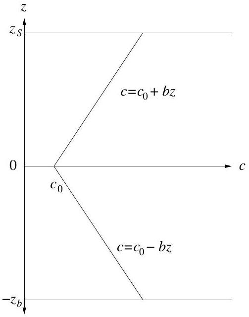
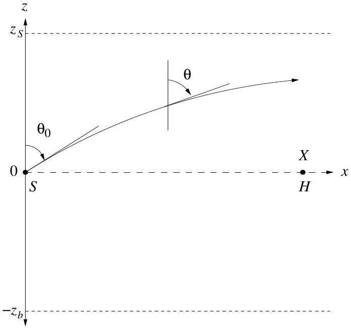

## Theoretical Question 2

## Sound Propagation

Introduction
The speed of propagation of sound in the ocean varies with depth, temperature and salinity. Figure 1(a) below shows the variation of sound speed $c$ with depth $z$ for a case where a minimum speed value $c_{0}$ occurs midway betweeen the ocean surface and the sea bed. Note that for convenience $z=0$ at the depth of this sound speed minimum, $z=z_{S}$ at the surface and $z=-z_{b}$ at the sea bed. Above $z=0, c$ is given by

$$
c=c_{0}+b z .
$$

Below $z=0, c$ is given by

$$
c=c_{0}-b z .
$$

In each case $b=\left|\frac{d c}{d z}\right|$, that is, $b$ is the magnitude of the sound speed gradient with depth; $b$ is assumed constant.

Figure 1 (a)

Figure 1 (b)

Figure 1(b) shows a section of the $z-x$ plane through the ocean, where $x$ is a horizontal direction. The variation of $c$ with respect to $z$ is shown in figure 1(a). At the position $z=0, x=0$, a sound source $S$ is located. A 'sound ray' is emitted from $S$ at an angle $\theta_{0}$ as shown. Because of the variation of $c$ with $z$, the ray will be refracted.

(a) (6 marks)
Show that the trajectory of the ray, leaving the source $S$ and constrained to the $z-x$ plane forms an arc of a circle with radius $R$ where
$$
R=\frac{c_{0}}{b \sin \theta_{0}} \text { for } 0 \leq \theta_{0}<\frac{\pi}{2} .
$$
(b) (3 marks)
Derive an expression involving $z_{S}, c_{0}$ and $b$ to give the smallest value of the angle $\theta_{0}$ for upwardly directed rays which can be transmitted without the sound wave reflecting from the sea surface.
(c) (4 marks)
Figure 1(b) shows the position of a sound receiver $H$ which is located at the position $z=0, x=X$. Derive an expression involving $b, X$ and $c_{0}$ to give the series of angles $\theta_{0}$ required for the sound ray emerging from $S$ to reach the receiver $H$. Assume that $z_{S}$ and $z_{b}$ are sufficiently large to remove the possibility of reflection from sea surface or sea bed.

(d) (2 marks)
Calculate the smallest four values of $\theta_{0}$ for refracted rays from $S$ to reach $H$ when
    - $X=10000 \mathrm{~m}$
    - $c_{0}=1500 \mathrm{~ms}^{-1}$
    - $b=0.02000 \mathrm{~s}^{-1}$
(e) (5 marks)
Derive an expression to give the time taken for sound to travel from $S$ to $H$ following the ray path associated with the smallest value of angle $\theta_{0}$, as determined in part (c). Calculate the value of this transit time for the conditions given in part (d). The following result may be of assistance:
$$
\int \frac{d x}{\sin x}=\ln \tan \left(\frac{x}{2}\right)
$$
Calculate the time taken for the direct ray to travel from $S$ to $H$ along $z=0$. Which of the two rys will arrive first, the ray for which $\theta_{0}=\pi / 2$, or the ray with the smallest value of $\theta_{0}$ as calculated for part (d)?
