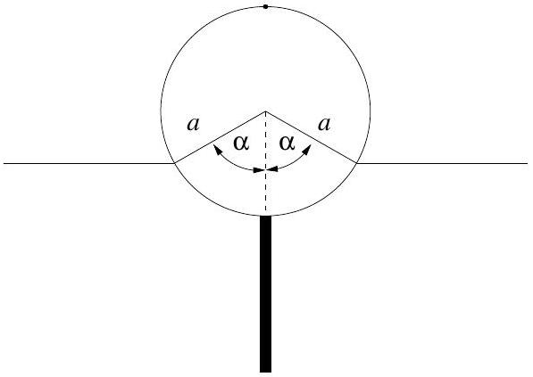
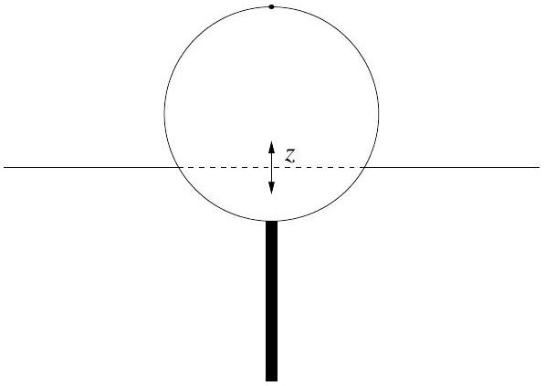
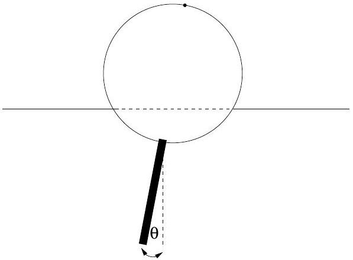
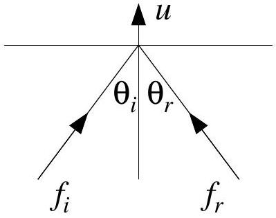
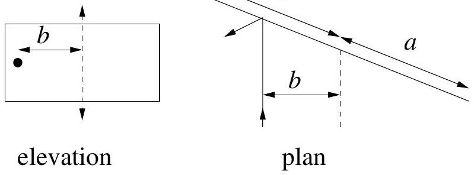
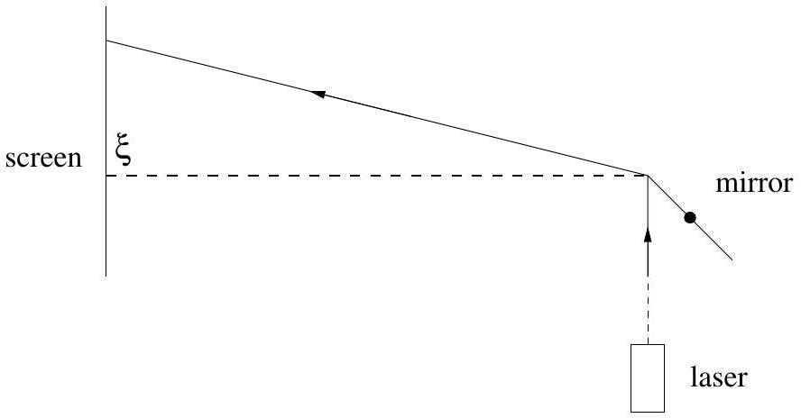

## Theoretical Question 3

## Cylindrical Buoy

(a) (3 marks)
A buoy consists of a solid cylinder, radius $a$, length $l$, made of lightweight material of uniform density $d$ with a uniform rigid rod protruding directly outwards from the bottom halfway along the length. The mass of the rod is equal to that of the cylinder, its length is the same as the diameter of the cylinder and the density of the rod is greater than that of seawater. This buoy is floating in sea-water of density $\rho$.
In equilibrium derive an expression relating the floating angle $\alpha$, as drawn, to $d / \rho$. Neglect the volume of the rod.

(b) (4 marks)
If the buoy, due to some perturbation, is depressed vertically by a small amount $z$, it will experience a nett force, which will cause it to begin oscillating vertically about the equilibtium floating position. Determine the frequencty of this vertical mode of vibration in terms of $\alpha, g$ and $a$, where $g$ is the acceleration due to gravity. Assume the influence of water motion on the dynamics of the buoy is such as to increase the effective mass of the buoy by a factor of one third. You may assume that $\alpha$ is not small.

(c) (8 marks)
In the approximation that the cylinder swings about its horizontal central axis, determine the frequency of swing again in terms of $g$ and $a$. Neglect the dynamics and viscosity of the water in this case. The angle of swing is assumed to be small.

(d) (5 marks)
The buoy contains sensitive acelerometers which can measure the vertical and swinging motions and can relay this information by radio to shore. In relatively calm waters it is recorded that the vertical oscillation period is about 1 second and the swinging oscillation period is about 1.5 seconds. From this information, show that the floating angle $\alpha$ is about 90° and thereby estimate the radius of the buoy and its total mass, given that the cylinder length $l$ equals $a$.

[You may take it that $\rho \simeq 1000 \mathrm{kgm}^{-3}$ and $g \simeq 9.8 \mathrm{~ms}^{-2}$.]

## Original Theoretical Question 3

The following question was not used in the XXVI IPhO examination.

## Laser and Mirror

(a) Light of frequency $f_{i}$ and speed $c$ is directed at an angle of incidence $\theta_{i}$ to the normal of a mirror, which is receding at speed $u$ in the direction of the normal. Assuming the photons in the light beam undergo an elastic collision in the rest frame of the mirror, determine in terms of $\theta_{i}$ and $u / c$ the angle of reflection $\theta_{r}$ of the light and the reflected frequency $f_{r}$, with respect to the original frame.

[You may assume the following Lorentz transformation rules apply to a particle with energy $E$ and momentum p:
$$
p_{\perp}=p_{\perp}, \quad p_{\|}=\frac{p_{\|}-v E / c^{2}}{\sqrt{1-v^{2} / c^{2}}}, \quad E=\frac{E-v p_{\|}}{\sqrt{1-v^{2} / c^{2}}},
$$
where $\mathbf{v}$ is the relative velocity between the two inertial frames; $p$ stands for the component of momentum perpendicular to v and $p$ represents the component of momentum parallel to v.]
(b) A thin rectangular light mirror, perfectly reflecting on each side, of width $2 a$ and mass $m$, is mounted in a vacuum (to eliminate air resistance), on essentially frictionless needle bearings, so that it can rotate about a vertical axis. A narrow laser beam operating continuously with power $P$ is incident on the mirror, at a distance $b$ from the axis, as drawn.

Suppose the mirror is originally at rest. The impact of the light causes the mirror to acquire a very small but not constant angular acceleration. To analyse the siuation approximately, assume that at any given stage in the acceleration process the angular velocity $\omega$ of the mirror is constant throughout any one complete revolution, but takes on a slightly larger value in the next revolution due to the angular momentum imparted to the mirror by the light during the preceding revolution. Ignoring second order terms in the ratio (mirror velocity $/ c$ ), calculate this increment of angular momentum per revolution at any given value of $\omega$. [HINT: You may find it useful to know that $\int \sec ^{2} \theta d \theta=\tan \theta$.]
(c) Using the fact that the velocity of recoil of the mirror remains small compared with $c$, derive an approximate expression for $\omega$ as a function of time.

(d) As the mirror rotates, there will be instants when the light is reflected from its edge, giving the reflected ray an angle of somewhat more than 90° with respect to the incident beam.. A screen 10 km away, with its normal perpendicular to the incident beam, intercepts the beam reflected from near the mirror's edge. Find the deviation $\xi$ of that extreme spot from its initial position (as shown by the dashed line, when the mirror was almost at rest), after the laser has operated for 24 hours. You may suppose the laser power is $P=100 \mathrm{~W}$, that the mirror has mass $m=1$ gram and that the geometry of the apparatus corresponds to $a=b \sqrt{2}$. Neglect diffraction effects at the edge.

