## PART 5

## Experimental Competition

| Exam commission | page | 142 |
| :--- | :--- | :--- |
| Problems in English | page | 143 |
| The men behind the equipment | page | 153 |
| Model answers in English | page | 154 |
| Marking form (translated to English) | page | 165 |
| The last preparations (photos) | page | 171 |
| Examples of translated texts | page | 172 |
| Examples of student's papers | page | 181 |
| Photos from the experim. competition | page | 190 |

Preparation of the experimental competition was carried out by:

Børge Holme

Tom Henning Johansen

Arnt Inge Vistnes

## Commission for the Experimental Competition:

Tom Henning Johansen
Børge Holme
Svenn L. Andersen
Carl Angell
Bjørn Berre ${ }^{\#}$
Jan Kåre Bording
Magne Guttormsen
Vidar Hansen
Tor Haugset
Geir Helgesen ${ }^{§}$
Jan Holtet
Randi Haakenaasen
Trond Myklebust
Jon Samset ${ }^{\text {§ }}$
from
University of Oslo, Oslo
§ : Institute for Energy Technology, Kjeller
\# : Agricultural University of Norway, As

## $\mathbf{2 7}^{\text {th }}$ INTERNATIONAL PHYSICS OLYMPIAD OSLO, NORWAY

## EXPERIMENTAL COMPETITION   JULY 41996

## Time available: 5 hours

## READ THIS FIRST :

1. Use only the pen provided.
2. Use only the marked side of the paper.
3. No points will be given for error estimates except in 2c. However, it is expected that the correct number of significant figures are given.
4. When answering problems, use as little text as possible. You get full credit for an answer in the form of a numerical value, a drawing, or a graph with the proper definition of axes, etc.
5. Write on top of every sheet in your report:
    - Your candidate number (IPhO ID number)
    - The section number
    - The number of the sheet
6. Write on the front page the total number of sheets in your report, including graphs, drawings etc.
7. Ensure to include in your report the last page in this set used for answering section 2a and 3b, as well as all graphs requested.

SAFETY HAZARD: Be careful with the two vertical blades on the large stand. The blades are sharp!

## SUMMARY

The set of problems will cover a number of topics in physics. First, some mechanical properties of a physical pendulum will be explored, and you should be able to determine the acceleration of gravity. Then, magnetic forces are added to the pendulum. In this part the magnetic field from a permanent magnet is measured using an electronic sensor. The magnetic moment of a small permanent magnet will be determined. In addition, a question in optics in relation to the experimental setup will be asked.

## INSTRUMENTATION

The following equipment is available (see Figure 1):

A Large aluminium stand
B Threaded brass rod with a tiny magnet in one end (painted white) (iron in the other).
C 2 Nuts with a reflecting surface on one side
D Oscillation period timer (clock) with digital display
E Magnetic field (Hall) probe, attached to the large stand
F 9 V battery
G Multimeter, Fluke model 75
H 2 Leads
I Battery connector
J Cylindrical stand made of PVC (grey plastic material)
K Threaded rod with a piece of PVC and a magnet on the top
L Small PVC cylinder of length 25.0 mm (to be used as a spacer)
M Ruler

If you find that the large stand wiggles, try to move it to a different posistion on your table, or use a piece of paper to compensate for the non-flat surface.

The pendulum should be mounted as illustrated in Figure 1. The long threaded rod serves as a physical pendulum, hanging in the large stand by one of the nuts. The groove in the nut should rest on the two vertical blades on the large stand, thus forming a horizontal axis of rotation. The reflecting side of the nut is used in the oscillation period measurement, and should always face toward the timer.

The timer displays the period of the pendulum in seconds with an uncertainty of $\pm 1 \mathrm{~ms}$. The timer has a small infrared light source on the right-hand side of the display (when viewed from the front), and an infrared detector mounted
close to the emitter. Infrared light from the emitter is reflected by the mirror side of the nut. The decimal point lights up when the reflected light hits the detector. For proper detection the timer can be adjusted vertically by a screw (see N in Figure 1). Depending on the adjustment, the decimal point will blink either once or twice each oscillation period. When it blinks twice, the display shows the period of oscillation, $T$. When it blinks once, the displayed number is $2 T$. Another red dot appearing after the last digit indicates low battery. If battery needs to be replaced, ask for assistance.

The multimeter should be used as follows:
Use the "V $\Omega$ " and the "COM" inlets. Turn the switch to the DC voltage setting. The display then shows the DC voltage in volts. The uncertainty in the instrument for this setting is $\pm(0.4 \%+1$ digit $)$.

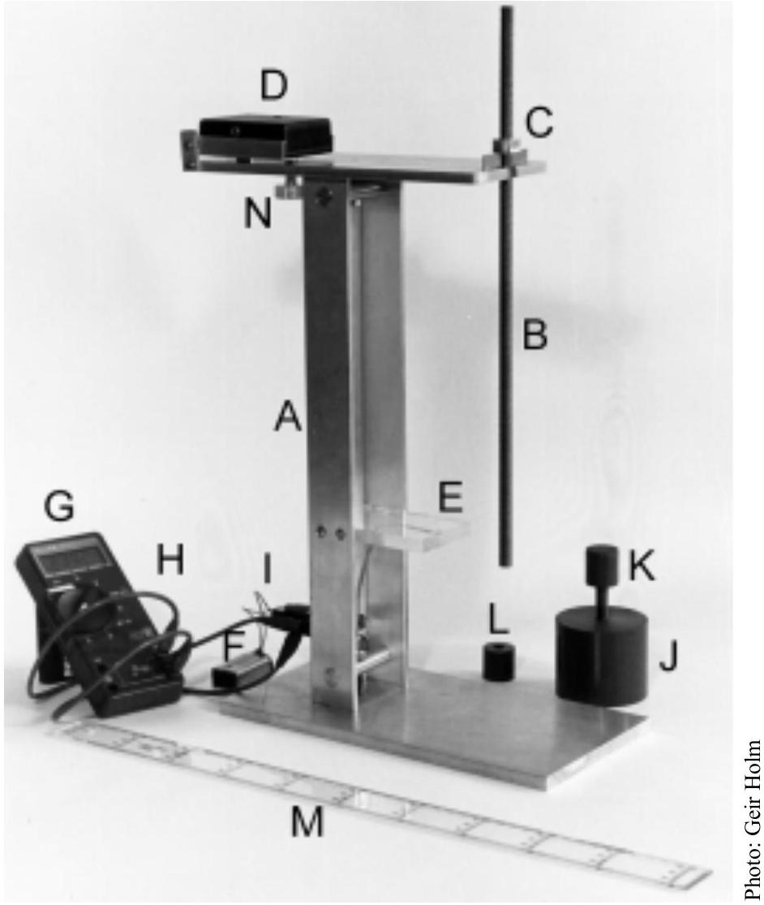
Figure 1. The instrumentation used.

## THE PHYSICAL PENDULUM

A physical pendulum is an extended physical object of arbitrary shape that can rotate about a fixed axis. For a physical pendulum of mass $M$ oscillating about a horizontal axis a distance, $l$, from the centre of mass, the period, $T$, for small angle oscillations is

$$
T=\frac{2 \pi}{\sqrt{g}} \sqrt{\frac{I}{M l}+l}
$$

Here $g$ is the acceleration of gravity, and $I$ is the moment of inertia of the pendulum about an axis parallel to the rotation axis but through the centre of mass.

Figure 2 shows a schematic drawing of the physical pendulum you will be using. The pendulum consists of a cylindrical metal rod, actually a long screw, having length $L$, average radius $R$, and at least one nut. The values of various dimensions and masses are summarised in Table 1. By turning the nut you can place it at any position along the rod. Figure 2 defines two distances, $x$ and $l$, that describe the position of the rotation axis relative to the end of the rod and the centre of mass, respectively.

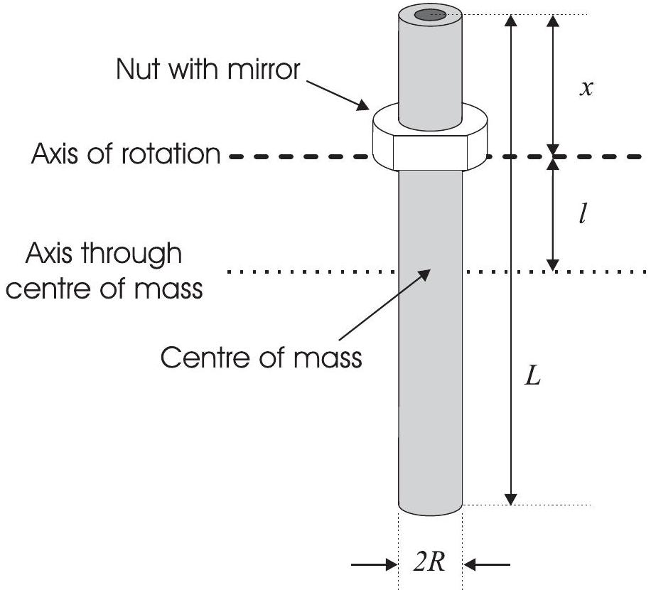
Figure 2: Schematic drawing of the pendulum with definition of important quantities.

Rod

| Length | $L$ | $(400.0 \pm 0.4) \mathrm{mm}$ |
| :--- | :--- | :--- |
| Average radius | R | $(4.4 \pm 0.1) \mathrm{mm}$ |
| Mass | $M_{\text {ROD }}$ | $(210.2 \pm 0.2) \cdot 10^{-3} \mathrm{~kg}$ |
| Distance between screw threads |  | $(1.5000 \pm 0.0008) \mathrm{mm}$ |

| Nut |  |  |
| :--- | :--- | :--- |
| Height | $h$ | $(9.50 \pm 0.05) \mathrm{mm}$ |
| Depth of groove | $d$ | $(0.55 \pm 0.05) \mathrm{mm}$ |
| Mass | $M_{\text {NUT }}$ | $(4.89 \pm 0.03) \cdot 10^{-3} \mathrm{~kg}$ |

Table 1: Dimensions and weights of the pendulum

A reminder from the front page: No points will be given for error estimates except in 2c. However, it is expected that the correct number of significant figures are given.

## Section 1 : Period of oscillation versus rotation axis position (4 marks)

a) Measure the oscillation period, $T$, as a function of the position $x$, and present the results in a table.
b) Plot $T$ as a function of $x$ in a graph. Let 1 mm in the graph correspond to 1 mm in $x$ and 1 ms in $T$. How many positions give an oscillation period equal to $T=950 \mathrm{~ms}, T=1000 \mathrm{~ms}$ and $T=1100 \mathrm{~ms}$, respectively?
c) Determine the $x$ and $l$ value that correspond to the minimum value in $T$.

## Section 2 : Determination of $\boldsymbol{g}$ (5 marks)

For a physical pendulum with a fixed moment of inertia, $I$, a given period, $T$, may in some cases be obtained for two different positions of the rotation axis. Let the corresponding distances between the rotation axis and the centre of mass be $l_{1}$ and $l_{2}$. Then the following equation is valid:

$$
l_{1} l_{2}=\frac{I}{M}
$$

a) Figure 6 on the last page in this set illustrates a physical pendulum with an axis of rotation displaced a distance $l_{1}$ from the centre of mass. Use the information given in the figure caption to indicate all positions where a rotation axis parallel to the drawn axis can be placed without changing the oscillation period.
b) Obtain the local Oslo value for the acceleration of gravity $g$ as accurately as possible. Hint: There are more than one way of doing this. New measurements might be necessary. Indicate clearly by equations, drawings, calculations etc. the method you used.
c) Estimate the uncertainty in your measurements and give the value of $g$ with error margins.

## Section 3 : Geometry of the optical timer (3 marks)

a) Use direct observation and reasoning to characterise, qualitatively as well as quantitatively, the shape of the reflecting surface of the nut (the mirror). (You may use the light from the light bulb in front of you).

Options (several may apply):

1. Plane mirror
2. Spherical mirror
3. Cylindrical mirror
4. Cocave mirror
5. Convex mirror

In case of 2-5: Determine the radius of curvature.
b) Consider the light source to be a point source, and the detector a simple photoelectric device. Make an illustration of how the light from the emitter is reflected by the mirror on the nut in the experimantal setup (side view and top view). Figure 7 on the last page in this set shows a vertical plane through the timer display (front view). Indicate in this figure the whole region where the reflected light hits this plane when the pendulum is vertical.

## Section 4 : Measurement of magnetic field (4 marks)

You will now use an electronic sensor (Hall-effect sensor) to measure magnetic field. The device gives a voltage which depends linearly on the vertical field through the sensor. The field-voltage coefficient is $\Delta V / \Delta B=22.6 \mathrm{~V} / \mathrm{T}$ (Volt/ Tesla). As a consequence of its design the sensor gives a non-zero voltage (zero-offset voltage) in zero magnetic field. Neglect the earth's magnetic field.

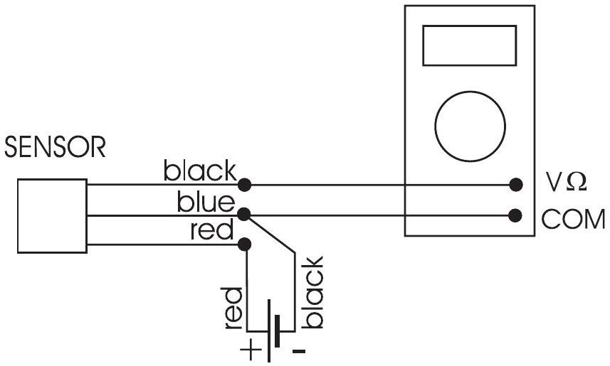
Figure 3: Schematics of the magnetic field detector system

a) Connect the sensor to the battery and voltmeter as shown above. Measure the zero-offset voltage, $V_{0}$.

A permanent magnet shaped as a circular disk is mounted on a separate stand. The permanent magnet can be displaced vertically by rotating the mount screw, which is threaded identically to the pendulum rod. The dimensions of the permanent magnet are; thickness $t=2.7 \mathrm{~mm}$, radius $r=12.5 \mathrm{~mm}$.
b) Use the Hall sensor to measure the vertical magnetic field, $B$, from the permanent magnet along the cylinder axis, see Figure 4. Let the measurements cover the distance from $y=26 \mathrm{~mm}$ (use the spacer) to $y=3.5 \mathrm{~mm}$, where $y=1 \mathrm{~mm}$ corresponds to the sensor and permanent magnet being in direct contact. Make a graph of your data for $B$ versus $y$.

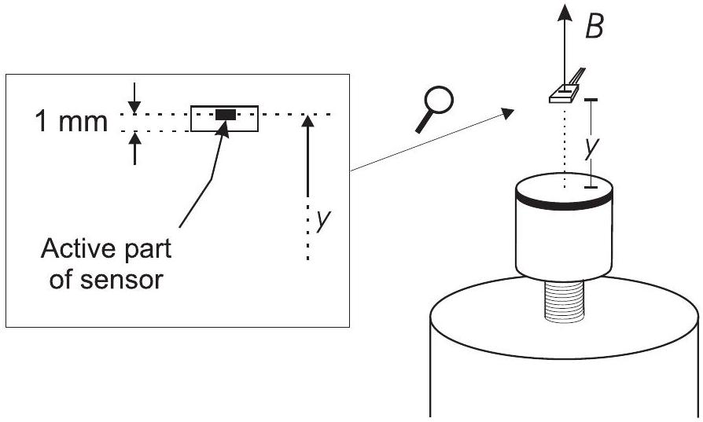
Figure 4: Definition of the distance $y$ between top of magnet and the active part of the sensor.

c) It can be shown that the field along the axis of a cylindrical magnet is given by the formula

$$
B(y)=B_{0}\left[\frac{y+t}{\sqrt{(y+t)^{2}+r^{2}}}-\frac{y}{\sqrt{y^{2}+r^{2}}}\right]
$$

where $t$ is the cylinder thickness and $r$ is the radius. The parameter $B_{0}$ characterizes the strength of the magnet. Find the value of $B_{0}$ for your permanent magnet. ${ }^{\S}$ Base your determination on two measured $B$-values obtained at different $y$.

## Section 5 : Determination of magnetic dipole moment (4 marks)

A tiny magnet is attached to the white end of the pendulum rod. Mount the pendulum on the stand with its magnetic end down and with $\boldsymbol{x}=\mathbf{1 0 0 ~ m m}$. Place the permanent magnet mount under the pendulum so that both the permanent magnet and the pendulum have common cylinder axis. The alignment should be done with the permanent magnet in its lowest position in the mount. (Always avoid close contact between the permanent magnet and the magnetic end of the pendulum.)
a) Let $z$ denote the air gap spacing between the permanent magnet and the lower end of the pendulum. Measure the oscillation period, $T$, as function of the distance, $z$. The measurement series should cover the interval from $z=25 \mathrm{~mm}$ to $z=5.5 \mathrm{~mm}$ while you use as small oscillation amplitude as possible. Be aware of the possibility that the period timer might display $2 T$ (see remark regarding the timer under Instrumentation above). Plot the observed $T$ versus $z$.
b) With the additional magnetic interaction the pendulum has a period of oscillation, $T$, which varies with $z$ according to the relation

$$
\frac{1}{T^{2}} \propto 1+\frac{\mu B_{0}}{M g l} f(z)
$$

Here $\propto$ stand for "proportional to", and $\mu$ is the magnetic dipole moment of the tiny magnet attached to the pendulum, and is the parameter determined in section 4c. The function $f(z)$ includes the variation in magnetic field with distance. In Figure 5 on the next page you find the particular $f(z)$ for our experiment, presented as a graph.
Select an appropirate point on the graph to determine the unknown magnetic moment $\mu$.

[^0]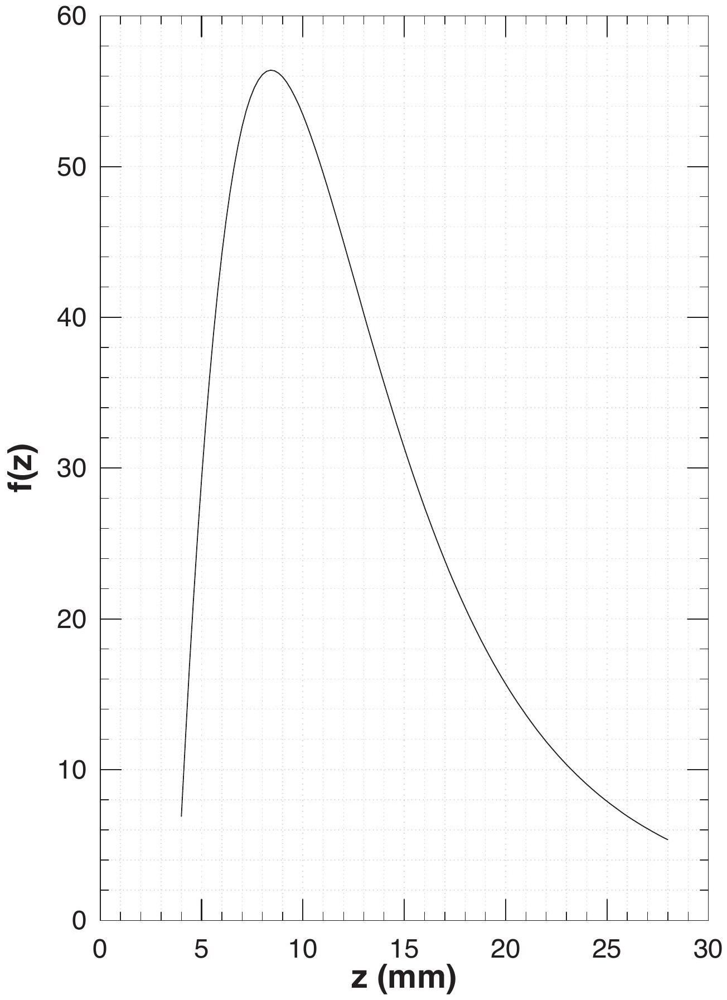
Figure 5. Graph of the dimension-less function $f(z)$ used in section 5b.

| Candidate: | Question: | Page ..... of ..... |
| :--- | :--- | :--- |

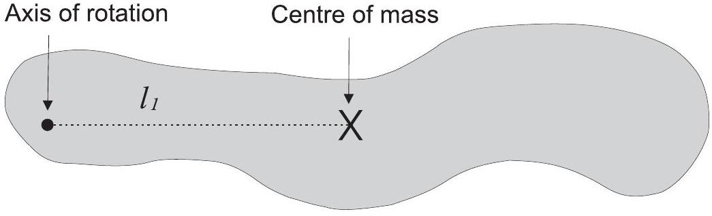
Figure 6. For use in section 2a. Mark all positions where a rotation axis (orthogonal to the plane of the paper) can be placed without changing the oscillation period. Assume for this pendulum (drawn on scale, 1:1) that $I / M=2100 m m^{2}$. (Note: In this booklet the size of this figure is about 75\% of the size in the original examination paper.)

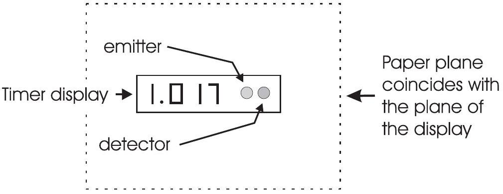
Figure 7. For use in section 3b. Indicate the whole area where the reflected light hits when the pendulum is vertical.

## Include this page in your report!

## The men behind the equipment

The equipment for the practical competition was constructed and manufactured at the Mechanics Workshop at the Department of Physics, University of Oslo (see picture below, from left to right: Tor Enger (head of the Mechanics Workshop), Pål Sundbye, Helge Michaelsen, Steinar Skaug Nilsen, and Arvid Andreassen).

Photo: Geir Holm

The electronic timer was designed and manufactured by Efim Brondz, Department of Physics, University of Oslo (see picture below). About 40.000 soldering points were completed manually, enabling the time-recording during the exam to be smooth and accurate.

Photo: Geir Holm

## $27{ }^{\text {th }}$ INTERNATIONAL PHYSICS OLYMPIAD OSLO, NORWAY

Model Answer
for the
EXPERIMENTAL COMPETITION
JULY 41996

These model answers indicate what is required from the candidates to get the maximum score of 20 marks. Some times we have used slightly more text than required; paragraphs written in italic give additional comments. This practical exam will reward students with creativity, intuition and a thorough understanding of the physics involved.

Alternative solutions regarded as less elegant or more time consuming are printed in frames like this with white background.

Anticipated INCORRECT answers are printed on grey background and are included to point out places where the students may make mistakes or approximations without being aware of them.

Section 1:
1a) Threads are $1.50 \mathrm{~mm} /$ turn . Counted turns to measure position $x$.

| Turn no. | 0 | 10 | 20 | 30 | 40 | 50 | 60 | 70 | 80 | 90 | 100 |
| :--- | :--- | :--- | :--- | :--- | :--- | :--- | :--- | :--- | :--- | :--- | :--- |
| $x[\mathrm{~mm}]$ | 10.0 | 25.0 | 40.0 | 55.0 | 70.0 | 85.0 | 100.0 | 115.0 | 130.0 | 145.0 | 160.0 |
| $T[\mathrm{~ms}]$ | 1023 | 1005 | 989 | 976 | 967 | 964 | 969 | 987 | 1024 | 1094 | 1227 |

| Turn no. | 110 | 120 | 46 | 48 | 52 | 54 |
| :--- | :--- | :--- | :--- | :--- | :--- | :--- |
| $x[\mathrm{~mm}]$ | 175.0 | 190.0 | 79.0 | 82.0 | 88.0 | 91.0 |
| $T[\mathrm{~ms}]$ | 1490 | 2303 | 964 | 964 | 964 | 965 |

| Candidate: IPhO ID | Question: 1 | Page 2 of 11 |
| :--- | :--- | :--- |

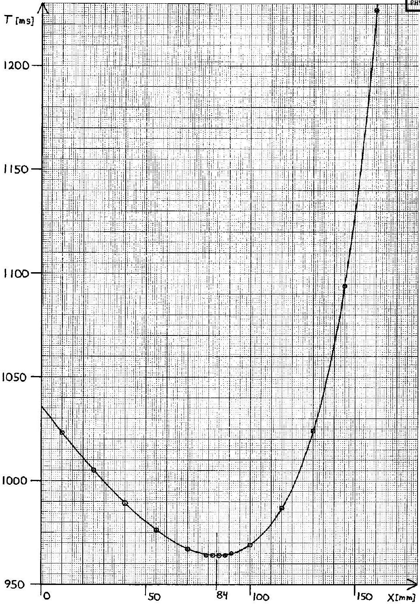

1b) Graph: $T(x)$, shown above.

| $T=950 \mathrm{~ms}$ : | NO positions |
| :--- | :--- |
| $T=1000 \mathrm{~ms}$ : | 2 positions |
| $T=1100 \mathrm{~ms}$ : | 1 position |

| Candidate: IPhO ID | Question: 1 + 2 | Page 3 of 11 |
| :--- | :--- | :--- |

1c) Minimum on graph: $x=84 \mathrm{~mm}$, (estimated uncertainty 1 mm )
By balancing the pendulum horizontally: $l=112.3 \mathrm{~mm}+0.55 \mathrm{~mm}=113 \mathrm{~mm}$
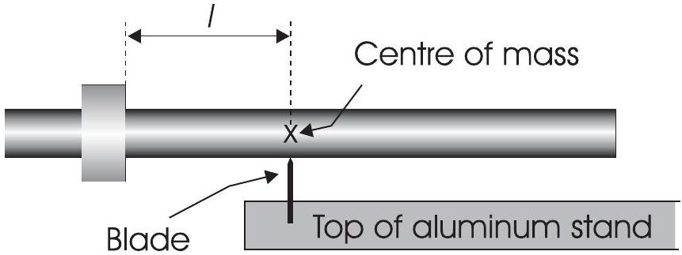

ALTERNATIVE 1c-1:
$x_{C M}=\frac{M_{\text {ROD }} L-M_{\text {NUT }} h}{2 M}+\frac{M_{\text {NUT }}}{M} x=197.3 \mathrm{~mm}$ for $x=84 \mathrm{~mm}$ gives $l=197.3 \mathrm{~mm}-84 \mathrm{~mm}=113 \mathrm{~mm}$
$M=M_{\text {ROD }}+M_{\text {NUT }}, h=8.40 \mathrm{~mm}=$ height of nut minus two grooves.

INCORRECT 1c-1: Assuming that the centre of mass for the pendulum coincides with the midpoint, $L / 2$, of the rod gives $l=L / 2-x=116 m m$.
(The exact position of the minimum on the graph is $x=84.4 \mathrm{~mm}$. with $l=112.8 \mathrm{~mm}$ )

## Section 2:

2a) $l_{2}=\frac{I}{M l_{1}}=\frac{2100 \mathrm{~mm}^{2}}{60 \mathrm{~mm}}=35 \mathrm{~mm}$

See also Figure 6 on the next page

| Candidate: IPhO ID | Question: 2 | Page 4 of 11 |  | 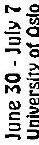   2 κjnf - og aunt |
| :--- | :--- | :--- | :--- | :--- |

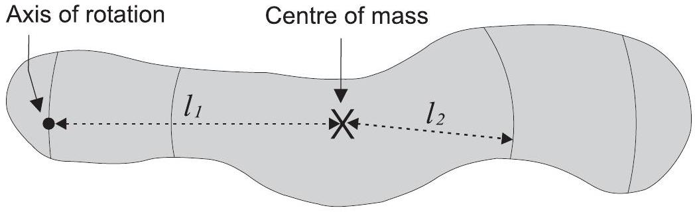
Figure 6. For use in section 2a. Mark all positions where a rotation axis (orthogonal to the plane of the paper) can be placed without changing the oscillation period. Assume for this pendulum (drawn on scale, 1:1) that $I / M=2100 m m^{2}$. (Note: In this booklet the size of this figure is about 75\% of the size in the original examination paper.)

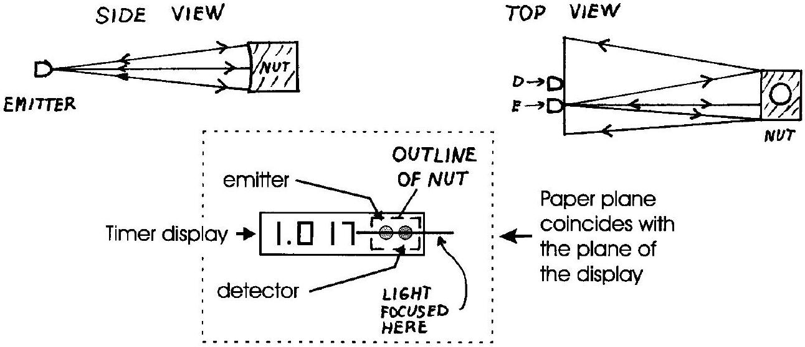
Figure 7. For use in section 3b. Indicate the whole area where the reflected light hits when the pendulum is vertical.

| Candidate: IPhO ID | Question: 2 | Page 5 of 11 |
| :--- | :--- | :--- |

2b) Simple method with small uncertainty: Inverted pendulum.
Equation (1) + (2) $\Rightarrow T_{1}=T_{2}=\frac{2 \pi}{\sqrt{g}} \sqrt{l_{1}+l_{2}} \Leftrightarrow g=\frac{4 \pi^{2}}{T_{1}^{2}}\left(l_{1}+l_{2}\right)$
NOTE: Independent of I/M !
Used both nuts with one nut at the end to maximise $l_{1}+l_{2}$. Alternately adjusted nut positions until equal periods $T_{1}=T_{2}$ :
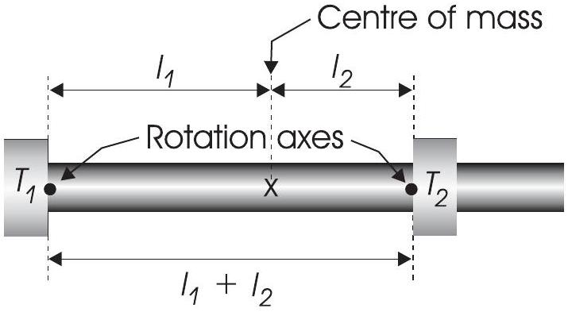

$$
T_{1}=T_{2}=1024 \mathrm{~ms} .
$$

Adding the depth of the two grooves to the measured distance between nuts:
$l_{1}+l_{2}=(259.6+2 \cdot 0.55) \mathrm{mm}=0.2607 \mathrm{~m}$

$$
g=\frac{4 \pi^{2}}{T_{1}^{2}}\left(l_{1}+l_{2}\right)=\frac{4 \cdot 3.1416^{2} \cdot 0.2607 \mathrm{~m}}{(1.024 \mathrm{~s})^{2}}=\underline{\underline{9.815 \mathrm{~m} / \mathrm{s}^{2}}}
$$

ALTERNATIVE 2b-1: Finding I(x). Correct but time consuming.
It is possible to derive an expression for $I$ as a function of $x$. By making sensible approximations, this gives:

$$
\frac{I(x)}{M}=\left[\frac{L^{2}}{12}+\frac{M_{N U T}}{M}\left(\frac{L+h}{2}-x\right)^{2}\right] \frac{M_{R O D}}{M}
$$

which is accurate to within 0.03 \%. Using the correct expression for $l$ as a function of $x$ :

$$
l(x)=x_{C M}-x=\frac{M_{R O D} L-M_{N U T} h}{2 M}-\frac{M_{R O D}}{M} x=195.3 \mathrm{~mm}-0.9773 x,
$$

equation (1) can be used on any point $(x, T)$ to find $g$. Choosing the point (85 mm, 964 ms) gives:

$$
g=\frac{4 \pi^{2}}{T^{2}}\left[\frac{I(x)}{M \cdot l(x)}+l(x)\right]=\frac{4 \cdot 3.1416^{2} \cdot 0.2311 \mathrm{~m}}{(0.964 \mathrm{~s})^{2}}=\underline{\underline{9.818 \mathrm{~m} / \mathrm{s}^{2}}}
$$

| Candidate: IPhO ID | Question: 2 | Page 6 of 11 |
| :--- | :--- | :--- |

Using the minimum point on the graph in the way shown below is wrong, since the curve in 1b), $T(x)=\frac{2 \pi}{\sqrt{g}} \sqrt{\frac{I(x)}{M \cdot l(x)}}+l(x)$ with $I(x) / M$ and $l(x)$ given above, describes a continuum of different pendulums with changing $I(x)$ and moving centre of mass.
Equation (1): $T=\frac{2 \pi}{\sqrt{g}} \sqrt{\frac{I}{M l}}+l$ describes one pendulum with fixed $I$, and does not apply to the curve in 1b).

INCORRECT 2b-1: At the minimum point we have from Equation (2) and 1c):
$l_{1}=l_{2}=l=\sqrt{I / M}=(113 \pm 1) \mathrm{mm}$ Equation (1) becomes
$T_{\text {min }}=\frac{2 \pi}{\sqrt{g}} \sqrt{\frac{l^{2}}{l}+l}=\frac{2 \pi}{\sqrt{g}} \sqrt{2 l}$ and
$g=\frac{8 \pi^{2} l}{T_{\min }{ }^{2}}=\frac{8 \cdot 3.1416^{2} \cdot 0.113 \mathrm{~m}}{(0.964 \mathrm{~s})^{2}}=9.60 \mathrm{~m} / \mathrm{s}^{2}$
Another source of error which may accidentally give a reasonable value is using the wrong value $l=(116 \pm 1) m m$ from «INCORRECT 1c-1»:

INCORRECT 2b-2: $g=\frac{8 \pi^{2} l}{T_{\text {min }}{ }^{2}}=\frac{8 \cdot 3.1416^{2} \cdot 0.116 \mathrm{~m}}{(0.964 \mathrm{~s})^{2}}=9.86 \mathrm{~m} / \mathrm{s}^{2}$

Totally neglecting the mass of the nut but remembering the expression for the moment of inertia for a thin rod about a perpendicular axis through the centre of mass, $I=M L^{2} / 12$, gives from equation (2) for the minimum point: $l^{2}=I / M=L^{2} / 12=0.01333 m^{2}$. This value is accidentally only 0.15\% smaller than the correct value for I(x)/M at the minimum point on the curve in 1b):

$$
\frac{I(x=84.43 \mathrm{~mm})}{M}=\left[\frac{L^{2}}{12}+\frac{M_{N U T}}{M}\left(\frac{L+h}{2}-x\right)^{2}\right] \frac{M_{R O D}}{M}=0.01335 \mathrm{~m}^{2} .
$$

(continued on next page)
~வதே.
(cont.)
Neglecting the term $\frac{M_{\text {NUT }}}{M}\left(\frac{L+h}{2}-84.43 \mathrm{~mm}\right)^{2}=0.00033 \mathrm{~m}^{2}$ is nearly compensated by omitting the factor $\frac{M_{R O D}}{M}=0.977$. However, each of these approximations are of the order of 2.5 \%, well above the accuracy that can be achieved.

INCORRECT 2b-3: At the minimum point equation (2) gives $l^{2}=\frac{I}{M}=\frac{L^{2}}{12}$. Then

$$
\begin{aligned}
& T_{\min }=\frac{2 \pi}{\sqrt{g}} \sqrt{2 l}=\frac{2 \pi}{\sqrt{g}} \sqrt{\frac{2 L}{\sqrt{12}}}=\frac{2 \pi}{\sqrt{g}} \sqrt{\frac{L}{\sqrt{3}}} \text { and } \\
& g=\frac{4 \pi^{2} L}{\sqrt{3}^{2} T_{\min }^{2}}=\frac{4 \cdot 3.1416^{2} \cdot 0.4000 \mathrm{~m}}{1.7321 \cdot(0.964 \mathrm{~s})^{2}}=9.81 \mathrm{~m} / \mathrm{s}^{2}
\end{aligned}
$$

2c) Estimating uncertainty in the logarithmic expression for $g$ :
Let $S \equiv l_{1}+l_{2} \Rightarrow g=\frac{4 \pi^{2} S}{T^{2}}$

$$
\begin{aligned}
\Delta S & =0.3 \mathrm{~mm} \quad \Delta T=1 \mathrm{~ms} \\
\frac{\Delta g}{g} & =\sqrt{\left(\frac{\Delta S}{S}\right)^{2}+\left(-2 \frac{\Delta T}{T}\right)^{2}}=\sqrt{\left(\frac{0.3 \mathrm{~mm}}{260.7 \mathrm{~mm}}\right)^{2}+\left(2 \cdot \frac{1 \mathrm{~ms}}{1024 \mathrm{~ms}}\right)^{2}} \\
& =\sqrt{(0.0012)^{2}+(0.0020)^{2}}=0.0023=0.23 \% \\
\Delta g & =0.0023 \cdot 9.815 \mathrm{~m} / \mathrm{s}^{2}=0.022 \mathrm{~m} / \mathrm{s}^{2} \\
g & =(9.82 \pm 0.02) \mathrm{m} / \mathrm{s}^{2}
\end{aligned}
$$

The incorrect methods INCORRECT 2b-1, 2b-2 and 2b-3 have a similar expressions for g as above. With $\Delta l=1 \mathrm{~mm}$ in INCORRECT 2b-1 and 2b-2 we get $\Delta g=0.09 \mathrm{~m} / \mathrm{s}^{2}$.
INCORRECT 2b-3 should have $\Delta l=0.3 \mathrm{~mm}$ and $\Delta g=0.02 \mathrm{~m} / \mathrm{s}^{2}$.

| Candidate: IPhO ID | Question: 2 + 3 + 4 | Page 8 of 11 |
| :--- | :--- | :--- |

ALTERNATIVE 3 has a very complicated $x$ dependence in $g$. Instead of differentiating $g(x)$ it is easier to insert the two values $x+\Delta x$ and $x-\Delta x$ in the expression in brackets [ ], thus finding an estimate for $\Delta[]$ and then using the same formula as above.
(The official local value for $g$, measured in the basement of the adjacent building to where the practical exam was held is $g=9.8190178 \mathrm{~m} / \mathrm{s}^{2}$ with uncertainty in the last digit.)

## Section 3.

3a) 3. Cylindrical mirror
    4. Concave mirror

Radius of curvature of cylinder, $r=145 \mathrm{~mm}$. (Uncertainty approx. $\pm 5 m m$, not asked for.)
(In this set-up the emitter and detector are placed at the cylinder axis. The radius of curvature is then the distance between the emitter/detector and the mirror.)

3b) Three drawings, see Figure 7 on page 4 in this Model Answers.
(The key to understanding this set-up is that for a concave cylindrical mirror with a point source at the cylinder axis, the reflected light will be focused back onto the cylinder axis as a line segment of length twice the width of the mirror.)

## Section 4.

4a) $\mathrm{V}_{\mathrm{O}}=2.464 \mathrm{~V}$ (This value may be different for each set-up.)
4b) Threads are 1.50 mm /turn. Measured $V(y)$ for each turn. Calculated
$$
B(y)=\left[V(y)-V_{0}\right] \frac{\Delta B}{\Delta V}=\left[V(y)-V_{0}\right] / \frac{\Delta V}{\Delta B} . \quad \text { (Table not requested) }
$$
See graph on next page.

| Candidate: IPhO ID | Question: 4 + 5 | Page 9 of 11 |
| :--- | :--- | :--- |

Graph: B(y):
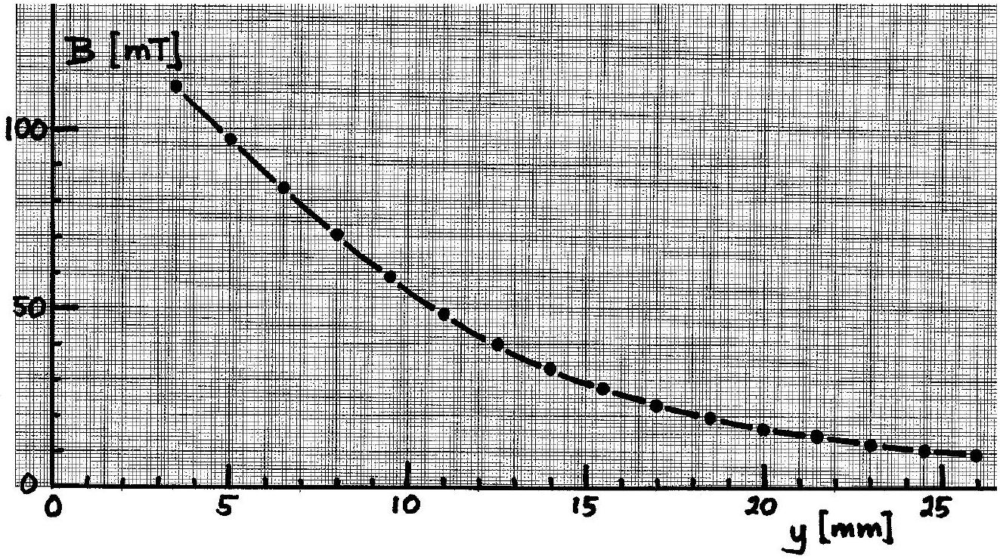

4c)
$$
B_{0}=B(y)\left[\frac{y+t}{\sqrt{(y+t)^{2}+r^{2}}}-\frac{y}{\sqrt{y^{2}+r^{2}}}\right]^{-1}
$$
The point (11 mm, 48.5 mT) gives $B_{0}=0.621 \mathrm{~T}$ and (20 mm, 16,8 mT) gives $B_{0}=0.601 \mathrm{~T}$. Mean value: $B_{0}=0.61 \mathrm{~T}$ (This value may vary for different magnets.)

## Section 5:

5a) Used the spacer and measured $T(z)$ from $z=25 \mathrm{~mm}$ to 5.5 mm. (Table is not requested.) See plot on next page.

Graph: T(z):

5b) $l(x=100 \mathrm{~mm})=97.6 \mathrm{~mm}$ (by balancing the pendulum or by calculation as in 1c).

$$
M=M_{R O D}+M_{N U T}
$$

Proportionality means: $\frac{1}{T^{2}}=a\left[1+\frac{\mu B_{0}}{M g l} f(z)\right]$ where $a$ is a proportionality constant. Setting $\mathrm{B}_{0}=0$ corresponds to having an infinitely weak magnet or no magnet at all. Removing the large magnet gives: $\mathrm{T}_{0}=968 \mathrm{~ms}$ and $\frac{1}{T_{0}{ }^{2}}=a\left[1+0 \cdot \frac{\mu}{M g l} f(z)\right]$ or $a=\frac{1}{T_{0}{ }^{2}}$.
Selecting the point where $f(z)$, see Fig. 5, changes the least with $z$, i.e., at the maximum, one has $f_{\text {max }}=56.3$. This point must correspond to the minimum oscillation period, which is measured to be $T_{\text {min }}=576 \mathrm{~ms}$.
We will often need the factor

$$
\frac{M g l}{B_{0}}=\frac{0.215 \mathrm{~kg} \cdot 9.82 \mathrm{~m} / \mathrm{s}^{2} \cdot 0.0976 \mathrm{~m}}{0.61 \mathrm{~T}}=0.338 \mathrm{Am}^{2} .
$$

| Candidate: IPhO ID | Question: 5 | Page 11 of 11 |
| :--- | :--- | :--- |

The magnetic moment then becomes

$$
\mu=\frac{M g l}{B_{0}} \frac{1}{f_{\max }}\left[\left(\frac{T_{0}}{T}\right)^{2}-1\right]=\frac{0.338 \mathrm{Am}^{2}}{56.3}\left[\left(\frac{968}{576}\right)^{2}-1\right]=\underline{\underline{1.1 \cdot 10^{-2} \mathrm{Am}^{2}}}
$$

ALTERNATIVE 5b-1: Not what is asked for: Using two points to eliminate the proportionality constant $a$ : Equation (4) or $\frac{1}{T^{2}}=a\left[1+\frac{\mu B_{0}}{M g l} f(z)\right]$ gives:

$$
\begin{aligned}
& a T_{1}^{2}\left[1+\frac{\mu B_{0}}{M g l} f\left(z_{1}\right)\right]=a T_{2}^{2}\left[1+\frac{\mu B_{0}}{M g l} f\left(z_{2}\right)\right] \\
& T_{1}^{2}+T_{1}^{2} \frac{\mu B_{0}}{M g l} f\left(z_{1}\right)=T_{2}^{2}+T_{2}^{2} \frac{\mu B_{0}}{M g l} f\left(z_{2}\right) \\
& \frac{\mu B_{0}}{M g l}\left[T_{1}^{2} f\left(z_{1}\right)-T_{2}^{2} f\left(z_{2}\right)\right]=T_{2}^{2}-T_{1}^{2} \\
& \mu=\frac{M g l}{B_{0}} \cdot \frac{T_{2}^{2}-T_{1}^{2}}{T_{1}^{2} f\left(z_{1}\right)-T_{2}^{2} f\left(z_{2}\right)}
\end{aligned}
$$

Choosing two points ( $z_{1}=7 \mathrm{~mm}, T_{1}=580.5 \mathrm{~ms}$ ) and ( $z_{2}=22 \mathrm{~mm}, T_{2}=841 \mathrm{~ms}$ ). Reading from the graph $f\left(z_{1}\right)=56.0$ and $f\left(z_{2}\right)=12.0$ we get

$$
\mu=0.338 \mathrm{Am}^{2} \cdot \frac{841^{2}-580^{2}}{580^{2} \cdot 56.0-841^{2} \cdot 12.0}=1.2 \cdot 10^{-2} \mathrm{Am}^{2}
$$

| Candidate: | Total score: + + + + = |
| :--- | :--- |
| Country: | Marker's name: |
| Language: | Comment: |

## Marking Form   for the Experimental Competition at the 27th International Physics Olympiad Oslo, Norway

July 4, 1996

To the marker: Carefully read through the candidate's exam papers and compare with the model answer. You may use the transparencies (handed out) when checking the graph in 1b) and the drawing in 2a). When encountering words or sentences that require translation, postpone marking of this part until you have consulted the interpreter.

Use the table below and mark a circle around the point values to be subtracted. Add vertically the points for each subsection and calculate the score.
NB: Give score 0 if the value comes out negative for any subsection.
Add the scores for each subsection and write the sum in the 'Total score'- box at the upper right. Keep decimals all the way.

If you have questions, consult the marking leader. Good luck, and remember that you will have to defend your marking in front of the team leaders.
(Note: The terms "INCORRECT 2b-1" found in the table for subsection 2c) and similar terms elsewhere, refer to the Model Answer, in which anticipated incorrect answers were included and numbered for easy reference.)

| Subsection 1a) | Deficiency | Subtract |
| :--- | :--- | :--- |
|  | No answer | 1.0 |
|  | $x$ lacks unit | 0.1 |
|  | Other than 0 or 1 decimal in $x$ | 0.1 |
|  | $x$ does not cover the interval 10 mm - 160 mm | 0.1 |
|  | $T$ lacks unit | 0.1 |
|  | $T$ given with other than 1 or 0.5 millisecond accuracy | 0.1 |
|  | Fewer than 11 measuring points (15 mm sep.). Subtr. up to | 0.2 |
|  | Systematic error in $x$ (e.g. if measured from the top of the nut so that the |  |
|  | first $x=0 \mathrm{~mm}$ ) | 0.2 |
|  | If not aware of doubling of the timer period | 0.2 |
| Other (specify): |  |  |
|  | Score for subsection 1a: 1.0 - | = |

| Subsection 1b) | Deficiency | Subtract |
| :--- | :--- | :--- |
|  | No answer | 1.0 |
|  | Lacks " $x[(\mathrm{~m}) \mathrm{m}]$ " on horizontal axis | 0.1 |
|  | 1 mm on paper does not correspond to 1 mm in $x$ | 0.1 |
|  | Fewer than 3 numbers on horizontal axis | 0.1 |
|  | Lacks " $T[(\mathrm{~m}) \mathrm{s}]$ " on vertical axis | 0.1 |
|  | 1 mm on paper does not correspond to 1 ms in $T$ | 0.1 |
|  | Fewer than 3 numbers on vertical axis | 0.1 |
|  | Measuring points not clearly shown (as circles or crosses) | 0.2 |
| More than 5 ms deviation in more than 2 measuring points on the graph |  | 0.2 |
| Wrong answer to the questions ( $x$-values give full score if correct number |  |  |
|  | of values: 0, 2, 1) | 0.2 |
| Other (specify): |  |  |
|  | Score for subsection 1b): | = |

| Subsection 1c) | Deficiency | Subtract |
| :--- | :--- | :--- |
| No answer |  | 2.0 |
|  |  | 0.4 |
|  | $x$ lacks unit | 0.1 |
|  | $x$ given more (or less) accurately than in whole millimeters | 0.3 |
|  | $l$ lacks unit | 0.1 |
|  | $l$ given more (or less) accurately than the nearest mm | 0.3 |
|  | Wrong formula (e.g. $l=200.0 \mathrm{~mm}-x$ ) or something other than $l=x_{\mathrm{CM}}-x$ | 0.6 |
|  | If it is not possible to see which method was used to find the center of mass | 0.2 |
| Other (specify): |  |  |
| Score for subsection 1c): 2.0 - |  | = |

| Subsection 2a) | Deficiency | Subtract |
| :--- | :--- | :--- |
|  | No answer | 1.5 |
|  | If drawn straight (vertical) lines | 0.4 |
|  | If points are drawn | 0.5 |
|  | Other than 4 regions are drawn | 0.5 |
|  | Inaccurate drawing $(> \pm 2 \mathrm{~mm})$ | 0.3 |
|  | Lacks the values $l_{1}=60 \mathrm{~mm}, l_{2}=35 \mathrm{~mm}$ on figure or text Other (specify): | 0.3 |
|  | Score for subsection 2a): 1.5 - | = |

| Subsection 2b) | Deficiency | Subtract |
| :--- | :--- | :--- |
|  | No answer | 2.5 |
|  | Lacks (derivation of) formula for $g$ | 0.3 |
|  | For INVERTED PENDULUM: Lacks figure | 0.2 |
|  | Values from possible new measurements not given | 0.3 |
|  | Incomplete calculations | 0.3 |
|  | If hard to see which method was used | 0.4 |
|  | Used the formula for INVERTED PENDULUM but read $l_{1}$ and $l_{2}$ from graph in 1b) by a horizontal line for a certain $T$ | 1.5 |
|  | Used one of the other incorrect methods | 2.0 |
|  | Other than 3 (or 4) significant figures in the answer | 0.3 |
|  | $g$ lacks unit $\mathrm{m} / \mathrm{s}^{2}$ | 0.1 |
| Other (specify): |  |  |
|  | Score for subsection 2b): 2.5 - | = |

| Subsection 2c) | Deficiency | Subtract |
| :--- | :--- | :--- |
|  | No answer | 2.5 |
|  | Wrong expression for $\Delta g / g$ or $\Delta g$. Subtract up to | 0.5 |
|  | For INVERTED PENDULUM: If $0.3 \mathrm{~mm}>\Delta\left(l_{1}+l_{2}\right)>0.5 \mathrm{~mm}$ | 0.2 |
|  | For ALTERNATIVE 2c-1: If $\Delta[]>0.1 \mathrm{~mm}$ | 0.2 |
|  | For INCORRECT 2c-1 and 2c-2: If $1 \mathrm{~mm}>\Delta l>2 \mathrm{~mm}$ | 0.2 |
|  | For INCORRECT 2c-3: If $0.3 \mathrm{~mm}>\Delta L>0.4 \mathrm{~mm}$ | 0.2 |
|  | For all methods: If $\Delta T \neq 1$ (or 0.5 ) ms | 0.2 |
|  | Error in the calculation of $\Delta g$ | 0.2 |
|  | Lacks answer including $g \pm \Delta g$ with 2 decimals | 0.2 |
|  | $g \pm \Delta g$ lacks unit | 0.1 |
| Other (specify): |  |  |
|  | Score for subsection 2c): 2.5 - | = |

| Subsection 3a) | Deficiency | Subtract |
| :--- | :--- | :--- |
|  | No answer | 1.0 |
|  | Lacks point 3. cylindrical mirror | 0.3 |
|  | Lacks point 4. concave mirror | 0.3 |
|  | Includes other points (1, 2 or 5), subtract per wrong point: | 0.3 |
|  | Lacks value for radius of curvature | 0.4 |
|  | If $r<130 \mathrm{~mm}$ or $r>160 \mathrm{~mm}$, subtract up to | 0.2 |
|  | If $r$ is given more accurately than hole millimeters | 0.2 |
| Other (specify): |  |  |
|  | Score for subsection 3a): | = |
| Subsection 3b)   Deficiency   Subtract |  |  |
|  |  |  |
|  | Lacks side view figure | 0.6 |
|  | Errors or deficiencies in the side view figure. Subtract up to | 0.4 |
|  | Lacks top view figure | 0.6 |
|  | Errors or deficiencies in the top view figure. Subtract up to | 0.4 |
|  | Drawing shows light focused to a point | 0.3 |
|  | Drawing shows light spread out over an ill defined or wrongly shaped |  |
|  | surface | 0.3 |
|  | Line/surface is not horizontal | 0.2 |
|  | Line/point/surface not centered symmetrically on detector | 0.2 |
|  | Line/point/surface has length different from twice the width of the nut |  |
|  | (i.e. outside the interval 10-30 mm) | 0.1 |
| Other (specify): |  |  |
|  | Score for subsection 3b): | = |

| Subsection 4a) | Deficiency | Subtract |
| :--- | :--- | :--- |
|  | No answer | 1.0 |
|  | $V_{o}$ lacks unit V | 0.1 |
|  | Less than 3 decimals in $V_{o}$ | 0.1 |
|  | Incorrect couplings (would give $V_{o}<2.3 \mathrm{~V}$ or $V_{o}>2.9 \mathrm{~V}$ ) | 0.8 |
| Other (specify): |  |  |
|  | Score for subsection 4a): 1.0 - | = |

| Subsection 4b) | Deficiency | Subtract |
| :--- | :--- | :--- |
|  | No answer | 1.5 |
|  | Forgotten $V_{o}$ or other errors in formula for $B$ | 0.2 |
|  | Lacks " $y[(\mathrm{~m}) \mathrm{m}]$ " on horizontal axis | 0.1 |
|  | Fewer than 3 numbers on horizontal axis | 0.1 |
|  | Lacks " $B[(\mathrm{~m}) \mathrm{T}]$ " on vertical axis | 0.1 |
|  | Fewer than 3 numbers on vertical axis | 0.1 |
|  | Fewer than 9 measuring points. Subtract up to | 0.2 |
|  | Measuring points do not cover the interval 3.5 mm - 26 mm | 0.2 |
|  | Measuring points not clearly shown (as circles or crosses) | 0.1 |
|  | Error in data or unreasonably large spread in measuring points. Subtract |  |
|  | up to | 0.5 |
| Other (specify): |  |  |
|  | Score for subsection 4b): | = |

| Subsection 4c) | Deficiency | Subtract |
| :--- | :--- | :--- |
|  | No answer | 1.5 |
|  | Incorrect formula for $B_{o}$ | 0.3 |
|  | If used only one measuring point | 0.4 |
|  | If used untypical points on the graph | 0.3 |
|  | Errors in calculation of mean value for $B_{o}$ | 0.2 |
|  | $B_{o}$ lacks unit T | 0.1 |
|  | Other than two significant figures in (the mean value of) $B_{o}$ | 0.2 |
|  | $B_{o}<0.4 \mathrm{~T}$ or $B_{o}>0.7 \mathrm{~T}$. Subtract up to | 0.2 |
| Other (specify): |  |  |
|  | Score for subsection 4c): 1.5 - | = |

| Subsection 5a) | Deficiency | Subtract |
| :--- | :--- | :--- |
|  | No answer | 1.0 |
|  | Lacks " $z$ [(m)m]" on horizontal axis | 0.1 |
|  | Fewer than 3 numbers on horizontal axis | 0.1 |
|  | Lacks " $T[(\mathrm{~m}) \mathrm{s}]$ " on vertical axis | 0.1 |
|  | Fewer than 3 numbers on vertical axis | 0.1 |
|  | Fewer than 8 measuring points. Subtract up to | 0.2 |
|  | Measuring points not clearly shown (as circles or crosses) | 0.1 |
|  | Measuring points do not cover the interval 5.5 mm - 25 mm | 0.2 |
|  | Error in data (e.g. plotted $2 T$ instead of T) or unreasonably large spread in measuring points. Subtr. up to | 0.5 |
| Other (specify): |  |  |
|  | Score for subsection 5a): 1.0 - | = |

| Subsection 5b) | Deficiency | Subtract |
| :--- | :--- | :--- |
| No answer |  | 3.0 |
|  |  | 0.3 |
|  | Used ALTERNATIVE 5b-1 | 1.0 |
| Lacks method for finding the proportionality factor $a$ |  | 2.5 |
| Not found correct proportionality factor $a$ |  | 0.3 |
| Used another point than the maximum of $f(z)$ |  | 0.1 |
| Incorrect reading of $f(z)$ |  | 0.1 |
| Used $M_{R O D}$ or another incorrect value for $M$ |  | 0.2 |
| Incorrect calculation of $\mu$ |  | 0.3 |
| $\mu$ lacks unit ( $\mathrm{Am}^{2}$ or J/T) |  | 0.2 |
| More than 2 significant figures in $\mu$ |  | 0.3 |
|  |  |  |
| Score for subsection 5b): 3.0 - |  | = |

## Total points:

Total for section 1 (max. 4 points):
Total for section 2 (max. 5 points):
Total for section 3 (max. 3 points):
Total for section 4 (max. 4 points):
Total for section 5 (max. 4 points):

## The last preparations

The problem for the experimental competition was discussed by the leaders and the organizers the evening before the exam. At this meeting the equipment was demonstrated for the first time (picture).

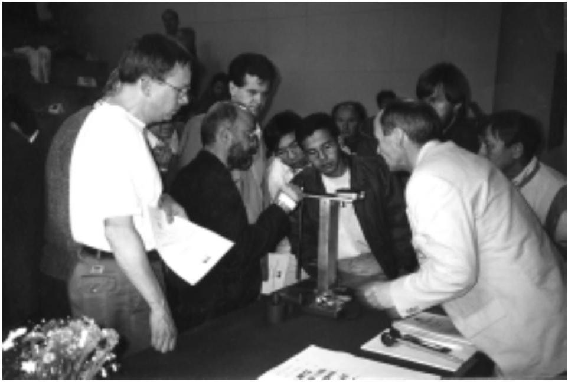
Photo: Børge Holme

After the meeting had agreed on the final text (in English), the problems had to be translated into the remaining 36 languages. One PC was available for each nation for the translation process (see picture below). The last nation finished their translation at about 4:30 a.m. in the morning, and the competition started at 0830. Busy time for the organizers! Examples of the different translations are given on the following pages.

Photo: Børge Holme

[^0]:    $\S 2 B_{0}$ is a material property called remanent magnetic induction, $B_{r}$.
