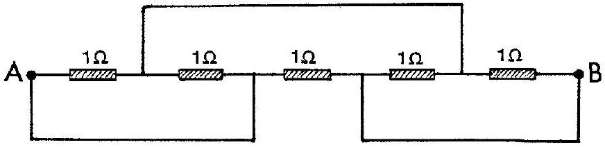
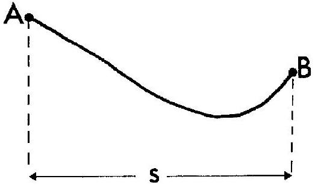
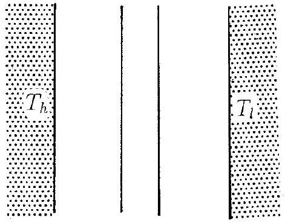
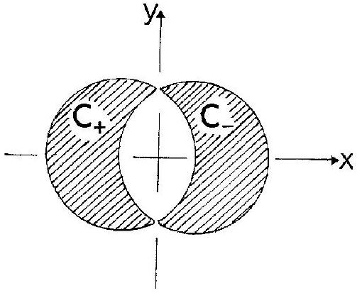

## PROBLEM 1

(The five parts of this problem are unrelated)
a) Five $1 \Omega$ resistances are connected as shown in the figure. The resistance in the conducting wires (fully drawn lines) is negligible.

Determine the resulting resistance $R$ between A and B . (1 point)

b) 
A skier starts from rest at point A and slides down the hill, without turning or braking. The friction coefficient is $\mu$. When he stops at point B , his horizontal displacement is $s$. What is the height difference $h$ between points A and B ? (The velocity of the skier is small so that the additional pressure on the snow due to the curvature can be neglected. Neglect also the friction of air and the dependence of $\mu$ on the velocity of the skier.) (1.5 points)
c) A thermally insulated piece of metal is heated under atmospheric pressure by an electric current so that it receives electric energy at a constant power $P$. This leads to an increase of the absolute temperature $T$ of the metal with time $t$ as follows:
$$
T(t)=T_{0}\left[1+a\left(t-t_{0}\right)\right]^{1 / 4} .
$$
Here $a, t_{0}$ and $T_{0}$ are constants. Determine the heat capacity $C_{p}(T)$ of the metal (temperature dependent in the temperature range of the experiment). (2 points)

d) A black plane surface at a constant high temperature $T_{h}$ is parallel to another black plane surface at a constant lower temperature $T_{l}$. Between the plates is vacuum.

In order to reduce the heat flow due to radiation, a heat shield consisting of two thin black plates, thermally isolated from each other, is placed between the warm and the cold surfaces and parallel to these. After some time stationary conditions are obtained.

By what factor $\xi$ is the stationary heat flow reduced due to the presence of the heat shield? Neglect end effects due to the finite size of the surfaces. (1.5 points)
e) Two straight and very long nonmagnetic conductors $C_{+}$and $C_{-}$, insulated from each other, carry a current $I$ in the positive and the negative $z$ direction, respectively. The cross sections of the conductors (hatched in the figure) are limited by circles of diameter $D$ in the $x-y$ plane, with a distance $D / 2$ between the centres. Thereby the resulting cross sections each have an area $\left(\frac{1}{12} \pi+\frac{1}{8} \sqrt{3}\right) D^{2}$. The current in each conductor is uniformly distributed over the cross section.

Determine the magnetic field $B(x, y)$ in the space between the conductors. (4 points)
